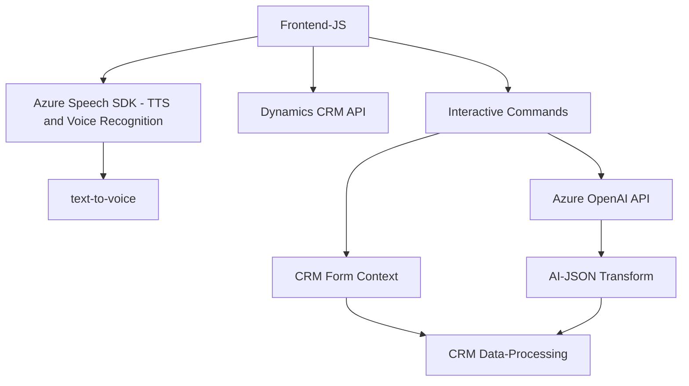

## **Resumen técnico**
El repositorio representa una solución integral que utiliza el servicio Azure Speech SDK para crear una interfaz de interacción basada en voz y texto sobre formularios de Dynamics 365. Por otro lado, integra un plugin para procesar datos mediante Azure OpenAI en la plataforma CRM. 

## **Descripción de la Arquitectura**
La solución es parcialmente desacoplada y combina las siguientes características:
1. **Frontend (FRONTEND/JS):** Aplicación en JavaScript que interactúa con los formularios de Dynamics 365 mediante el SDK de Dynamics y utiliza Azure Speech SDK para el reconocimiento y síntesis de texto a voz. Usa un enfoque modular por funciones, adoptando patrones como el Single Responsibility Principle.
2. **Backend (Plugins/TransformTextWithAzureAI.cs):** Usa un plugin ICD para integrar Azure OpenAI con la funcionalidad de Dynamics 365, adoptando un enfoque de Service Layer para interactuar con datos del CRM.
3. **Conexión externa:** Los servicios de Azure OpenAI y Azure Speech SDK representa el uso de APIs para procesar texto y voz en tiempo real.

La arquitectura describe un **modelo híbrido**, donde diversos elementos interactúan:
- Un **frontend modular** representa funcionalidad basada en JavaScript.
- **Backend basado en plugins** para enriquecer un sistema CRM preexistente (Dynamics 365).
- Uso de servicios **externos en la nube** para funciones IA de avanzada.

## **Tecnologías usadas**
1. **JavaScript (FRONTEND/JS)**
   - Usage: Nodo cliente para interacción, dependencias dinámicas, y separación funcional.
   - Frontend framework: Puede integrarse en Dynamics 365 pero no se define un ecosistema reactivo.
2. **Azure Speech SDK:** Procesamiento de texto a voz y reconocimiento de voz en el frontend.
   - Direct integration via dynamic script loads.
3. **Microsoft Dynamics 365 / CRM Dataverse:** Backend del CRM utilizado mediante **modelo Plugin Pattern**.
4. **Azure OpenAI API:** Utilizado desde el archivo backend para transformar el texto con GPT mediante HTTP requests.
5. **.NET Framework (C#) SDKs:** Utilización de módulos incluyendo:
   - `Microsoft.Xrm.Sdk` (base SDK para Plugins de Dynamics CRM).
   - Librerías de procesamiento y manipulación de JSON.
6. **Service Layer Architecture:** Backend mediante `IOrganizationService`.

## **Dependencias o Componentes Externos**
- **Azure OpenAI API:** Conexión HTTP directa con el servicio de OpenAI. 
- **Azure Speech SDK:** Integrado en el frontend para gestionar funciones de síntesis de voz y reconocimiento de audio.
- **Microsoft Dynamics CRM API:** Dependencia para controlar y actualizar elementos del CRM Dataverse (form context, API Web).
- **Newtonsoft.Json.L**: utilizado para procesar valores y mapear transformaciones completas JSON.
- **Hosting Cloud y/o servicios integrados:** Probablemente Azure como base de servidores backend CRM alojados.

## **Diagrama Mermaid**

## **Conclusión final**
El repositorio combina tecnologías avanzadas de Microsoft Azure Speech SDK y OpenAI para potenciar una solución de voz y texto interactiva en un contexto CRM. La arquitectura implica componentes desacoplados (frontend y plugin backend + APIs) conectados mediante servicios externos en la nube y Dynamics API internals. Si bien es modular y construida bajo patrones como SRP, puede beneficiarse de una separación más definida de responsabilidades para enviar datos, manifestando un pequeño desafío cuando ampliamos esta solución.