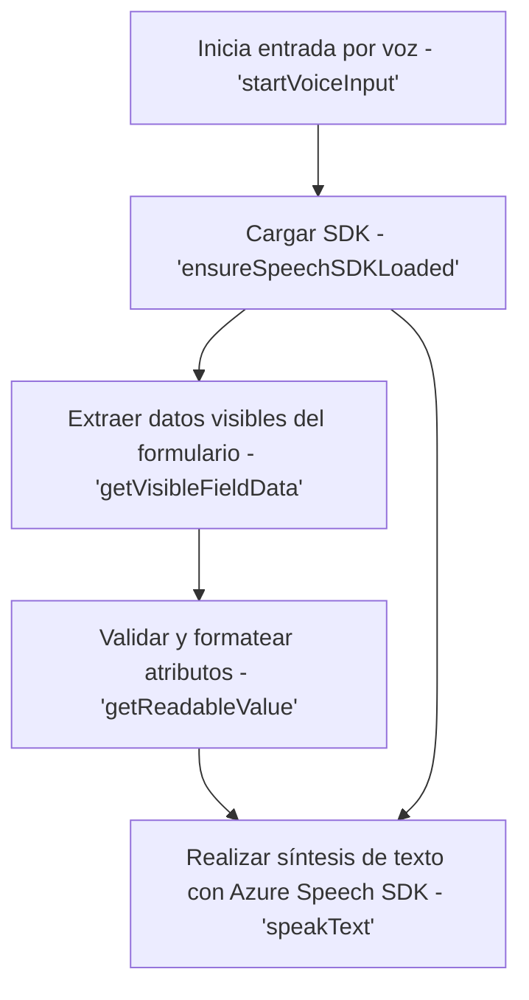
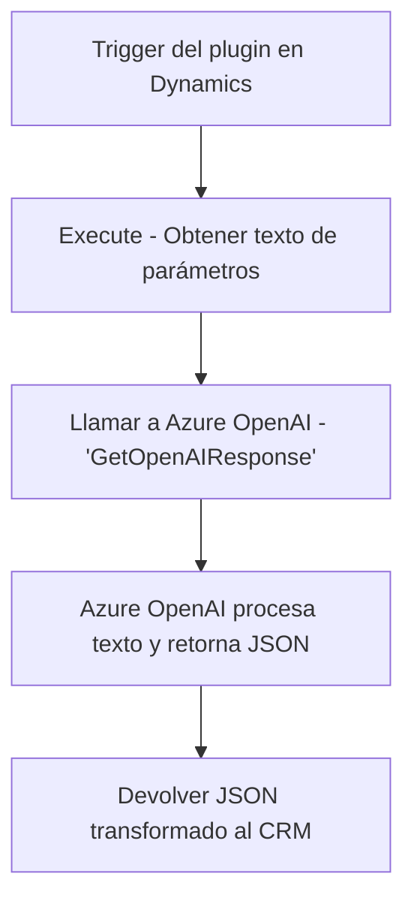

### Breve resumen técnico:
Los archivos proporcionados pertenecen a una solución que integra un sistema CRM basado en Microsoft Dynamics con tecnologías de inteligencia artificial y procesamiento del lenguaje natural, como Azure Speech SDK y Azure OpenAI. Se centra en la interacción entre formularios web del CRM y la API de Azure, añadiendo funcionalidades como síntesis de voz, reconocimiento de voz y transformación de textos a formatos estructurados.

---

### Descripción de arquitectura:
1. **Tipo de solución**: El repositorio forma parte de un sistema CRM extendido (Microsoft Dynamics) que proporciona integración con tecnologías de procesamiento de lenguaje. Incluye tanto un frontend para interacción directa del usuario con el formulario, complementado por una operación de "entrada y procesamiento de voz", como un backend con manejo de plugins para enriquecer datos con una API externa.
   
2. **Estructura de la solución**:
   - **Frontend**:
     - Proporciona funciones de interacción directa con usuarios (lectura y procesamiento de formularios por voz y visualización en Dynamics CRM).
     - Modularidad basada en funciones separadas para la síntesis de voz, extracción de datos, procesamiento de comandos hablados y asignación de valores a formulario.
   - **Backend**:
     - Plugin basado en Azure OpenAI para ejecutar reglas específicas y transformar datos en estructuras JSON: adecuado para almacenarlos en el CRM o utilizarlos para otros análisis.

3. **Arquitectura de software**: 
   - **Arquitectura multicapa (n capas)**:
      - La solución tiene una separación entre el manejo visual (Frontend/JS), la lógica y procesamiento de datos en el sistema CRM (Plugins).
   - **Modularización**:
      - Cada archivo contiene diferentes funciones/clases, definidas para realizar tareas específicas, con bajo acoplamiento.
   - **Desacoplamiento mediante SDKs/APIs externas**:
      - El software depende de integraciones dinámicas con Azure Speech SDK y Azure OpenAI.
   - **Uso de patrones de diseño en el backend**:
      - Plugin Pattern: Implementación en Microsoft CRM.
      - Service Locator: Uso de `IServiceProvider`.

---

### Tecnologías usadas:
1. **Frontend**:
   - Lenguaje: JavaScript.
   - Framework backend/CRM: Microsoft Dynamics CRM (`Xrm.WebApi`).
   - Servicios Cloud: 
     - Azure Speech SDK para síntesis de voz y reconocimiento.
     - Azure OpenAI API para procesamiento del texto.
2. **Backend**:
   - Lenguaje: C# (.NET framework).
   - API de Microsoft Dynamics CRM: `Microsoft.Xrm.Sdk`.
   - API externa: Azure OpenAI.
   - JSON Manipulation: `Newtonsoft.Json` y `System.Text.Json`.

---

### Diagramas Mermaid:

#### Frontend: Interacción de voz con el formulario y Azure

---

#### Backend: Transformación en plugin con Azure OpenAI

---

### Conclusión final:
Este repositorio forma parte de una solución integral para integrar procesamiento y síntesis de voz con formularios en Microsoft Dynamics CRM. Utiliza una arquitectura **n capas** que separa el frontend basado en servicios web y SDKs para Azure Speech de un backend basado en plugins y dependiente de Azure OpenAI. La solución demuestra modularidad al dividir cada funcionalidad con objetivos claros, dinamismo al cargar SDKs en tiempo de ejecución y un diseño que aprovecha patrones de desarrollo recomendados para extensiones de CRM (`Plugin Pattern`). Las dependencias en tecnologías de Microsoft Dynamics 365, Azure AI y JavaScript confirman una integración cloud-first para potenciar las capacidades del sistema CRM.