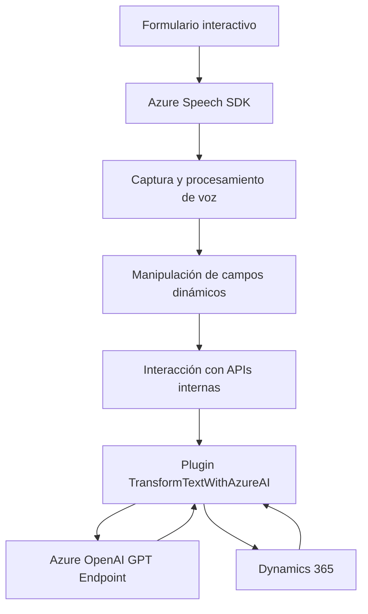

### Breve resumen técnico

La solución en el repositorio está diseñada para procesar formularios interactivos, integrar reconocimiento y síntesis de voz mediante Azure Speech SDK, y transformar texto en estructuras JSON utilizando Azure OpenAI. Es una combinación de un sistema frontend interactivo basado en JavaScript y extensiones backend mediante Dynamics 365 Plugins en C#.

---

### Descripción de arquitectura

**Tipo de solución:**  
La solución abarca dos componentes principales:
1. **Frontend:** Con interacción en tiempo real para captura y síntesis de voz, así como procesamiento de formularios.
2. **Backend:** Extensiones basadas en plugins de Dynamics 365 para transformar texto y procesar datos con Azure OpenAI.

**Arquitectura general:**  
1. En el frontend, la arquitectura sigue un enfoque modular con funciones independientes. Cada función tiene una responsabilidad específica, como carga dinámica de SDKs, extracción y manipulación de campos de formularios, interacción con APIs internas y procesamiento de voz.
2. En el backend, la arquitectura sigue el patrón de Plugins y se estructura en capas que delegan lógica compleja a servicios externos (Azure OpenAI) y manejan eventos específicos en Dynamics 365. Este enfoque facilita una **n capas/modular** compatible con la arquitectura empresarial.

---

### Tecnologías y patrones utilizados

#### **Frontend**
- **Lenguaje:** JavaScript.
- **Framework:** Ninguno específico (utilización directa de APIs y SDK externo).
- **SDK:** Azure Speech SDK para captura y síntesis de voz.
- **Patrones destacados:** 
  - Carga dinámica de dependencias (Azure Speech SDK).
  - Procesamiento de datos en tiempo real.
  - Interacción con APIs RESTful.

#### **Backend**
- **Lenguaje:** C#.
- **Framework:** Dynamics 365 Plugin Framework.
- **Librerías:** 
  - `Newtonsoft.Json` para manejo de objetos JSON.
  - `System.Net.Http` para integración con APIs REST (Azure OpenAI).
- **Patrones destacados:**
  - Plugin pattern para eventos en Dynamics 365.
  - Integración con API externa (Azure OpenAI).
  - Procesamiento de texto estructurado con servicios distribuidos.

---

### Dependencias y componentes externos

1. **Azure Speech SDK:** Manejado dinámicamente en el frontend desde el CDN oficial (`https://aka.ms/csspeech/jsbrowserpackageraw`).
2. **Azure OpenAI GPT Endpoint:** Utilizado en el backend para transformar texto.
3. **Dynamics 365 Plugin Framework:** Extiende la funcionalidad del sistema CRM.
4. **Librerías estándar:** `Newtonsoft.Json` y `System.Text.Json` para procesamiento de JSON.
5. **APIs internas de Dynamics 365:** `Xrm.WebApi` y contexto de ejecución de plugins (`IPluginExecutionContext`).

---

### Diagrama **Mermaid** válido para GitHub

---

### Conclusión final

La solución corresponde a una arquitectura **modular basada en n capas**, orientada principalmente a la integración de funcionalidades avanzadas como captura/síntesis de voz, transcripción, automatización de formularios y procesamiento avanzado de texto mediante Azure OpenAI. Su diseño combina tecnología frontend con plugins backend para lograr una experiencia fluida en sistemas empresariales como Dynamics 365.