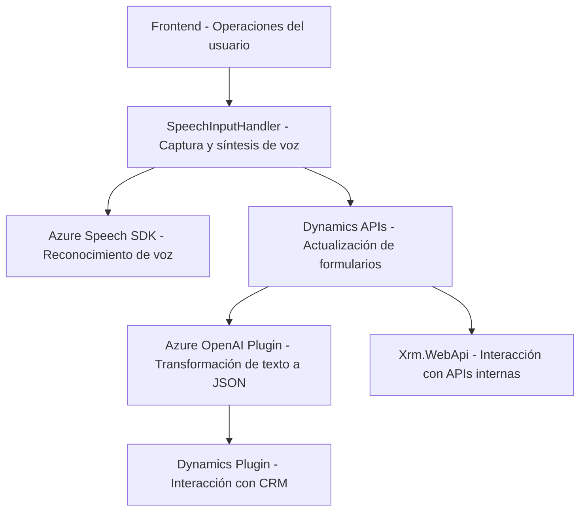

### Breve resumen técnico

Este repositorio contiene soluciones distribuidas que integran **Microsoft Dynamics 365** con las funcionalidades de **Azure Speech SDK** y **Azure OpenAI Service**. Se observa una clara orientación hacia el procesamiento de datos de formularios utilizando voz y texto, además de la integración con servicios de IA para tareas de transformación avanzada.

---

### Descripción de la arquitectura

La arquitectura del sistema parece seguir un enfoque híbrido, donde se combinan plugins en Dynamics 365 (componente de back-end con ejecución bajo la interfaz IPlugin) y se complementan con archivos de JavaScript que funcionan como microfrontend para gestionar la entrada de voz desde Azure Speech SDK y sus interacciones con Microsoft Dynamics. Se integra lógica de microservicios externos como **Azure OpenAI Service** y **Azure Speech SDK**. La estructura modular y el desacoplamiento de las responsabilidades (voz, procesamiento de formularios y AI) apuntan hacia una **arquitectura de capas**, además de elementos de **arquitectura hexagonal** debido a la clara separación entre la lógica del sistema y los servicios externos.

---

### Tecnologías, frameworks y patrones usados

1. **Repositorios descritos:**
   - Uso del SDK de **Azure Speech**.
   - Interacción con **Microsoft Dynamics 365 SDK** y APIs (`Xrm.WebApi.online`).
   - Plugin desarrollado en **.NET**, utilizando C#.
   - Microservicios basados en **Azure OpenAI GPT-4**.
   
2. **Patrones arquitectónicos:**
   - **Event-driven**: Muchas funciones se activan ante eventos o acciones específicas, como la carga del SDK o la captura de voz.
   - **Modularidad**: Cada archivo tiene funciones bien separadas y orientadas a un propósito único.
   - **Fachada**: Funciones como `startVoiceInput` actúan como un punto de entrada unificado que encapsula detalles técnicos.
   - **Adaptador**: Transformaciones entre APIs externas (Azure, Dynamics).

---

### Dependencias o componentes externos presentes o inferidos

- **Azure Speech SDK**: Para entrada de voz y síntesis de voz.
- **Azure OpenAI GPT-4 Service**: Para transformar texto mediante IA avanzada.
- **Microsoft Dynamics 365 Managed SDK Toolkit**: Para agilidad en el procesamiento de entidades y datos del CRM.
- **Librerías auxiliares**:
  - `HttpClient` y gestión avanzada de JSON (`Newtonsoft.Json` y `System.Text.Json`).
  - Servicios de manipulación de DOM típicos en JavaScript.

---

### Diagrama Mermaid para GitHub Markdown

---

### Conclusión final

Este repositorio implementa una solución híbrida basada en la integración de múltiples servicios de **Microsoft Azure** y **Dynamics 365**, logrando sinergia entre inputs de voz, procesamiento con IA y actualización dinámica de formularios en el CRM. Su orientación modular, desacoplamiento y utilización de APIs externas, junto con patrones claros como **event-driven** y **modularidad**, permiten mantener una arquitectura robusta, extensible y altamente adaptable.