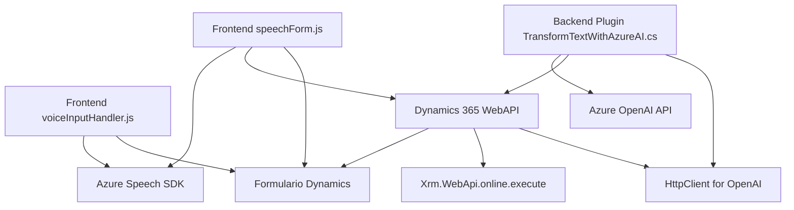

### Breve resumen técnico
El repositorio implementa una solución que integra formularios de Dynamics 365 con funcionalidades avanzadas de voz, procesamiento de texto y transformación automática mediante servicios de Azure, como el Speech SDK y OpenAI. Incluye tanto componentes frontend (JavaScript) como plugins para CRM (C#).

---

### Descripción de arquitectura
La arquitectura general es de **n-capas**, claramente separadas entre frontend, lógica de negocio y servicios externos. Sin embargo, existe una integración monolítica para procesos específicos (voz, texto dinámico y APIs custom). Los patrones destacados en la arquitectura son:
1. Modularidad funcional: Las funciones en los archivos JS y el plugin en C# se dividen según su propósito.
2. Integración con SDK y servicios externos: Azure Speech y OpenAI potencian la funcionalidad.
3. Modelo de servicio en Dynamics 365: Plugins y APIs personalizadas se integran sin modificaciones significativas en la arquitectura global de Dynamics.

---

### Tecnologías usadas
1. **Frontend (JavaScript)**:
   - Azure Speech SDK: Voz y texto a voz.
   - Dynamics 365 Web API (`Xrm.WebApi`): Gestión y manipulación de formularios y registros.
2. **Backend Dynamics Plugin (C#)**:
   - Azure OpenAI APIs: Procesamiento de texto hacia JSON estructurado.
   - Microsoft Dynamics CRM SDK: Gestión de eventos y ejecución dentro del CRM.
   - Newtonsoft.Json / System.Text.Json: Serialización/deserialización JSON.
   - .NET: Para manejo de servicios HTTP y procesamiento lógico.
3. **Azure Services**:
   - Speech SDK para entrada/salida de voz.
   - OpenAI para transformación de texto asistida por IA.

---

### Dependencias o componentes externos presentes
1. **Azure Speech SDK**: Entradas por voz y síntesis de voz.
2. **Azure OpenAI API**: Procesamiento avanzado de texto.
3. **Microsoft Dynamics SDK**: Plugins y APIs (`Xrm.WebApi`).
4. **Newtonsoft.Json** / **System.Text.Json**: Serialización y manipulación de JSON.
5. **DOM y APIs JavaScript**: Manipulación de formularios y elementos en frontend.

---

### Diagrama Mermaid válido para GitHub

---

### Conclusión final
La solución es un **conjunto de componentes en n-capas**, que utiliza ampliamente servicios externos de Azure integrados con Dynamics 365. La arquitectura destaca por su modularidad y claridad en la separación de responsabilidades. Mientras los archivos JavaScript manejan la lógica de frontend y voz, el plugin en C# facilita la interacción con servicios de inteligencia artificial. Esto garantiza una solución eficiente y flexible, ideal para empresas que deseen automatizar procesos y utilizar voz como interfaz. Sin embargo, una oportunidad de mejora sería la mayor adopción de principios de arquitectura hexagonal para desacoplar dependencias externas.