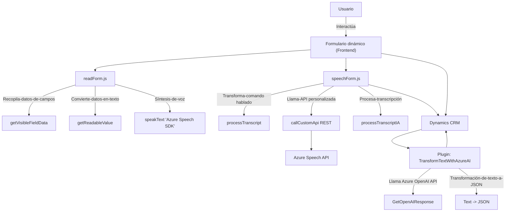

### Análisis Técnico

#### Resumen técnico
El sistema tiene tres componentes clave:
1. **Frontend**:
   - Utiliza **Azure Speech SDK** para reconocimiento y síntesis de voz desde formularios dinámicos.
   - Dos archivos principales (`readForm.js` y `speechForm.js`) gestionan la interacción del usuario con formularios y voz, integrándose directamente en el contexto de Dynamics.
   - Modularidad a nivel de funciones con patrones como `Facade` y `Event-driven programming`.

2. **Backend plugin**:
   - Implementa un plugin (`IPlugin`) para Dynamics CRM que usa **Azure OpenAI API** para transformar texto en JSON estructurado según reglas específicas.

#### Descripción de arquitectura
La arquitectura general parece ser **cliente-servidor** con un enfoque **n-capas (multitier)**:
- La capa frontend contiene lógica para interacción con el usuario (extracto de datos y reconocimiento/síntesis de voz).
- La capa backend está basada en plugins que interactúan dinámicamente con los datos del sistema CRM usando APIs de servicios externos (Azure).

#### Tecnologías usadas
1. **Frontend**:
   - **Javascript**: Mediante funciones para la integración y manejo del SDK.
   - **Azure Speech SDK**: Reconocimiento de voz y síntesis de texto.
   - **Facades** y estructura modular para simplificar la gestión.

2. **Backend**:
   - **C#**: Lenguaje orientado a objetos para la creación del plugin.
   - **Microsoft.Xrm.Sdk**: Interacción con el pipeline de Dynamics CRM.
   - **Azure OpenAI API**: Procesamiento de lenguaje natural y generación de JSON semántico.
   - **System.Net.Http**, **Newtonsoft.Json.Linq**, y **System.Text.Json**: Para manejo de API REST y operaciones con JSON.

---

### Diagrama **Mermaid** para **GitHub Markdown**

---

### Conclusión Final
Esta solución se presenta como una integración avanzada entre componentes frontend y plugins personalizados para Dynamics CRM utilizando servicios de Azure. La arquitectura forma parte de un enfoque **n-capas**, que permite una clara separación de responsabilidades: el frontend gestiona la interacción con los usuarios, incluida la entrada y salida de voz mediante **Azure Speech SDK**, mientras que el backend usa plugins que se integran de manera fuerte con APIs externas como Azure OpenAI. Además, la solución aplica patrones como **Facade** (para simplificar la interacción con SDK) y programación por eventos mediante funciones asincrónicas en **JavaScript**.