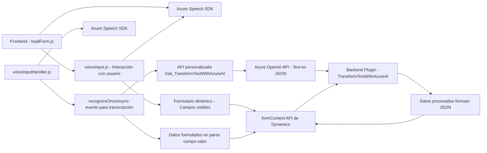

## Breve resumen técnico

El repositorio dado implementa una solución que combina frontend y backend para manejar formularios interactivos con funcionalidades de síntesis y transcripción de voz. En el frontend se utilizan JavaScript y Azure Speech SDK para la síntesis de voz y transcripción. En el backend, se emplea un plugin de Microsoft Dynamics CRM que integra Azure OpenAI para transformar texto en JSON estructurado.

---

## Descripción de arquitectura

La arquitectura del sistema es una combinación de tres capas principales, y puede describirse como **n capas** con integración a servicios externos:
1. **Frontend:** JavaScript emplea Azure Speech SDK para interactuar con formularios en dinámica y realizar síntesis/transcripción en tiempo real.
2. **Backend:** Un plugin (C#) ejecutado en Microsoft Dynamics CRM actúa como mediador entre los datos de los formularios y un servicio de inteligencia artificial (Azure OpenAI), procesando texto y aplicando normas de transformación.
3. **Servicios Externos:** Uso de APIs externas como Azure Speech SDK y Azure OpenAI.

El sistema emplea procesamiento basado en eventos y una integración con servicios REST, mientras que el backend sigue un patrón orientado a plugins.

---

## Tecnologías usadas

### **Frontend:**
- **JavaScript:** Para la lógica del cliente, extracción de datos de formularios, integración de Azure Speech SDK.
- **Azure Speech SDK:** Manejo de síntesis y transcripción de voz.

### **Backend:**
- **C#:** Para la implementación del plugin CRM.
- **ASP.NET Plugin Framework:** Para desarrollar extensiones en Microsoft Dynamics 365 CRM.
- **Microsoft Dynamics CRM SDK (Xrm):** Para la interacción directa con los formularios y datos del sistema.
- **Azure OpenAI:** Servicio de inteligencia artificial que procesa texto y lo devuelve en JSON.

### **Dependencias adicionales:**
- **Newtonsoft.Json:** Parsing y manejo de estructuras JSON en el backend.
- **System.Net.Http:** Solicitudes HTTP hacia servicios como Azure OpenAI.
- **Azure Speech SDK CDN:** Carga dinámica del SDK en el navegador.

---

## Diagrama Mermaid válido para GitHub

---

## Conclusión final

El repositorio implementa una solución de **n capas** que facilita la interacción con formularios en aplicaciones basadas en Microsoft Dynamics CRM, añadiendo capacidades de voz e inteligencia artificial. La arquitectura está diseñada para ser modular y extensible, con una integración significativa con servicios externos como **Azure Speech SDK** y **Azure OpenAI**. El backend emplea un abordaje basado en plugins y la invocación de APIs externas. Aunque la solución es flexible y funcional, su diseño puede ser optimizado integrando patrones adicionales, como **hexagonal** o la encapsulación de servicios externos en adaptadores más robustos.