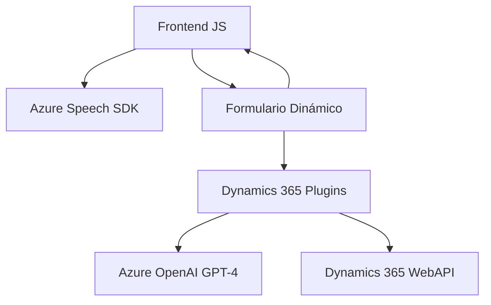

### Breve resumen técnico
El repositorio parece estar diseñado para enriquecer la experiencia del usuario mediante la integración de reconocimiento de voz y síntesis. Utiliza **Azure Speech SDK** y **Azure OpenAI** para el procesamiento de voz y texto, mientras interactúa con formularios dinámicos en Microsoft Dynamics CRM. Este sistema maneja características como actualización de formularios basados en voz y transformación de texto con reglas inteligentes.

---

### Descripción de arquitectura
#### Tipo de solución
La solución integra **frontend** basado en JavaScript con un **backend** basado en plugins de Dynamics 365, que se comunica con servicios externos de Azure como Speech SDK y OpenAI. Es una mezcla de arquitectura **cliente-servidor con integración de APIs externas**.

#### Tipo de arquitectura
En términos globales, la arquitectura del sistema probablemente corresponde a un **hexágono adaptado o arquitectura centrada en APIs** con diversos puntos de interacción:
1. **Frontend:** Clientes que realizan síntesis y reconocer voz.
2. **Backend (CRM):** Procesamiento de datos mediante plugins alojados en Dynamics CRM.
3. **API externas:** Servicios de procesamiento como Azure Speech SDK y OpenAI.

#### Elementos clave:
- **Frontend:** Realiza tareas como síntesis de voz y reconocimiento, trabajando con datos dinámicos de formularios.
- **Backend:** Plugins Dynamics CRM implementan la lógica de negocios y ejecutan transformaciones avanzadas de texto utilizando API de Azure OpenAI.
- **Servicios externos:** Integraciones con Azure para el procesamiento de voz y generación de contenido basado en IA.

#### Patrones utilizados
1. **Patrón Repositorio:** Usado en Dynamics CRM para acceder y manipular campos de formularios.
2. **Patrón Plugin-based:** Para extender la funcionalidad del CRM mediante lógica encapsulada en plugins.
3. **Patrón Lazy Load:** SDKs como Azure Speech SDK se cargan dinámicamente en el navegador solo cuando son necesarios.

---

### Tecnologías usadas
1. **Frontend:**
   - **JavaScript:** Lenguaje principal para las integraciones con Azure Speech SDK.
   - **Azure Speech SDK:** Utilizado para reconocimiento y síntesis de voz.
   - **Dynamics 365 WebAPI:** Para recuperar y actualizar datos de formularios en tiempo real.
2. **Backend:**
   - **C#:** Lenguaje central para el desarrollo de plugins en Dynamics CRM.
   - **Azure OpenAI GPT-4:** Transformación de texto según reglas avanzadas vía API.
   - **Newtonsoft.Json:** Manejo de estructuras JSON.
   - **System.Net.Http:** Comunicación con APIs externas.
3. **CRM:**
   - **Dynamics 365:** Base para manejar los formularios y datos estructurados.
   
---

### Diagramas **Mermaid**
Diagrama que representa las interacciones entre los elementos de la solución:

---

### Conclusión final
La solución presentada se centra en la integración de servicios externos como Azure Speech SDK y OpenAI para complementar funcionalidades en Microsoft Dynamics 365. Su arquitectura es híbrida, combinando componentes cliente-servidor y servicios basados en APIs externas. Los patrones usados realzan la modularidad y escalabilidad del sistema, con suficiente flexibilidad para manejar aplicaciones de voz y textos transformados mediante IA en un contexto CRM.

El diseño es perfectamente apto para amplias personalizaciones en empresas que busquen enriquecer la interacción de usuario en escenarios como ventas, atención al cliente o procesamiento de datos dinámicos. Sin embargo, depender de servicios de Azure exige una estricta gestión de claves de seguridad y costos de suscripción.