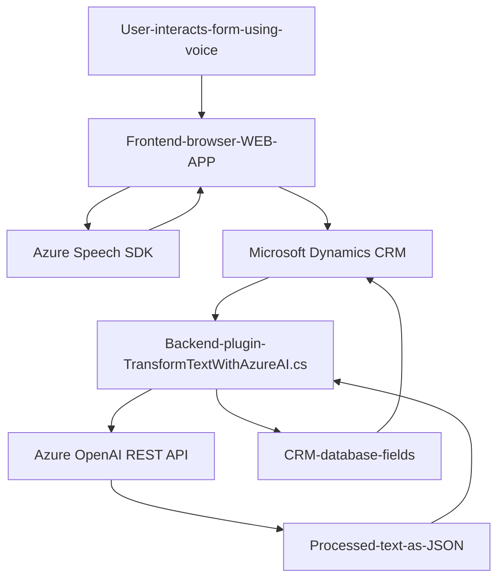

### 📘 **Análisis Técnico**

#### **Breve Resumen Técnico**
El repositorio parece contener una solución híbrida orientada a la integración de funcionalidades de inteligencia artificial (Azure Speech SDK y Azure OpenAI) con sistemas empresariales como Microsoft Dynamics CRM. Se divide principalmente en:
1. **Frontend (JS):** Para interacción con formularios y generación dinámica de voz/texto.
2. **Backend (C# Plugin):** Un `plugin` que conecta Dynamics CRM con Azure OpenAI para procesamiento de texto transformado.

---

#### **Arquitectura**
1. **Frontend:**  
   El diseño del frontend sigue un modelo **modular con integración de eventos**. Tiene funciones especializadas para:
   - Interactuar con formularios mediante Contextos/DOM.
   - Procesar reconocimiento de voz y transformación de texto usando Azure Speech SDK.
   - Usar APIs personalizadas en el backend para trabajar con entradas dinámicas.

2. **Backend:**  
   El plugin en C# sigue el patrón **Plugin Architecture**, basado en la integración de servicios de Microsoft Dynamics CRM. Usa un enfoque orientado a **servicios externos** para realizar el procesamiento del texto con Azure OpenAI.

3. **Global:**  
   La arquitectura general combina patrones de **event-driven architecture (evento/callback)** en el frontend, junto con una solución **cliente-servidor** que intercambia datos entre el cliente (JS) y el backend plugin (C#). A nivel global, se puede considerar una arquitectura de **n-capas**:
   - **Capa de presentación:** Interacción del usuario con aplicaciones frontend.
   - **Capa lógica:** Responsable del procesamiento de voz y transformación del texto (Azure Speech SDK y Azure OpenAI).
   - **Capa de datos:** Microsoft Dynamics CRM como base de datos y hub de integraciones.

---

#### **Tecnologías Usadas**
1. **Frontend:**  
   - **Azure Speech SDK:** Para reconocimiento/transformación de voz en texto y generación de audio.  
   - **Vanilla JavaScript:** Uso de módulos funcionales para interacción y manipulación de formularios.  
   - **Dynamics CRM Contexts (Xrm.WebApi):** Lectura, escritura y actualización de campos en formularios de Dynamics CRM.

2. **Backend:**  
   - **Microsoft Dynamics CRM SDK (C#):** Para manipular datos dentro del CRM.  
   - **Azure OpenAI API:** Para realizar tareas de transformación avanzada de texto mediante modelos de inteligencia artificial.  
   - **System.Net.Http:** Comunicación RESTful con Azure OpenAI.  
   - **Serialización JSON:** Uso de `Newtonsoft.Json` y `System.Text.Json` para manejar datos en formatos JSON.

3. **General:**  
   - **PROMISE/Asynchronous Programming:** Implementado en el frontend para la gestión eficiente de operaciones asincrónicas.  
   - **Plugin Execution Pipeline:** Automatización de eventos y lógica de negocio en Dynamics CRM.

---

#### **Dependencias Externas**
- **Frontend:**
  - Azure Speech SDK para reconocimiento/generación de voz.
  - Dynamics CRM API (`Xrm.WebApi`) para interacción con formularios.
  
- **Backend:**
  - Azure OpenAI REST API para procesamiento de texto.
  - Microsoft Dynamics CRM SDK para trabajo con plugins y datos.
  - External libraries for JSON processing (Newtonsoft.Json / System.Text.Json).

---

### ⚙️ **Diagrama Mermaid**

---

### **Conclusión Final**
- **Tipo de solución:** Este repositorio parece implementar una solución **híbrida frontend-backend** que automatiza interacciones entre el usuario y formularios dinámicos (en Dynamics CRM), usando Azure Speech SDK para reconocimiento/síntesis de voz y un `plugin` en C# para procesar texto con Azure OpenAI.
- **Patrones:** El repositorio emplea patrones bien definidos como:
  - **Modularización en frontend:** Cada función se especializa en una tarea (verificación, extracción de datos de formulario, síntesis de voz, etc.).
  - **Event-driven en frontend:** Se usa la lógica basada en eventos y promesas para cargar recursos externos como el Speech SDK.
  - **Plugin-Oriented Backend:** Carga y ejecución dentro del pipeline de Dynamics CRM, integrando reglas predefinidas con APIs externas como Azure OpenAI.
- **Arquitectura:** La solución sigue la arquitectura de **n capas**, con integración dinámica entre componentes del sistema CRM y servicios externos basados en REST.

Esta combinación de tecnologías y patrones asegura escalabilidad y flexibilidad, aunque sería necesario implementar mejores prácticas (por ejemplo, manejo de credenciales del API).