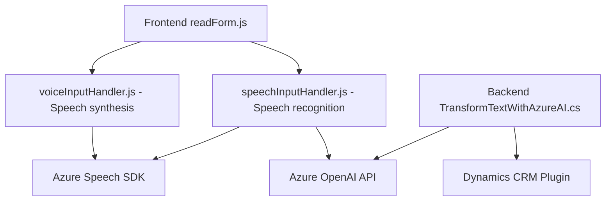

### Breve resumen técnico

El repositorio analiza un conjunto de soluciones orientadas a la voz e inteligencia artificial (IA) mediante el uso de SDKs de Azure y plataformas como Microsoft Dynamics CRM. Los archivos están dirigidos principalmente al reconocimiento de voz, síntesis de texto a voz, procesamiento de texto y transformación de datos con servicios externos de IA.

### Descripción de arquitectura

La solución tiene características de un diseño **modular basado en n capas**, que integra lógica de negocio, interacción con formularios y APIs externas mediante SDKs, además de implementar un plugin para Dynamics CRM. Tiene una **arquitectura orientada a eventos y servicios** integrada a través de dependencias externas como el **Azure Speech SDK** y **Azure OpenAI API**. No es una arquitectura estrictamente de microservicios, pero puede usarse en sistemas distribuidos para tareas específicas de procesamiento.

### Tecnologías usadas

1. **Frontend (JavaScript):**
   - SDK de Azure Speech: Reconocimiento y síntesis de voz.
   - JavaScript para la manipulación y lectura de formularios.
   - Promesas (asíncrono) para llamadas externas y procesamiento de flujo lógico.

2. **Backend (C# para plugins):**
   - Microsoft Dynamics SDK.
   - Azure OpenAI API para transformación de texto.
   - NewtonSoft.Json y System.Text.Json para manejo JSON.
   - System.Net.Http para comunicación HTTP.

3. **Patrones de diseño:**
   - Modularización (alto nivel de cohesión en funciones específicas).
   - Diseño orientado a servicios y eventos: Integración con SDKs de terceros y APIs externas.
   - Uso de comunicación asincrónica.
   - Carga condicional de SDKs externos.

### Dependencias o componentes externos presentes

- **Azure Speech SDK:** Para reconocimiento de voz y síntesis de texto a voz.
- **Azure OpenAI API:** Para transformar texto en estructuras JSON según normas predefinidas.
- **Microsoft Dynamics CRM SDK:** Para integración directa con formularios y lógica interna.
- **Newtonsoft.Json:** Deserialización JSON en el plugin de Dynamics CRM.
- **System.Net.Http:** Para manejar solicitudes HTTP hacia servicios externos.

---

### Diagrama Mermaid válido para GitHub Markdown

---

### Conclusión final

La solución implementada en el repositorio apunta a una integración avanzada de reconocimiento, síntesis de voz y transformaciones de texto en aplicaciones dinámicas respaldadas por herramientas como **Azure Speech SDK** y **Azure OpenAI API**. La arquitectura es **modular y basada en n capas**, con lógica distribuida entre el frontend (JavaScript) y plugins backend (C#). Ofrece gran flexibilidad para integrar servicios de IA y compatibilidad dinámica con plataformas como Microsoft Dynamics CRM, orientándose hacia una **arquitectura componible y extensible**, ideal para sistemas empresariales.