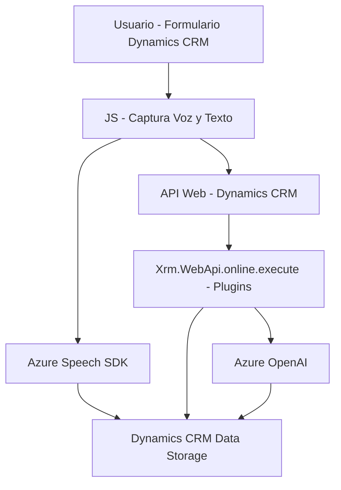

## **Resumen Técnico**

- **Tipo de solución:**  
La solución es un sistema integrado compuesto por módulos que conectan un frontend interactivo en JavaScript con un backend en Dynamics CRM mediante plugins y procesamiento adicional con servicios de Azure, incluyendo Speech SDK y OpenAI. Primordialmente, la solución se categoriza como una integración de plataforma CRM con capacidad de procesamiento de datos basada en IA y síntesis/transcripción de voz.

- **Componentes analizados:**  
  - **Frontend/JS:** Herramientas de voz para capturar y analizar datos interactivamente en formularios y comunicar las modificaciones al sistema CRM.
  - **Backend (.NET Plugin):** Extensiones y lógica personalizada en Dynamics CRM con procesamiento de texto basado en Inteligencia Artificial.

---

## **Descripción de la arquitectura**

La arquitectura parece ser una combinación de **n-capas**:
1. **Frontend**: Implementación en JavaScript para realizar síntesis de voz, transcripción y manipulación de formularios en Dynamics CRM.
2. **Backend/Integration Layer**: Plugins desarrollados en .NET que manejan la lógica server-side en Dynamics CRM y conexión segura con la API de Azure. Tiene comunicación explícita entre los servicios para la gestión y respuesta de datos.
3. **External APIs**: Utilización de servicios alojados en Azure, como Speech SDK y OpenAI, ambos responsables de la transcripción de datos en lenguaje natural y generación de texto estructurado.

Además, la solución implementa patrones de integración como:
- **Servicio externo:** Las dependencias con Azure Speech SDK y OpenAI están gestionadas a través de HTTP APIs utilizando claves de autorización.
- **Facade:** El plugin encapsula la comunicación entre Dynamics CRM y OpenAI, proporcionando una interfaz simplificada para las transformaciones textuales.

---

## **Tecnologías Usadas:**
1. **Frontend:**  
   - **JavaScript:** Para la creación de scripts del cliente (`voiceInput.js`, `speechForm.js`).  
   - **Azure Speech SDK (Web)**: Para funcionalidades de síntesis de voz y transcripción de audio a texto en el frontend.  
   - **Microsoft Dynamics CRM (modelos de datos)**: Para interacción en formularios (`formContext`, `executionContext`).  

2. **Backend:**  
   - **C# y .NET Framework/Core:** Implementación del plugin en Dynamics CRM para extender la funcionalidad administrativa.  
   - **Azure OpenAI API:** Para el procesamiento mediante el modelo GPT hospedado en Azure con transformaciones de texto.  
   - **Newtonsoft.Json/System.Text.Json:** Para manejo eficiente de JSON en .NET.  
   - **Azure Speech SDK (con JavaScript):** Comunicación con APIs de Azure Speech desde el frontend.  

---

## **Dependencias o componentes externos**
1. **Azure Speech SDK**  
   - Endpoint principal: `https://aka.ms/csspeech/jsbrowserpackageraw` para carga.
   - Proporciona síntesis de voz y transcripción del audio.
   
2. **Azure OpenAI API**  
   - Modelo utilizado: GPT-4.
   - Procesa texto entrado en formas complejas y lo devuelve como JSON.  

3. **Dynamics CRM SDK**  
   - CRM API directamente utilizada por los plugins y los scripts JavaScript.

4. **JavaScript APIs**  
   - Operaciones asíncronas para grabación y procesamiento de voz.  
   
---

## **Diagrama Mermaid**
A continuación se describe la interacción entre los componentes del sistema utilizando un diagrama Mermaid:

---

## **Conclusión Final**

La solución propuesta es una integración para Microsoft Dynamics CRM destinada a mejorar la interacción usuario-sistema mediante funcionalidades de generación y procesamiento de voz, así como la integración de inteligencia artificial de Azure. Puede clasificarse como una arquitectura **n-capas** con una separación clara de responsabilidades:

- **Frontend de voz:** para interacción directa con el usuario.
- **Backend CRM con Plugins:** lógica personalizada y APIs externas que enriquecen el contenido del sistema.
- **Servicios Externos:** Comunicación con Azure para inteligencia artificial y síntesis de voz.

Aunque funcional y bien segmentada, se puede mejorar la seguridad de la configuración externa (hardcoded API keys) y realizar depuración más robusta para las dependencias externas.