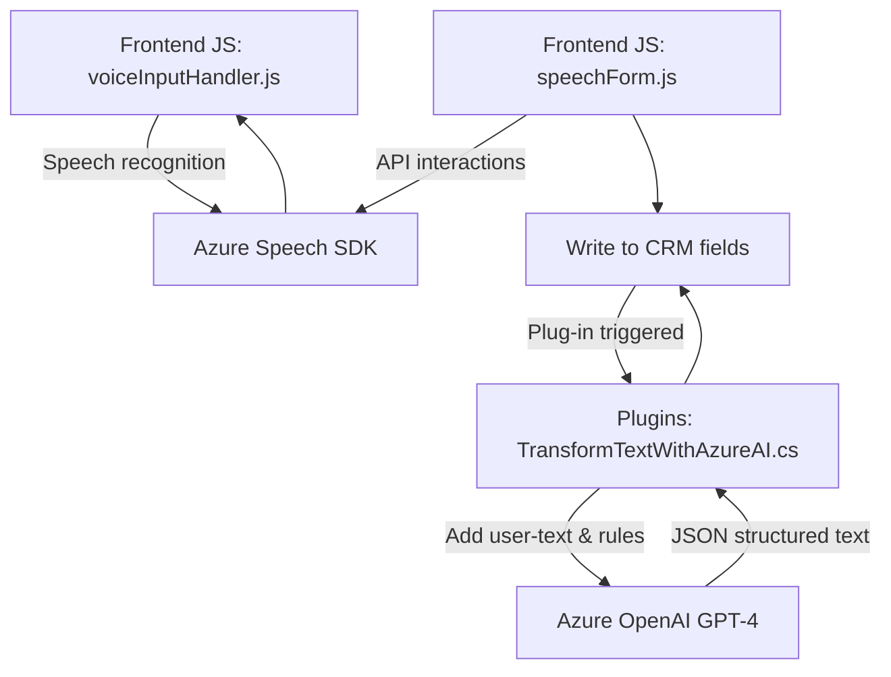

# Breve resumen técnico
El repositorio integra funcionalidades frontales y backend para la interacción entre formularios de Dynamics CRM, servicios de AI como Azure Speech SDK, y Azure OpenAI GPT-4. Su objetivo principal es aumentar la accesibilidad (lectura por voz) y facilitar la entrada de datos mediante reconocimiento de voz y texto estructurado, implementando patrones avanzados para integración API y procesamiento de datos.

---

# Descripción de arquitectura
La solución implementada en el repositorio tiene aspectos híbridos:
1. **Front-end**: Implementado mediante JavaScript, interactúa con servicios como Azure Speech SDK para funcionalidades relacionadas con lectura y reconocimiento de voz.
2. **Plug-in Dynamics CRM**: Define lógica de negocio con un patrón plugin que implementa `IPlugin`. Este componente utiliza Azure OpenAI GPT-4 para transformar el texto ingresado en contenido JSON que se mapea directamente.
3. **Capas de procesamiento**:
    - Capa de entrada de voz/texto: Generación y reconocimiento en tiempo real para proporcionar datos al CRM.
    - Capa de integración: En la arquitectura de microservicios usa APIs (Azure Speech y OpenAI GPT-4).
    - Backend con Dynamics CRM: Ejecuta lógica de negocio en plugins con soporte de servicios externos.

La arquitectura combina un diseño **hexagonal (ports & adapters)**, especialmente para el plug-in, y patrones de integración en repositorios para el CRM.

---

# Tecnologías usadas
1. **Frontend (JavaScript)**:
   - APIs dinámicas (Azure Speech SDK para síntesis y reconocimiento de audio).
   - Promises y callbacks para tareas asíncronas.
   - Modulación excluyente para crear procesos del SDK (como cargadores dinámicos).
2. **Backend (C#, Dynamics CRM)**:
   - **Microsoft.Xrm.Sdk**: Mapeo e integración directa con modelos y atributos de CRM.
   - **Azure OpenAI GPT-4**: Transformaciones avanzadas en contexto empresarial.
   - **System.Net.Http** y **Newtonsoft.Json** para realizar consultas y trabajar con datos JSON.
3. **Architectural Patterns**:
   - *Plugin Design*: En el caso del archivo `TransformTextWithAzureAI.cs`.
   - *Fachada de API*: Visto en los componentes frontend con el Speech SDK.
   - *Modularización fría*: Uso de funciones especializadas en JavaScript para controlar la lógica.
   - *Hexagonal*: Observado en el diseño desacoplado de integración para Dynamics CRM.

---

# Diagrama Mermaid válido para GitHub

---

# Conclusión final
Este repositorio representa una solución avanzada para la integración de accesibilidad y entrada de datos en sistemas empresariales de CRM mediante servicios cognitivos basados en AI. Su arquitectura híbrida (combinación de hexagonal, API interfacing, y plugins) optimiza las interacciones entre usuarios y sistemas, permitiendo la automatización de tareas empresariales complejas.