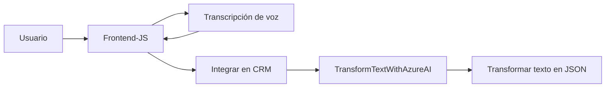

### **Breve resumen técnico**
Este repositorio parece formar parte de una solución de software que integra capacidades de procesamiento de voz y texto con **Microsoft Dynamics 365 CRM** utilizando servicios externos de **Azure Speech SDK** y **Azure OpenAI API**. Los archivos de JavaScript implementan funcionalidades para interactuar con formularios en un entorno web para manejar datos hablados o vistos, mientras que el archivo C#, como un plugin, extiende funcionalidades de Dynamics CRM para procesar texto y transformar datos.

---

### **Descripción de arquitectura**
La arquitectura tiende hacia un modelo **modular basado en capas**, aunque con componentes distribuidos. La interacción entre frontend (JS files) y backend (C# plugin) junto a servicios externos (Azure SDK y APIs) sugiere influencias de una **arquitectura hexagonal** al separar interfaces externas (Speech SDK y OpenAI) de las reglas de negocio y procesamiento. También incorpora principios de **Domain-Driven Design (DDD)** para realizar transformaciones específicas basadas en reglas normativas de CRM.

1. **Frontend:** JS para captura y procesamiento de voz, integración con Azure Speech SDK, y mapeo hacia formularios de Dynamics CRM.
2. **Backend:** Plugin .NET que actúa como intermediario entre Dynamics CRM y Azure OpenAI.
3. **APIs externas:** Azure Speech SDK para síntesis y transcripción de voz; Azure OpenAI API para análisis y transformación de texto.
4. **CRM API:** La integración con Microsoft Dynamics CRM a través de Web API y SDK permite realizar el mapeo dinámico y enriquecimiento de los datos en formularios.

---

### **Tecnologías usadas**
1. **Frontend:**
   - **HTML/JavaScript**: Para la manipulación de formularios dinámicos en el navegador.
   - **Azure Speech SDK**: Para la síntesis de voz y reconocimiento de audio.
   - **Microsoft Dynamics Web API**: Para realizar acciones directas sobre los formularios.
   
2. **Backend:**
   - **C# (.NET Framework)**: Para la implementación del plugin.
   - **Azure OpenAI API**: Integración para transformar texto mediante inteligencia artificial.
   - **Microsoft Dynamics CRM SDK**: Interacción directa con el modelo de datos del CRM.

3. **Patrones utilizados:**
   - **Modularidad y separación de responsabilidades:** Aplicada en funciones del frontend. Por ejemplo, funciones separadas para obtener datos visibles, cargar SDK, procesar transcripciones, etc.
   - **SOA:** Uso de servicios externos (Azure APIs).
   - **Plugin Architecture:** Característica central en CRM extensiones.
   - **Domain Model (DDD):** Operaciones sobre el modelo de datos están acopladas estrechamente a las reglas del dominio CRM.

---

### Diagrama Mermaid

---

### **Conclusión final**
El repositorio describe una solución híbrida con integración de múltiples tecnologías para procesar datos de voz y texto en un entorno CRM dinámico. La arquitectura modular y basada en servicios externos permite alta extensibilidad, lo que facilita su integración en escenarios complejos como Dynamics 365. Utiliza buenas prácticas como separación de responsabilidades y modularidad; sin embargo, podría beneficiarse de un manejo más seguro de claves API. Adicionalmente, la interacción con Azure Services destaca su capacidad en operaciones de IA y cloud computing.