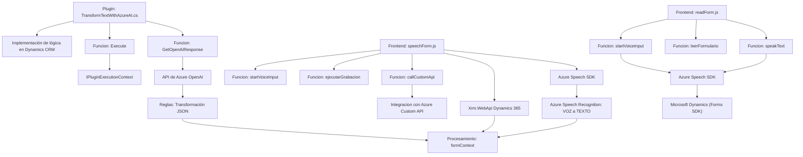

### Breve Resumen Técnico:
El repositorio contiene una solución que integra funcionalidades de entrada/salida de voz y procesamiento de texto mediante servicios en la nube de Azure (Azure Speech SDK y Azure OpenAI), con una backend que procesa datos estructurados en Dynamics CRM utilizando eventos y plugins. La solución abarca componentes de un frontend basado en JavaScript, servicios intermedios para la comunicación con Dynamics 365 y servicios externos (Azure Speech SDK y OpenAI).

---

### Descripción de Arquitectura:
La arquitectura utiliza un modelo **orientado al servicio con integración de APIs externas** y sigue una estructura modular para separar las responsabilidades. En general:
- **Frontend:** Realiza la integración del cliente web con Azure Speech SDK y Dynamics 365, con el patrón de modularidad y separación de responsabilidades (cada archivo divide tareas específicas como síntesis de voz y manipulación de formularios).
- **Backend:** Implementado como un plugin para Dynamics CRM, este módulo aplica reglas de negocio específicas y delega procesamiento avanzado de texto a Azure OpenAI, encapsulando estas operaciones en un único punto.

La arquitectura puede ser catalogada como una **híbrida**, fusionando elementos de **n capas** (frontend y backend), y técnicas de integración con APIs (microservicios externos).

---

### Tecnologías Usadas:
#### **Frontend:**
1. **JavaScript:** Para la interacción con el cliente.
2. **Azure Speech SDK:** Para los servicios de síntesis de texto a voz y reconocimiento de voz.
3. **Dynamics Web API (Xrm.WebApi):** Para operaciones con formularios y entidades de Dynamics CRM.

#### **Backend:**
1. **Microsoft Dynamics CRM SDK:** Desarrollo de plugins para lógica de negocio en eventos del CRM.
2. **Azure OpenAI Service:** Transformación avanzada de texto a través de GPT.
3. **.NET Framework:** Base del plugin desarrollado para interacción con Dynamics CRM.
4. **HTTPClient & JSON Parsing Libraries (Newtonsoft.Json / System.Text.Json)**: Comunicación y procesamiento con APIs externas.

#### **Otros Patrones y Prácticas:**
- Modularidad: Cada funcionalidad está separada (e.g., lectura del formulario, síntesis de voz, reconocimiento de voz, integración con APIs).
- Fachada HTTP: Uso de `HttpClient` para realizar solicitudes a servicios externos.
- Responsabilidad Única: Las funciones del frontend manipulan tareas específicas de inicio/modificación/interacción con el SDK.
- Conexión a servicios en la nube para delegar funcionalidades basadas en IA y voz.

---

### Diagrama Mermaid:

---

### Conclusión Final:
Esta solución utiliza una arquitectura **híbrida orientada a servicios**, combinando frontend y backend con servicios externos de Microsoft Azure (Speech SDK y OpenAI). Es altamente modular y sigue principios como la separación de responsabilidades y uso eficiente de APIs en la nube, lo que facilita su extensibilidad y mantenimiento.