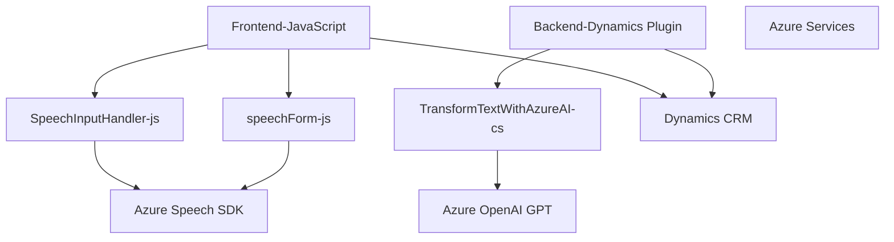

### Breve resumen técnico
El repositorio describe una solución híbrida sustentada en varias tecnologías y componentes que interactúan para generar y procesar voz, estructurar formularios y transformar texto. Utiliza principalmente servicios de Azure, APIs de Dynamics 365, y el Azure OpenAI service.

---

### Descripción de arquitectura
Esta solución combina elementos de varias arquitecturas, principalmente una **n capas** debido a la separación entre frontend, backend, y servicios externos. La solución tiene las siguientes características arquitectónicas:

1. **Frontend:** Scripts JavaScript (JS y APIs del navegador) con alta modularización implementan las características para obtener datos del formulario y generar voz (léase, interacción con cliente). Las funcionalidades están centradas en la arquitectura similar a MVC, donde `formContext` actúa como el "Model", el formulario como "View" y los scripts como "Controller".
   
2. **Backend plugin:** Código .NET que aprovecha el modelo de **Plugin-Based Architecture** de Dynamics 365 para transformar datos. El backend actúa como una capa para integrar los datos formulados con el servicio Azure OpenAI y generar respuestas JSON. 

3. **Integración con servicios externos:**
   - Interacción directa con **Azure Speech SDK** (para sintetizar voz y hacer reconocimiento de voz).
   - Comunicación con **Azure OpenAI** para procesamiento de texto avanzado utilizando inteligencia artificial (GPT-4).

4. **Patrones y diseño:** Modularización del código con funciones y clases bien definidas para acciones específicas. Uso de programación orientada a eventos, integración de servicios externos, y principios SOLID aplicados en el plugin del backend.

---

### Tecnologías usadas
- **Frontend:**
  - **JavaScript ES6+:** Modularización, promesas y programación orientada a eventos.
  - **Azure Speech SDK:** Reconocimiento y síntesis de voz.
  - **Dynamics 365 (formContext):** Contexto de formularios interactivos.

- **Backend:**
  - **Microsoft Dynamics SDK (`Microsoft.Xrm.Sdk`)**: Para extender la funcionalidad de Dynamics mediante un plugin.
  - **Azure OpenAI GPT-4**: Para procesar datos textuales en el backend.
  - **HTTP Client (`System.Net.Http`, `Newtonsoft.Json.Linq`)**: Para integrar APIs externas.

---

### Diagrama Mermaid válido para GitHub

---

### Conclusión final
La solución propuesta se enfoca en la entrada de voz y procesamientos avanzados de texto, vinculándolos con formularios interactivos de Dynamics 365. Utilizando una arquitectura modular y orientada a eventos, el cliente, el backend, y los servicios de Microsoft Azure trabajan juntos para proporcionar un flujo de datos dinámico y procesar texto mediante IA. Este sistema puede ser muy útil para tareas relacionadas con acceso inclusivo, autocompletar formularios mediante comandos de voz, y automatización de entradas dinámicas. Sin embargo, hay oportunidades de mejora, como el manejo de configuración externa (evitar "hardcoding") y validaciones más robustas tanto en frontend como en backend.