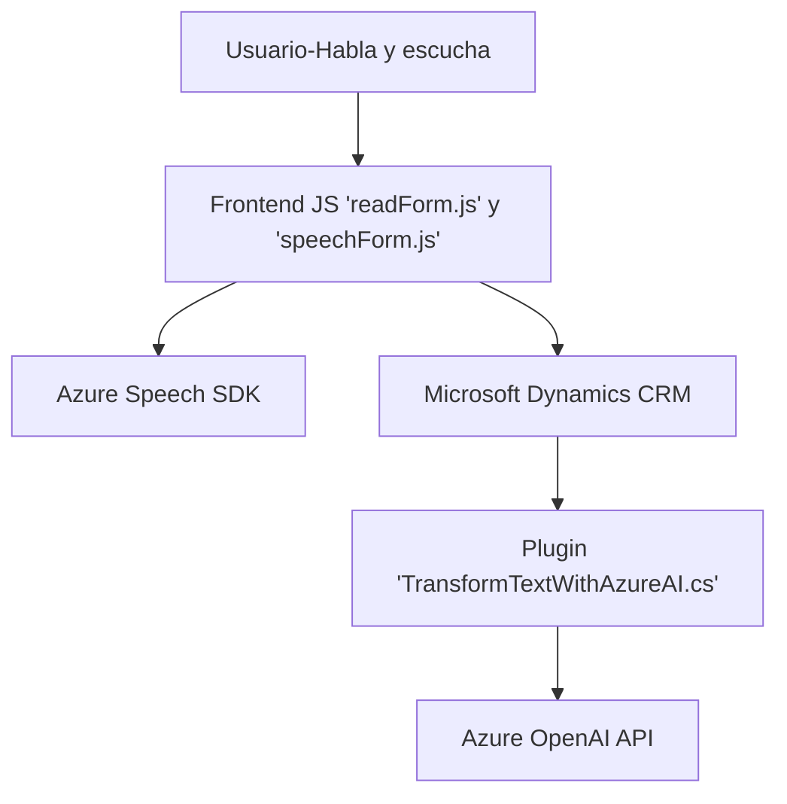

### Resumen técnico

El repositorio examinado implementa una solución de interacción avanzada entre usuarios y un sistema de CRM (ej. Microsoft Dynamics) mediante voz e inteligencia artificial (Azure Speech y OpenAI). Tiene tres componentes principales:
1. **Frontend/JS**: Scripts JavaScript que interactúan directamente con el formulario y conectan con servicios externos como Azure Speech SDK y APIs de CRM.
2. **Plugins**: Un plugin en C# que trabaja como punto de interacción entre Dynamics CRM y Azure OpenAI para transformar texto basado en reglas.

---

### Descripción de arquitectura

La solución tiene los siguientes niveles:
- **Frontend dinámico mediante scripts**: Interactúa con el usuario y el formulario, realizando síntesis y reconocimiento de voz. Proporciona datos al backend y asigna valores procesados en tiempo real.
- **Backend local y APIs personalizadas**: Gestiona la transformación y almacenamiento de datos procesados. Usa un plugin en Dynamics CRM para conectarse a Azure OpenAI, que realiza transformaciones complejas como conversión de texto a JSON.
- **Integración con servicios cloud**:
  - Azure Speech SDK para reconocimiento y síntesis de voz.
  - Azure OpenAI como modelo externo basado en IA para transformación de datos textuales.

La arquitectura es **modular de capas**, con integración de servicios cloud externos. Los scripts y plugins representan un enfoque híbrido: local para formularios y externo para tareas complejas.

---

### Tecnologías usadas

1. **Frontend**:
   - **JavaScript ES6**: Base para scripts interactivos en los formularios del CRM.
   - **Azure Speech SDK**: Reconocimiento y síntesis de voz.
   - **Microsoft Dynamics CRM APIs**: Manipulación de datos y formularios.

2. **Backend (Plugin)**:
   - **C#**: Lenguaje implementado para la lógica del plugin.
   - **Dynamics CRM SDK**: Extensión de funcionalidad CRM.
   - **Azure OpenAI API**: Integración con modelos GPT para procesamiento de texto.
   - **Newtonsoft.Json & System.Text.Json**: Manejo de JSON.

---

### Diagrama **Mermaid**

---

### Conclusión final

La solución combina integraciones avanzadas de voz e inteligencia artificial con un CRM mediante un enfoque modular y de capas. Utiliza tecnologías líderes en el mercado (Azure Speech SDK y OpenAI) para la interacción inteligente, y se apoya en un diseño basado en plugins para extender las funcionalidades del backend. Esto permite una implementación eficiente y escalable de sistemas centrados en la interacción con el usuario y la automatización de tareas administrativas.

La arquitectura cumple con estándares modernos al aprovechar servicios cloud, mantener un código modular, y establecer límites claros entre frontend y backend. Es ideal para despliegues en entornos empresariales que buscan integrar CRM y voz/IA.