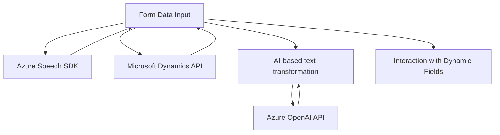

### Breve resumen técnico:
El repositorio muestra una solución integral que combina procesamiento de voz y texto para integrar datos de formularios dinámicos en el contexto de **Microsoft Dynamics CRM**. Los archivos presentan dos componentes principales:
1. Un **Frontend** basado en JavaScript (Azure Speech SDK).
2. Un **Plugin Backend .NET (C#)** que interactúa con **Azure OpenAI**.

La solución se centra en automatizar y facilitar la interacción con formularios mediante reconocimiento e inteligencia artificial, añadiendo funcionalidades de síntesis y procesamiento de voz.

---

### Descripción de arquitectura:
La solución sigue una arquitectura híbrida, integrando varios **patrones de diseño** en una lógica coherente:
1. **Frontend en n-capas**: JavaScript implementa acceso a APIs (Dynamics y Azure Speech SDK) y maneja DOM/atributos en el cliente. Es una capa de presentación acoplada con servicios funcionales.
2. **Backend Plugin-Based**: El plugin implementado en C# sigue una **arquitectura de extensiones** propia de Dynamics CRM. Actúa como una capa de lógica empresarial que consume el servicio externo de Azure OpenAI para transformar entrada textual.
3. **Integración de Microservicios**: La interacción con APIs externas (Azure Speech SDK y OpenAI) revela una orientación hacia la modularidad del sistema.

---

### Tecnologías usadas:
1. **Frontend:**
   - **JavaScript ES6**: Lenguaje usado para la lógica dinámica interactiva.
   - **Azure Speech SDK**: Reconocimiento y síntesis de voz mediante servicios de Azure.
   - **Microsoft Dynamics API**: Interacción con formularios dinámicos y datos.
   - **Promesas y Callbacks**: Para manejo asíncrono de dependencias.

2. **Backend:**
   - **C# .NET Framework**: Desarrollo del plugin compatible con Dynamics CRM.
   - **Azure OpenAI**: Transformación y procesamiento avanzado de texto mediante inteligencia artificial.
   - **HttpClient**: Comunicación con APIs externas.
   - **Newtonsoft.Json / System.Text.Json**: Manipulación y procesamiento de objetos JSON.
   
3. Patrones:
   - **Facade Pattern**: Simplificación de la entrada inicial mediante puntos centralizados como `startVoiceInput` y `Execute`.
   - **Repository Pattern**: Manejo estructurado de datos del formulario dinámico (Xrm.WebApi).
   - **Service Connector**: Conexión con Azure OpenAI para delegar procesamiento de texto.

---

### Diagrama **Mermaid** válido para GitHub:

---

### Conclusión final:
La solución combina el poder de servicios avanzados como **Azure Speech SDK** y **Azure OpenAI** con el robusto ecosystem de **Microsoft Dynamics CRM**, creando una herramienta eficaz para transformar cómo los usuarios interactúan con formularios dinámicos. La elección de una arquitectura híbrida es adecuada para garantizar flexibilidad y extensibilidad. Sin embargo, la alta dependencia de servicios externos (Azure) podría requerir ajustes para escenarios auto-hospedados o de alta disponibilidad.