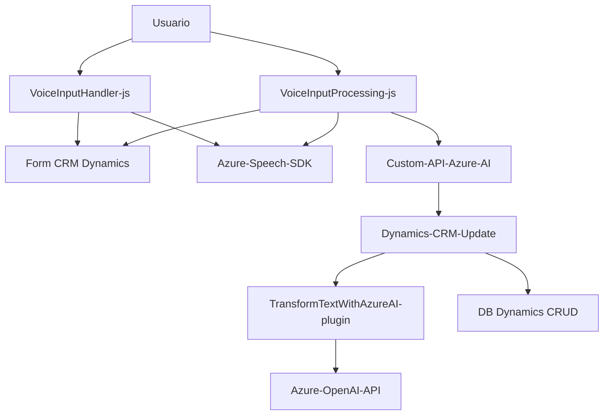

### Breve resumen técnico
El análisis de los archivos revela que el proyecto es una solución de software para integrar Microsoft Dynamics CRM con capacidades de reconocimiento y síntesis de voz, así como con procesamiento avanzado de texto mediante la API de Azure OpenAI. La solución se enfoca especialmente en mejorar la experiencia del usuario en formularios dentro de Dynamics CRM mediante entrada de voz y generación de audio.

---

### Descripción de arquitectura
La arquitectura observada es una **integración de servicios externos en una aplicación orientada al cliente** (frontend JS con Dynamics CRM) que interactúa con SaaS como **Azure Speech SDK**, **Azure OpenAI**, y **Custom APIs** alojadas externamente para procesamiento. Además, el plugin de Dynamics CRM ("TransformTextWithAzureAI.cs") muestra un diseño basado en eventos, típico de aplicaciones **plugin-driven**. Los componentes trabajan a través de patrones como **eventos**, **facade**, y **estructuración modular**.

La arquitectura combina elementos de **microservicios** y **n-capas**:
1. **Frontend (capas cliente)**: JavaScript archivos como `VoiceInputHandler.js` y `VoiceInputProcessing.js` actúan como capa de presentación basada en eventos, integrando servicios externos mediante APIs (Azure Speech, Dynamics WebApi, Custom API).
2. **Plugin (backend en CRM)**: La lógica de backend transformadora se implementa como un plugin en Dynamics CRM. Este patrón se asemeja más a una arquitectura **microservicio orientado a eventos**.

---

### Tecnologías usadas
1. **Frontend**:
   - **JavaScript**: Para las operaciones en el cliente.
   - **Azure Speech SDK**: Reconocimiento y síntesis de voz.
   - **Dynamics CRM client-side API**: Interacción con formularios del CRM.
   - **Event-driven programming**: Funciones desencadenadas por eventos en el contexto del CRM.

2. **Backend (Plugin)**:
   - **C#.NET**: Desarrollo del plugin utilizando el framework .NET.
   - **Dynamics CRM APIs**: Para obtener información del contexto de CRM (incluyendo IOrganizationService y IPluginExecutionContext).
   - **Azure OpenAI service**: Para el procesamiento avanzado de texto.
   - **HTTPClient**: Comunicación con APIs externas.
   - **Newtonsoft.Json**: Para manejar JSON en el plugin backend.

---

### Diagrama Mermaid válido para GitHub

---

### Conclusión final
La solución es una plataforma integral basada en la **integración de frontend y backend con servicios externos** para mejorar la interacción en formularios de Microsoft Dynamics CRM. Con una arquitectura **fusionada entre microservicios y n-capas**, utiliza un enfoque orientado a **eventos** en el cliente y el plugin, dependencias robustas como **Azure Speech SDK** y **Azure OpenAI**, con patrones que garantizan modularidad y desacoplamiento. Es flexible y extensible para nuevas integraciones en Dynamics CRM.