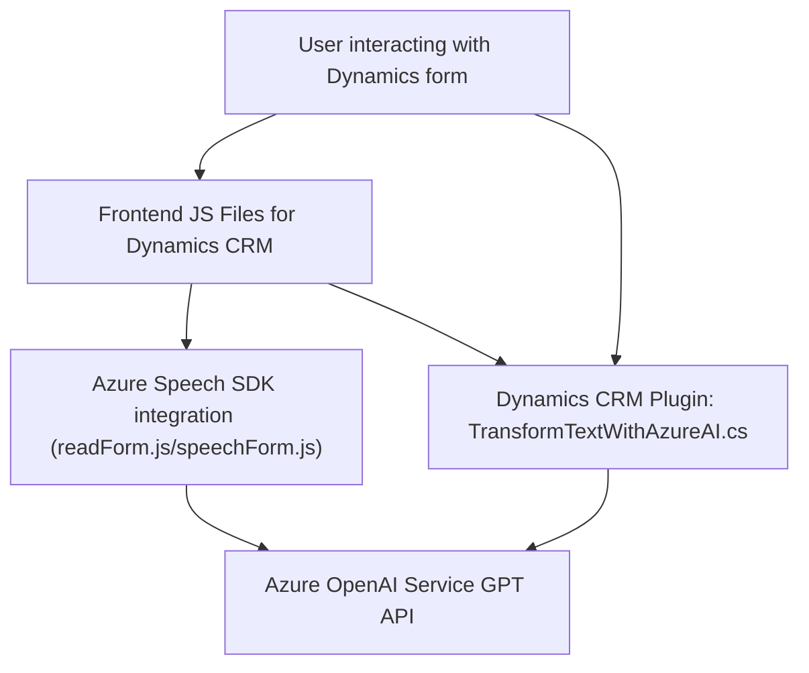

### Breve resumen técnico

El repositorio consta de tres archivos:  
1. **`FRONTEND/JS/readForm.js` y `speechForm.js`**: JavaScript para manejar formularios de Dynamics 365 mediante entrada de voz, integración con Azure Speech SDK, y mapeo de datos formattados.  
2. **`Plugins/TransformTextWithAzureAI.cs`**: Plugin de Dynamics CRM diseñado para transformar texto en JSON estructurado usando reglas personalizadas y el modelo de Azure OpenAI GPT.

---

### Descripción de la arquitectura

#### Frontend:
- **Arquitectura**: Aplicación cliente con **estructura modular** y lógica asincrónica.  
Se basa en una interacción orientada a eventos con **Azure Speech SDK** y utiliza funciones desacopladas para distintas tareas relacionadas a la recuperación, procesamiento y síntesis de datos en formularios de Dynamics 365.
  
#### Backend:
- **Arquitectura**: **Plugin basado en eventos (Dynamics CRM)**.  
El plugin sigue el patrón de responsabilidad única (**SRP**) para ejecutar transformaciones de texto mediante llamadas a la API de Azure OpenAI.
  
En conjunto, la solución respalda la manipulación dinámica y avanzada de datos en formularios basados en **Dynamics CRM**, habilitando interacciones por voz, procesamiento vía inteligencia artificial (IA), y comunicación con servicios externos en la nube (Azure).

---

### Tecnologías utilizadas

1. **Frontend** 
   - **JavaScript** y **Dynamics 365 SDK**: Aplicación cliente para interacción con formularios y datos en tiempo real.
   - **Azure Speech SDK**: Funcionalidad de reconocimiento y síntesis de voz.
   - **Xrm.WebApi**: Para realizar operaciones en las APIs de Dynamics 365.

2. **Backend** 
   - **C# con Dynamics CRM Plugin (IPlugin)**: Implementación de lógica personalizada ante eventos del sistema CRM.
   - **Azure OpenAI GPT Model**: Transformación de texto en JSON utilizando modelos avanzados de IA. Punto final REST con formato `gpt-4o`.
   - **Newtonsoft.Json**: Manipulación avanzada de estructuras JSON.
   - **System.Net.Http y System.Text.Json**: Realiza solicitudes HTTP para interactuar con servicios RESTful.

---

### Diagrama Mermaid válido para GitHub

---

### Conclusión final

Este repositorio representa una solución integrada para mejorar la experiencia de usuario en Dynamics 365 mediante la entrada y síntesis de voz, así como el procesamiento automatizado de datos con inteligencia artificial (OpenAI GPT). Desde la perspectiva arquitectónica:  
- **Frontend**: Modular y asincrónico con la integración de SDK dinámicos.  
- **Backend**: Basado en eventos con enfoque de microservicios para delegar funciones especializadas a diversas APIs de Azure.

Es idóneo para automatización de tareas en escenarios empresariales altamente dinámicos, como el análisis de formularios CRM y operaciones basadas en voz y texto enriquecido. Sin embargo, podría beneficiarse de mayores pruebas, modularidad, y optimización del manejo de errores en caso de fallos en los servicios externos.