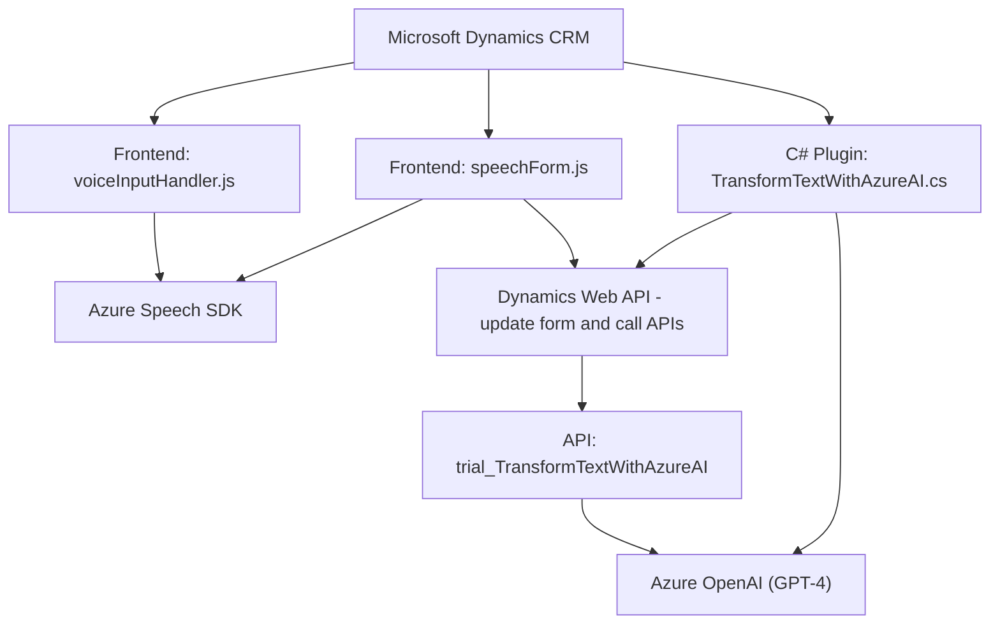

### Breve resumen técnico
El repositorio contiene una solución compuesta por tres elementos focalizados en la interacción con formularios de **Microsoft Dynamics CRM**, el procesamiento de comandos de voz con el SDK de **Microsoft Azure Speech**, y la integración con **Azure OpenAI API**. Es un sistema híbrido que combina un frontend en **JavaScript**, un backend funcional alojado como **plugins C# para Dynamics CRM**, y servicios de terceros.

---

### Descripción de arquitectura
La arquitectura utiliza:
1. **Cliente-Servidor**: El frontend en JavaScript realiza la interfaz de usuario y las llamadas al servidor (Dynamics CRM y Azure APIs). Mientras que los plugins en C# actúan como servicios server-side procesando operaciones sobre los datos y haciendo llamadas a Azure.
2. **Integración con APIs externas**: Utiliza servicios en la nube como **Azure OpenAI API** para procesamiento de texto y comandos.
3. **Módulos desacoplados**: El código presenta una estructura modular, donde cada función se especializa en una tarea específica:
   - Reconocimiento y lectura de voz del frontend (Azure Speech SDK).
   - Procesamiento y transformación de texto/formularios usando reglas especificadas en complementos y APIs (Plugins en C#).
   - Lógica basada en eventos (reconocimiento de voz, interacción del usuario con formularios).

La integración entre las capas (frontend + plugins + APIs) sugiere una arquitectura **n-capas** conectada con componentes externos.

---

### Tecnologías y frameworks usados
1. **Frontend:**
   - JavaScript (para interacción dinámica en formularios de Dynamics CRM).
   - **Azure Speech SDK**: Para reconocimiento y síntesis de voz.
   - Microsoft Dynamics CRM Web API (`Xrm.WebApi`) para gestionar formularios y campos.

2. **Backend:**
   - C# con Microsoft Dynamics CRM Plugin Framework (`IPlugin`).
   - **Azure OpenAI API**:
     - Procesamiento avanzado de texto usando GPT (Chat completions).
   - `Newtonsoft.Json` para deserialización de objetos JSON.

---

### Dependencias o componentes externos
1. **Microsoft Azure Speech SDK** para reconocimiento y síntesis de voz.
2. **Azure OpenAI API (GPT-4)** para procesamiento de texto.
3. **Dynamics CRM Web API** para servicios REST con formularios y datos específicos.
4. **Newtonsoft.Json** para manejo de objetos JSON en C#.
5. **Microsoft Dynamics CRM Plugin Framework** a través de `IPlugin`.

---

### Diagrama Mermaid válido para GitHub

---

### Conclusión final
Este repositorio implementa una solución basada en **n-capas** para capturar y procesar datos desde formularios en **Microsoft Dynamics CRM**, integrando capacidades de **IA (GPT)** y **procesamiento de voz**. El frontend usa una lógica modular en **JavaScript** para interactuar con formularios y enviar datos a través de APIs. El backend, alojado como un plugin en Dynamics CRM, encapsula procesos intensivos como llamadas a Azure OpenAI. Los componentes están conectados por servicios REST, siguiendo una arquitectura distribuida, pero el núcleo de la aplicación sigue la estructura de **n-capas**.

Las tecnologías elegidas proporcionan la escalabilidad y distribuyen responsabilidades entre frontend, backend y servicios externos en la nube, lo cual resulta adecuado para aplicaciones empresariales. Sin embargo, la presencia de claves privadas en el código fuente, la falta de manejo avanzado de errores, y la ausencia de pruebas automatizadas son puntos para considerar en futuras mejoras.