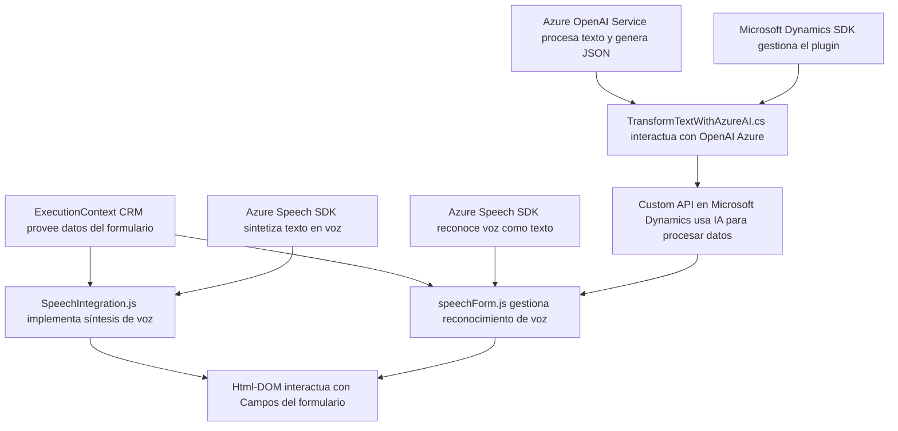

### Breve resumen técnico
El repositorio consiste en una solución híbrida que integra **Microsoft Dynamics CRM** con servicios en la nube de **Azure Speech SDK** y **Azure OpenAI Service**. Contiene múltiples elementos para procesar texto y voz, incluyendo un plugin en C# para el sistema CRM, y archivos JavaScript en el cliente para interacción directa con formularios.

---

### Descripción de la arquitectura
La arquitectura es híbrida, con componentes de **n capas**:  
1. **Presentación**: Código JavaScript para formularios y procesamiento directo en el navegador.  
2. **Negocio**: Lógica de procesamiento en plugins de Dynamics CRM y manipulación de datos en el lado del cliente.  
3. **Datos**: Interacción directa con servicios externos como **Azure Speech SDK** y **Azure OpenAI Service** para conversión de voz y procesamiento basado en IA.

Además, emplea una **arquitectura de microservicios** parcial para la integración con API externas que procesan voz o texto bajo demanda.

---

### Tecnologías usadas
1. **Frontend/Javascript**:
   - **Azure Speech SDK**: Integración con servicios de sintetización y reconocimiento de voz.
   - **Microsoft Dynamics CRM**: Contexto de formulario como núcleo.
   - **HTML y DOM**: Para manipular campos visibles del formulario.
   - **Asynchronous Javascript (`async/await`)**: Uso eficiente de promesas para SDK y API.
   
2. **Backend (.NET)**:
   - **Microsoft Dynamics SDK (`Microsoft.Xrm.Sdk`)**: Desarrollo de plugins y ejecución en contexto de eventos del CRM.
   - **Azure OpenAI Service**: Procesamiento avanzado de texto con IA.
   - **HTTP y JSON**: Comunicación con APIs externas.
   
3. **Patrones arquitectónicos**:
   - **Modularización**: Separación de funcionalidades específicas en funciones.
   - **Event-Driven**: Plugin basado en eventos del sistema CRM.
   - **Adaptador API**: Integración con servicios de Azure mediante HTTP dinámico.
   - **Asynchronous Communication**: Gestión eficiente de operaciones remotas en tiempo real.

---

### Diagrama Mermaid **100% compatible con GitHub Markdown**

---

### Conclusión final
El repositorio satisface componentes críticos de una solución integrada entre Microsoft Dynamics CRM y servicios de Azure. La capacidad de interactuar con formularios del cliente, integrar reconocimiento de voz y procesamiento textual avanzado adaptable lo convierten en una solución robusta y escalable. Su arquitectura híbrida (n capas + microservicios especializados) es eficiente y modular, facilitando el desarrollo futuro.