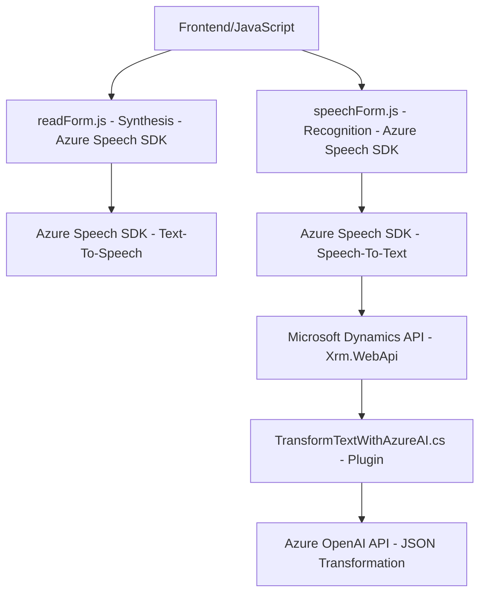

## Breve resumen técnico:
El repositorio presenta tres componentes principales orientados a la interacción usuario-sistema mediante voz y procesamiento de lenguaje natural (NLP) en un entorno de Microsoft Dynamics CRM con integración del Azure Speech SDK y Azure OpenAI API. Estos archivos forman una solución híbrida entre un frontend (JavaScript) que permite la interacción en tiempo real con formularios y micrófono, y un backend basado en plugins de Dynamics CRM que realiza el procesamiento avanzado del texto mediante la API de Azure OpenAI.

---

## Descripción de arquitectura:
La solución tiene características de un diseño orientado a cliente-servidor y segmentado. El frontend incluye dos módulos JavaScript (`readForm.js` y `speechForm.js`) que trabajan en conjunto para realizar la síntesis de voz y el reconocimiento de voz de datos en formularios dinámicos de Microsoft Dynamics. El backend (`TransformTextWithAzureAI.cs`) opera como un microservicio que integra el servicio externo de Azure OpenAI para transformar texto con reglas específicas. La arquitectura puede considerarse híbrida entre **monolito** (por la implementación en el plugin de Dynamics CRM) y **n-capas**, debido a la separación entre frontend y lógica backend. Además, la presencia de servicios externos (Azure APIs) introduce elementos de **arquitectura distribuida**.

---

## Tecnologías usadas:
### En el frontend:
1. **JavaScript**: Para lógica de ejecución, eventos del navegador y manipulación del DOM de formularios.
2. **Azure Speech SDK**: Realiza reconocimiento y síntesis de voz.
3. **Promises**: Utilizadas para manejar operaciones asíncronas, como la carga del SDK y llamadas a APIs externas.
4. **Patrones**:
   - **Event-Driven Architecture**: Las funciones se disparan basadas en eventos (ej.: carga dinámica de SDK cuando se necesita).
   - **Modular Design**: Separación de funciones en distintos métodos para facilitar el mantenimiento y entendimiento del código.

### En el backend:
1. **C#**
2. **Microsoft Dynamics CRM SDK**: Modelo de extensión.
3. **Azure OpenAI API**: Utilizada para transformar texto con reglas de NLP.
4. **Newtonsoft.Json**
5. **System.Net.Http**
6. **Patrones**:
   - **Plugin Pattern**: Personalización de flujos de Dynamics CRM.
   - **Microservicio**: Integración directa con servicios externos como Azure OpenAI API.
   - **DTO (Data Transfer Object)**: Entrada/salida JSON estructurada.

---

## Diagrama Mermaid válido para GitHub:
### Representación gráfica

---

## Conclusión final:
Esta solución se configura como una integración avanzada entre componentes del frontend y backend en un entorno empresarial basado en Microsoft Dynamics CRM. Los módulos `readForm.js` y `speechForm.js` proporcionan accesibilidad y usabilidad al usuario con reconocimiento y síntesis de voz, mientras que el plugin `TransformTextWithAzureAI.cs` opera como un microservicio para transformar y estandarizar texto mediante Azure OpenAI. La arquitectura es una combinación de cliente-servidor con servicios externos y una estructura **n-capas distribuidas**. Aunque el diseño es eficiente, se podrían considerar mejoras como la implementación de almacenamiento seguro para las claves API y la optimización de tiempos de espera en las interacciones con servicios externos.