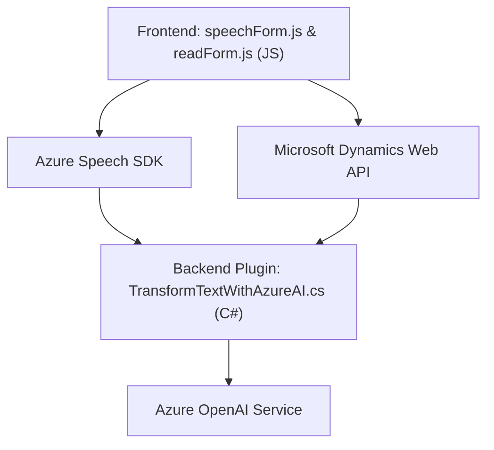

**Breve resumen técnico:**
El repositorio describe un software orientado a la interacción de usuarios con formularios y texto, empleando entrada por voz, conversión de datos en formularios y procesamiento de texto mediante servicios de inteligencia artificial y plataformas externas como Microsoft Dynamics CRM y Azure OpenAI. La solución integra un frontend basado en JavaScript y un backend orientado a plugins en Microsoft Dynamics.

---

**Descripción de arquitectura:**
La solución combina herramientas de frontend y backend en un modelo **n capas**. Estas capas están separadas por funcionalidades específicas:
1. **Frontend**: Procesamiento y entrada de datos de formularios mediante JavaScript, usando Azure Speech SDK y Microsoft Dynamics Web API.
2. **Middleware**: Con base en Microsoft Dynamics CRM, usa un plugin basado en la interfaz `IPlugin` para realizar interacciones con los datos del sistema CRM.
3. **Servicios externos**: Comunicación con el servicio Azure OpenAI para procesos avanzados de inteligencia artificial.

La aplicación parece estar diseñada como una solución extensible y modular para integrarse con Microsoft Dynamics CRM.

---

**Tecnologías y frameworks usados:**
1. **Frontend:**
   - **Vanilla JavaScript**: Se usa para gestionar eventos y realizar operaciones sobre datos de formularios.
   - **Azure Speech SDK**: Tecnología clave para realizar análisis de voz en tiempo real y sintetización de texto a voz.
   - **Microsoft Dynamics Web API** (`Xrm.WebApi.online.execute`): Llamadas REST para consultar entidades en Dynamics 365 CRM.
   - **DOM Scripting**: Para interactuar con los campos visibles del formulario.

2. **Backend:**
   - **Microsoft Dynamics CRM Plugin Architecture (C#)**: Se utiliza para integrar procesos externos en el sistema CRM.
   - **Azure OpenAI Service**: Servicio externo de inteligencia artificial para análisis y transformación de texto.
   - **ASP.NET Framework Libraries**
     - `System.Text.Json` y `Newtonsoft.Json`: Serialización/deserialización JSON para procesar datos.
     - `System.Net.Http`: Comunicación con APIs.
   - **Service Provider Pattern**: Utiliza `IServiceProvider` para gestionar componentes dinámicos en el contexto de ejecución.

3. **Patrones de diseño:**
   - Modularidad en funciones.
   - Fachada para abstraer puntos de entrada (`startVoiceInput`).
   - Delegación a APIs externas para lógica empresarial avanzada.
   - Dependencias dinámicas: SDK cargado en tiempo real.

---

**Diagrama Mermaid (válido para GitHub Markdown):**

---

**Conclusión final:**
Esta solución integra un sistema de procesamiento de formularios con entrada de voz y transformación de texto mediante herramientas avanzadas de inteligencia artificial. La arquitectura es **n capas**, con separación clara entre frontend, backend y servicios externos. Se aprovechan tecnologías como Azure Speech SDK, Dynamics CRM y OpenAI para responder a la necesidad de gestionar voz, datos y transformación inteligente. La estructura general sigue prácticas modernas, como modularidad y servicio externo, asegurando su compatibilidad con plataformas CRM y escalabilidad para futuras extensiones.