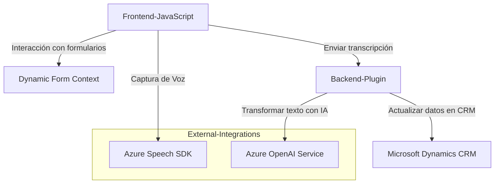

## Breve resumen técnico

El repositorio contiene tres tipos de componentes:
1. **Frontend (JavaScript)**: Scripts que habilitan la interacción mediante voz con formularios dinámicos en aplicaciones web, junto con integración a APIs y servicios de Microsoft Dynamics.
2. **Plugin Backend (C#)**: Un plugin personalizado para Microsoft Dynamics CRM que transforma texto mediante Azure OpenAI Service, integrándose con sistemas externos y aprovechando una arquitectura basada en plugins.

Cada archivo tiene un papel específico en la solución general, que parece ser una combinación orientada a servicios y capas.

---

## Descripción de arquitectura

### **Frontend**
- **Patrón modular**: Los archivos JavaScript gestionan funcionalidades específicas como captura de voz, extracción de datos de formularios y comunicación con servicios externos.
- **Orientación a servicios**: Maneja integraciones externas mediante Azure SDK y APIs personalizadas.
- **Estructura basada en capas**: Aunque dentro de los mismos archivos, la separación de responsabilidades por funciones, como extracción de datos visibles, síntesis de voz, y procesamiento de valor, apunta a una arquitectura en capas.

### **Backend Plugin**
- **Microsoft Dynamics Plugin architecture**: Código diseñado para ejecutarse dentro del ecosistema CRM de Dynamics, extendiendo su comportamiento mediante la interfaz `IPlugin`.
- **Responsabilidad única**: Centraliza la interacción con el servicio Azure OpenAI y enriquece la funcionalidad del CRM con capacidades de IA externas.

### **General**
- **Integración con sistemas externos**: Uso de SDKs y APIs (Azure Speech SDK y Azure OpenAI Service) como componentes externos clave.
- **Multicapa funcional**: El flujo de la solución parece depender de una arquitectura n-capas, con separación lógica de presentación (frontend) y lógica empresarial (plugins).
- **Posibilidad de evolución hacia microservicios**: Aunque actualmente es una arquitectura orientada a capas o híbrida, el nivel de integración externa proporciona una base para refactorización hacia microservicios.

---

## Tecnologías y patrones usados

### **Frontend: JavaScript**
1. **Lenguaje:** JavaScript.
2. **Frameworks:** No se menciona el uso de frameworks como React, Angular, o Vue en la estructura del repositorio, lo que indica un enfoque nativo a nivel de JS.
3. **SDKs externos:** Azure Speech SDK para servicios de síntesis de voz, reconocimiento, y configuración de audio/micro.
4. **Patrones**:
   - **Modularidad:** Responsabilidades divididas por función.
   - **Callback pattern:** Uso de métodos con funciones de retorno tras la ejecución de eventos o procesos asíncronos.
   - **Data extraction pattern:** Centralización en métodos que gestionan datos visibles y los procesan.

### **Backend: C# Plugin**
1. **Lenguaje:** C#.
2. **Platforma:** Microsoft Dynamics CRM.
3. **Frameworks:** Microsoft.Xrm.Sdk (para integración CRM), APIs HTTP para servicios Azure OpenAI.
4. **Plugins:** Implementación mediante la interfaz `IPlugin` y orientación modular hacia la lógica empresarial.
5. **Patrones**:
   - **Plugin Architecture:** Integración personalizada siguiendo la arquitectura de Dynamics.
   - **External Service Integration:** Uso de solicitudes HTTP para consumir Azure OpenAI y generar transformaciones de texto.

---

## Diagrama Mermaid

---

## Conclusión final

El repositorio describe una arquitectura n-capas que utiliza una combinación de frontend, backend en forma de plugin y servicios externos para proporcionar interacción mediante voz y AI. Las tecnologías principales son JavaScript y C# con uso intensivo de SDKs de Azure Speech y OpenAI. La solución es modular, orientada hacia servicios y puede evolucionar hacia una arquitectura de microservicios en el futuro.