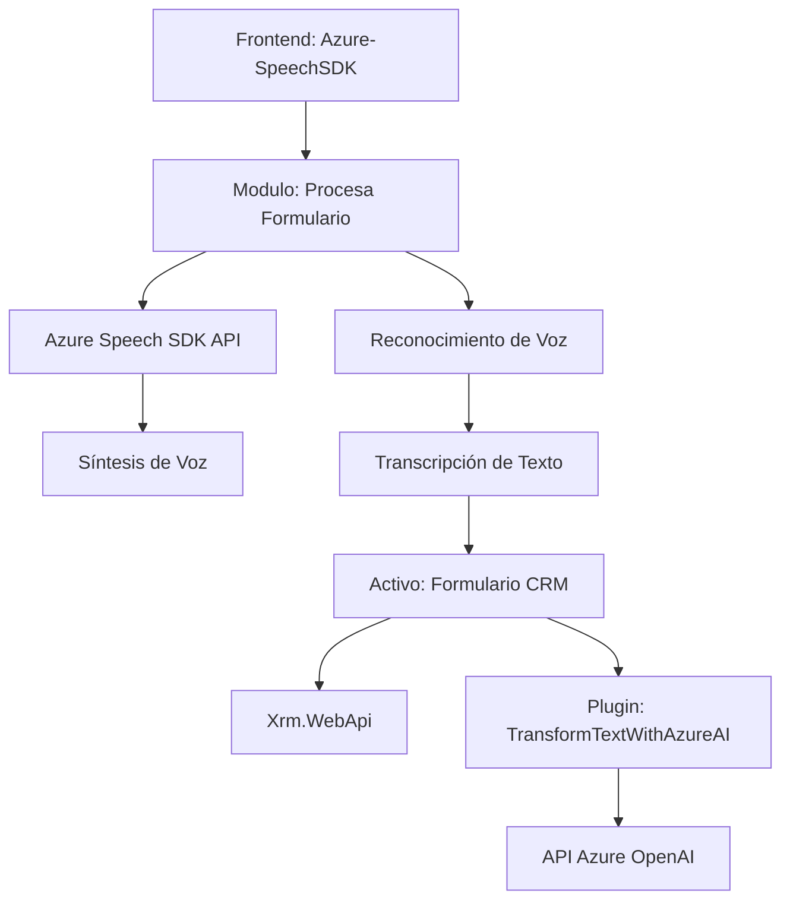

### Breve resumen técnico
El repositorio implementa funcionalidades relacionadas con procesamiento de lenguaje natural con Azure Speech SDK, API de reconocimiento de voz y Azure OpenAI. Los módulos conectan formularios dinámicos en Dynamics CRM con servicios para síntesis de voz, transcripción y transformación de texto. 

---

### Descripción de la arquitectura
La solución está constituida por tres componentes principales:
1. **Frontend:** 
   - Integrado con Azure Speech SDK para procesos de síntesis y reconocimiento de voz desde formularios en un entorno CRM.
   - Funciones distribuidas para obtener datos del formulario, procesar transcripciones y actualizar campos en tiempo real.

2. **Plugin:** 
   - Se ejecuta en el servidor CRM mediante la arquitectura basada en plugins de Dynamics CRM.
   - Consume la API de Azure OpenAI para generar datos estructurados de texto.

3. **APIs externas:** 
   - Involucra el consumo de los endpoints de Azure OpenAI y Speech SDK para capacidades de IA y procesamiento de voz.

La arquitectura podría clasificarse como **"microservicios distribuidos"** dada la separación de responsabilidades entre frontend (browser-dependent modules, llamadas a Speech SDK), middleware (plugins de Dynamics), y servicios externos (APIs de Azure).

---

### Tecnologías usadas
1. **Frontend:** 
   - Lenguaje: JavaScript.
   - Frameworks/Librerías:
     - Azure Speech SDK para reconocimiento y síntesis de voz.
     - Microsoft Dynamics CRM SDK (Xrm.WebApi) para integración con formularios.
     - Manipulación del DOM.

2. **Backend (Plugins):** 
   - Lenguaje: C#.
   - Framework: API de Dynamics (Microsoft.Xrm.Sdk).
   - Librerías externas:
     - `Newtonsoft.Json.Linq` para manejo avanzado de JSON.
   
3. **Servicios Cloud:** 
   - Azure Speech SDK.
   - Azure OpenAI API.

---

### Diagrama Mermaid válido para GitHub

---

### Conclusión final
La solución implementada combina tecnologías avanzadas de integración entre sistemas on-premise (Dynamics CRM) y servicios externos (Azure). Esto muestra un diseño escalable capaz de enriquecer la gestión de usuarios con capacidades cognitivas. Aunque la arquitectura apunta hacia una estructura distribuida, ciertos aspectos como la dependencia exclusiva de una nube específica y mejoras en el manejo de errores podrían ser áreas a revisar para garantizar más flexibilidad y fiabilidad.