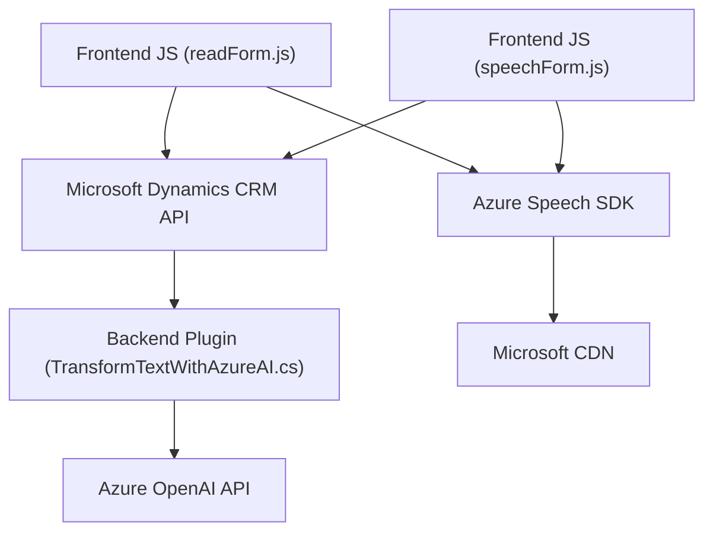

### Breve resumen técnico
El repositorio mencionado incluye tres archivos con funcionalidades específicas:
1. **`readForm.js`:** Obtiene los datos visibles de un formulario y los sintetiza en voz utilizando Azure Speech SDK.
2. **`speechForm.js`:** Reconoce la entrada de voz, la transcribe con Azure Speech SDK y procesa su contenido para interactuar con un formulario en Microsoft Dynamics 365.
3. **`TransformTextWithAzureAI.cs`:** Define un plugin para Dynamics CRM que utiliza la API de Azure OpenAI para transformar texto en formato JSON estructurado siguiendo reglas predefinidas.

---

### Descripción de arquitectura
La solución general integra tres componentes principales:
1. **Frontend (JavaScript):** Manejo de formularios y entrada/salida de datos por voz y texto. Es modular y constituye una capa de presentación.
2. **Backend (Plugin en C#):** Plugin que extiende Dynamics CRM con un servicio que conecta directamente con Azure OpenAI para transformar texto.
3. **API externa:** Integración con Azure Speech SDK y Azure OpenAI API, lo cual añade capacidades avanzadas de reconocimiento de voz y generación de texto estructurado mediante IA.

La arquitectura puede categorizarse de la siguiente forma:
- **Capa de presentación (Frontend):** Formulario procesado por las funciones JavaScript que interactúan con los datos.
- **Backend como servicio:** Plugins que operan en Dynamics CRM y utilizan la información de los formularios junto con la API de Azure OpenAI para procesamiento avanzado.
- **Integración de servicios externos:** Comunicación con API de Azure Speech y OpenAI (Servicios REST).

En términos generales, la arquitectura tiene elementos de:
- **Arquitectura orientada a eventos:** Con el uso de callbacks y Promesas en las operaciones asíncronas.
- **Arquitectura basada en servicios (SOA):** Con los plugins actuando como mediadores hacia los servicios de Microsoft Dynamics y servicios en la nube.
- **Modularidad:** Separación funcional en tres niveles claros (presentación, procesamiento y API).

---

### Tecnologías usadas
- **Frontend (JavaScript):**
  - JavaScript tradicional.
  - Azure Speech SDK (integrado desde una CDN).
  - Microsoft Dynamics CRM API (Xrm.WebApi.online).
  
- **Backend (C# Plugin):**
  - Framework .NET.
  - Microsoft Dynamics CRM SDK (`IPlugin`, `IOrganizationService`).
  - HTTP Client para consumir Azure OpenAI API.
  
- **Servicios externos:**
  - Azure Speech SDK.
  - Azure OpenAI API.

---

### Diagrama **Mermaid**

---

### Conclusión final
La solución implementa una arquitectura híbrida orientada a servicios que facilita la interacción entre usuarios, formularios en Microsoft Dynamics CRM y los servicios en la nube de Azure para inteligencia artificial y procesamiento de voz. 

El uso de patrones como modularidad, eventos, Mediator y callbacks asegura un diseño flexible y escalable. La incorporación de SDKs y APIs externas permite aprovechar tecnologías avanzadas como reconocimiento de voz y procesamiento de lenguaje con AI.

Sin embargo, como recomendación arquitectónica:
1. Evaluar posibles desacoplamientos para que los componentes no dependan directamente de servicios específicos y permitan configuraciones más dinámicas.
2. Validar la gestión de dependencias y latencia en conexiones con APIs externas, especialmente en sistemas con usuarios concurrentes. 

En general, es una solución robusta para su propósito.