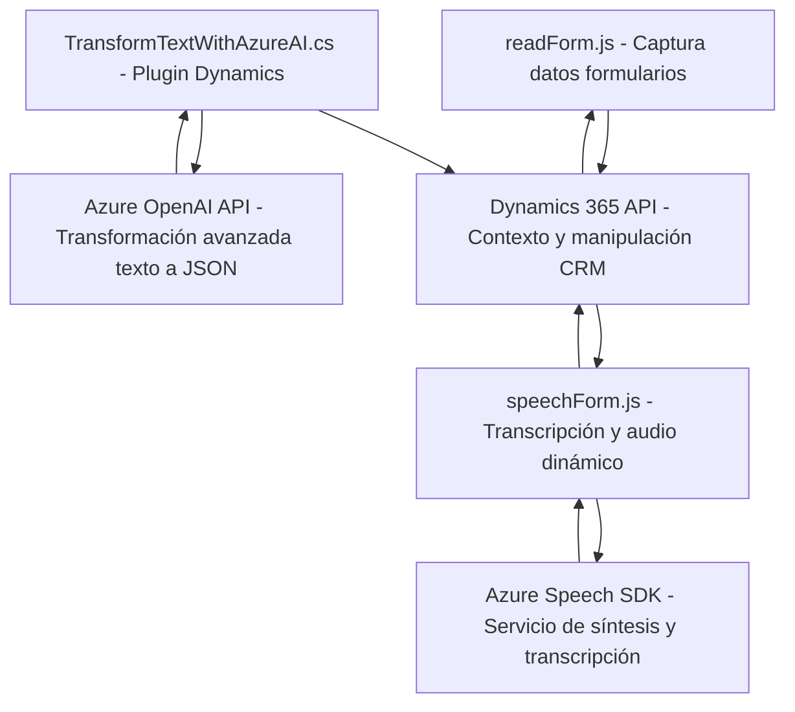

### Análisis detallado

#### 1. **Tipo de solución**
Esta solución representa una **integración entre un frontend dinámico, una API/plugin en el backend, y servicios externos (Azure)**. Es principalmente utilizada en entornos empresariales como **Microsoft Dynamics 365** para gestionar formularios, realizar síntesis de voz, transcripción por voz, y procesamiento avanzado de texto con IA aplicada. Los archivos de JavaScript del frontend (como `readForm.js` o `speechForm.js`) interactúan directamente con **Dynamics 365** y el **Azure Speech SDK**, mientras que el archivo backend de **C# plugin** (`TransformTextWithAzureAI.cs`) establece la integración con **Azure OpenAI API**.

---

#### 2. **Tecnologías, Frameworks y Patrones**
- **Frontend**:
  - **Tecnología:** JavaScript, Azure Speech SDK, Microsoft Dynamics 365 context (`executionContext`, `formContext`).
  - **Patrones:**
    - *Event-driven programming*: Responde a eventos del formulario y carga dinámica del SDK.
    - *Modular design*: Cada función realiza tareas específicas y desacopladas.
    - *Integration pattern*: Comunicación con SDK y APIs externas.
- **Backend**:
  - **Tecnología:** C#, .NET Framework, Microsoft Dynamics 365 Plugin Architecture.
  - **API externa:** Azure OpenAI API.
  - **Patrones:**
    - *Dependency Injection*: Uso del contexto de servicios en Dynamics CRM (`IServiceProvider`).
    - *DTO (Data Transfer Object)*: Uso de JSON estructurado para interacción con OpenAI API.
    - *HTTP integration*: Uso de `HttpClient` para comunicación externa.
    - *Microservicio dinámico*: Todo el plugin actúa como una unidad completamente desacoplada.

---

#### 3. **Arquitectura**
- **Tipo**: Arquitectura híbrida.
  - **Frontend**:
    - Modular, basado en funciones y componentes dinámicos.
    - Desacoplamiento entre operaciones de procesamiento de voz y manipulación de formularios.
  - **Backend**:
    - Desacoplado siguiendo un modelo de microservicio integrado: Cada plugin encapsula acciones individuales.
  - **Conexión a APIs externas:**
    - Uso de un **API Gateway** (Azure Speech SDK y Azure OpenAI API).
    - Comunicación asíncrona basada en eventos.

---

#### 4. **Dependencias o componentes externos posibles**
- **Frontend**:
  - **Azure Speech SDK**: Para síntesis de voz y transcripción desde el frontend.
  - **Microsoft Dynamics 365 context APIs**: Para manipulación de datos de formularios y entidades.
  - **Browser APIs**: Local playback of audio, dynamic JavaScript loading.
- **Backend**:
  - **Azure OpenAI API**: Proceso avanzado de transformación de texto asistido por IA.
  - **Newtonsoft.Json**: Manejo JSON hacia y desde APIs.
  - **Dynamics CRM SDKs**: Interacción con esquema y datos del sistema CRM.

---

#### 5. **Diagrama Mermaid**

---

### Conclusión final:
La solución presentada es un conjunto modular con **interacción multiplataforma** que aprovecha herramientas de la nube (Azure Speech SDK y OpenAI API) para automatizar y potenciar flujos de trabajo en **Microsoft Dynamics 365**. Muestra un enfoque híbrido entre arquitectura modular (frontend) y microservicios desacoplados (backend/plugin), garantizando escalabilidad, mantenibilidad y flexibilidad en adaptaciones futuras.