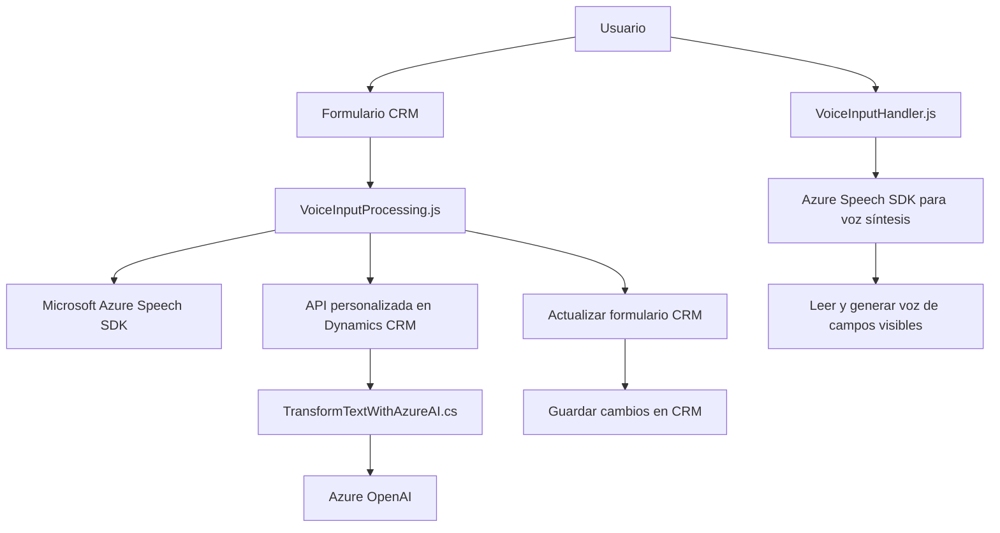

### Breve resumen técnico
El repositorio parece ser una solución que combina una aplicación frontend con ciertos elementos de integración en un entorno de Microsoft Dynamics CRM. Este software utiliza el **Microsoft Azure Speech SDK** para convertir texto en voz y obtener transcripciones de entrada de voz, y emplea la **Azure OpenAI API** como un servicio externo para realizar transformaciones de texto avanzado. También incluye un plugin de Dynamics CRM para interactuar directamente con el contexto del negocio.

---

### Descripción de arquitectura
La solución utiliza una arquitectura híbrida que combina:
1. **N capas** para la distribución lógica de responsabilidad:
   - Presentación (Frontend en JavaScript).
   - Aplicación de lógica (Transformación y procesamiento de texto en CRM).

2. **Integración de microservicios**:
   - Los microservicios son: Microsoft Azure Speech SDK (para voz), y la API de Azure OpenAI (para procesamiento avanzado de texto).

3. **Event-driven architecture** (en componentes frontend):
   - Dependencias manejadas mediante eventos, callbacks y operaciones asincrónicas como respuesta a input del usuario.

4. **Extensibilidad en CRM**:
   - Usa el patrón Plugin de Dynamics CRM para extender las funcionalidades del sistema mediante procesos de servidor (custom workflow).

---

### Tecnologías utilizadas
1. **Frontend (JavaScript):**
   - Microsoft Azure Speech SDK: Reconocimiento de voz y síntesis de texto.
   - Dynamics CRM context (`formContext`, `Xrm.WebApi`).

2. **Backend (C#):**
   - Microsoft Dynamics CRM SDK: `IPlugin`, `Xrm SDK` para manipular entidades CRM.
   - Azure OpenAI API: Reconocimiento avanzado y transformación de texto en JSON.
   - Manipulación de JSON: `Newtonsoft.Json.Linq` y `System.Text.Json`.

3. **Patrones:**
   - Modularización: En frontend y backend, cada funcionalidad está desacoplada por completo.
   - Microservicios: Interacción con módulos externos como Speech SDK y OpenAI API.
   - Event-driven architecture: Especialmente en archivos JS, donde se manejan eventos asíncronos.
   - Plugin Architecture: Extendiendo Dynamics CRM.

---

### Diagrama Mermaid 100% compatible con GitHub Markdown

---

### Conclusión final
1. **Tipo de solución:**  
   Este repositorio es una solución híbrida que combina componentes frontend en JavaScript integrados con Dynamics CRM y servicios de voz y transformación de texto en la nube, lo que indica una aplicación orientada a Personalización e Integración en CRM.

2. **Herramientas y arquitectura:**  
   Se basa en una arquitectura de **n capas** con integración de servicios externos (microservicios). Las API de Microsoft (Speech SDK y OpenAI) desempeñan un papel crítico para voz y procesamiento avanzado de datos. La modularización y diseño orientado a eventos en el frontend optimizan la construcción y mantenibilidad.

3. **Aplicabilidad:**  
   Este sistema se puede emplear en entornos corporativos donde se busca automatizar la interacción con usuarios finales mediante reconocimiento de voz, síntesis de texto y formulación de datos estructurados basados en IA.