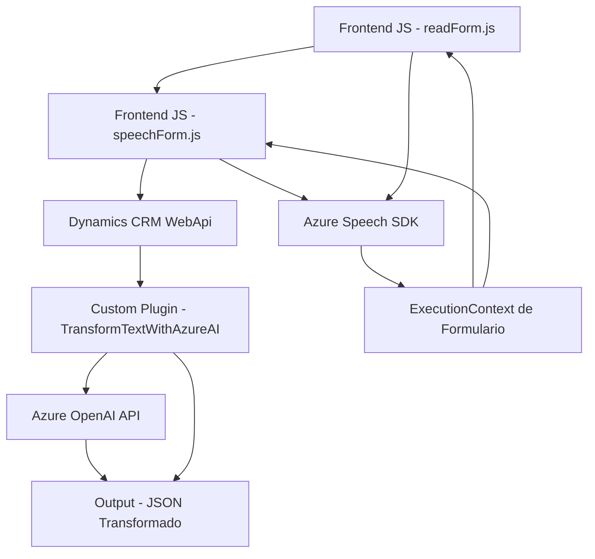

# Análisis técnico

## Breve resumen técnico
El repositorio parece estar destinado a soluciones empresariales basadas en Microsoft Dynamics CRM, integrando funcionalidad de entrada y salida de voz con el Azure Speech SDK y procesamiento de texto mediante Azure OpenAI. Sus componentes sugieren una arquitectura orientada a servicios (SOA) modular, diseñados para interactuar entre sí y con servicios externos.

---

## Descripción de arquitectura
La solución implica las siguientes características arquitectónicas:
1. **Modelo SOA**: Los componentes, como el _plugin TransformTextWithAzureAI.cs_, el frontend en JavaScript y los servicios personalizados de Azure, interactúan entre sí por medio de APIs y servicios REST.
2. **Frontend dinámico**: Los módulos en `FRONTEND/JS` se centran en la integración con formularios web y la dinámica de entrada/salida de voz.
3. **Backend basado en Microsoft Dynamics CRM**: El plugin refuerza la idea de un backend que actúa sobre eventos predefinidos mediante el patrón de diseño orientado a _plugins_.
4. **Integración de servicios externos**: Uso intensivo de recursos de Azure (Speech SDK, OpenAI API) para procesar entrada de voz y transformar texto.

---

## Tecnologías usadas
1. **Frontend**:
   - **JavaScript**: Modulos como `readForm.js` y `speechForm.js` trabajan directamente con el DOM y utilizan el Azure Speech SDK.
   - **Azure Speech SDK**: Dinámicamente cargado desde un CDN para funcionalidad de síntesis y recogida de voz.
   - **Dynamics CRM API**: Acceso al modelo común de datos para interactuar con formularios y gestionar datos CRM.

2. **Backend**:
   - **C# (.NET Framework)**: Implementación del plugin con Microsoft Dynamics SDK para extender funcionalidad.
   - **Microsoft Dynamics CRM**: Gestión de eventos y datos empresariales en el backend.
   - **Azure OpenAI**: Comunicación asincrónica con la API por medio de HTTP.
   - **Newtonsoft.Json**: Serialización/deserialización de datos JSON.

---

## Dependencias o componentes externos
1. **Microsoft Dynamics CRM**: Plataforma base para el procesamiento y almacenamiento de datos empresariales.
2. **Azure Speech SDK**: Utilizado para síntesis y recogida de datos de voz.
3. **Azure OpenAI API**: Usado para transformar texto ingresado en JSON estructurado.
4. **Newtonsoft.Json**: Para manipulación de datos JSON en plugins.
5. **Dynamic Resource Loading**: Scripts del SDK se cargan directamente desde un CDN (mejor para optimización pero incrementa la dependencia de conexión externa).

---

## Diagrama Mermaid

---

## Conclusión final
El repositorio muestra un sistema distribuido centrado en Microsoft Dynamics CRM con una arquitectura orientada a servicios (SOA) modular. Los archivos frontend integran dinámicamente recursos de Azure para salida/entrada de voz, mientras que el backend gestiona la transformación de texto a JSON mediante un _plugin_ de Dynamics CRM y Azure OpenAI API. A pesar de ser modular y basado en servicios externos, puede beneficiarse de una mejor infraestructura de seguridad, como la externalización de claves sensibles, y mayor documentación sobre dependencias externas para facilitar el despliegue.