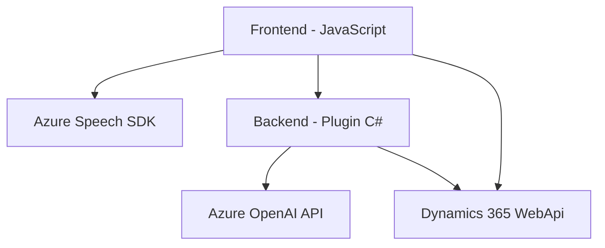

### Análisis de la solución

#### Breve resumen técnico
El repositorio representa una solución basada en Microsoft Dynamics CRM, integrada con **Azure Speech SDK** y **Azure OpenAI API**. El propósito principal es automatizar el procesamiento de formularios mediante la interpretación de datos de entrada y generación de texto o voz. Esto incluye lectura de formularios, transcripción de voz y transformación de texto en JSON estandarizado.

---

### Descripción de arquitectura
La solución tiene una arquitectura basada en la integración de servicios externos con una lógica focalizada en eventos de Dynamics CRM. Funciona como una aplicación modular, formada por los siguientes componentes:
1. **Frontend (JavaScript)**: Scripts para manipulación de formularios en Dynamics CRM a través del DOM y servicios como Azure Speech SDK. Estas funcionalidades son impulsadas por eventos en tiempo real del navegador.
2. **Backend (Plugin en C#)**: Un plugin personalizado que interactúa con la **API de Azure OpenAI** para transformar texto, respondiendo a eventos del CRM.
3. **Servicios Externos**: Integración con **Azure Speech SDK** y **Azure OpenAI API** como servicios externos críticos.

### Tecnologías usadas
1. **Frontend (JavaScript)**:
   - **Azure Speech SDK**: Para síntesis y reconocimiento de voz.
   - **DOM manipulation**: Para acceder y modificar formularios dinámicos.
   - **API Dynamics 365 (`Xrm.WebApi`)**: Para interactuar con entidades del CRM.
   - **Asynchronous programming**: Uso de promesas y callbacks.
   - **Integration pattern**: Para comunicación entre frontend, backend y servicios externos.

2. **Backend (C#)**:
   - **Microsoft Dynamics SDK (`IPlugin`)**: Permite personalizar y extender funcionalidades del CRM.
   - **Azure OpenAI API**: Provee procesamiento avanzado de texto en formato JSON a través de un API Gateway.
   - **Libraries**: `Newtonsoft.Json` y `System.Net.Http` para manipulación del JSON y manejo de solicitudes HTTP.

3. **Patrones arquitectónicos**:
   - **Event-Driven programming**: Flujos basados en eventos tanto en frontend (JavaScript) como en backend (Plugins).
   - **Facade Pattern**: Simplificación del uso de SDKs y APIs para mejor integración con el sistema.
   - **Plugin Pattern**: Código modular y reutilizable del plugin encargado de interactuar con el CRM.
   - **Service-Oriented Architecture (SOA)**: Uso extensivo de APIs para funcionalidad externa (Azure Speech y Azure OpenAI).
   - **Gateway Pattern**: Plugin que actúa como punto único de acceso con la Azure OpenAI API.

---

### Arquitectura general
La arquitectura de la solución es predominantemente de **3 capas**:
1. **Frontend**:
   - Scripts en **JavaScript** que interactúan con los formularios de Dynamics CRM para procesamiento de datos y entrada por síntesis/reconocimiento de voz.
   - Conexión directa al SDK de Azure Speech y a la API de Dynamics 365.
   
2. **Backend**:
   - Plugin en **C#** que centraliza lógica del servidor y realiza transformaciones en base a reglas predefinidas.
   - Interacción con **Azure OpenAI API** para realizar tareas avanzadas de procesamiento de datos y resultados en JSON.

3. **Servicios Externos**:
   - **Azure Speech SDK**: Manejo de los datos de voz y texto en el cliente.
   - **Azure OpenAI API**: Procesamiento de texto para transformarlo en modelos específicos según reglas comerciales.
   - **Dynamics 365 WebApi**: Gestiona operaciones de CRUD para entidades internas del CRM.

---

### Dependencias o componentes externos
1. **Azure Speech SDK**: Procesa reconocimiento y síntesis de voz.
2. **Azure OpenAI API**: Realiza procesos avanzados de análisis y transformación textual, involucrando operaciones de lenguaje natural.
3. **Dynamics 365 WebApi (Xrm.WebApi)**: Manipula datos dentro de las entidades de formulario del CRM, incluyendo búsquedas y actualizaciones.
4. **Newtonsoft.Json / System.Text.Json**: Permite lectura y manipulación de respuestas JSON provenientes de servicios externos.
5. **HTTP Client (`System.Net.Http`)**: Librería utilizada para consumir APIs remotas.

---

### Diagrama Mermaid válido para GitHub

---

### Conclusión final
La solución es un **sistema con arquitectura de 3 capas que integra diversos servicios externos para reconocimiento y síntesis de voz, así como transformación textual avanzada.**  
Permite la interacción dinámica con formularios mediante eventos en el frontend (Javascript), mientras que el backend (C# Plugin) orquesta la lógica server-side y la comunicación con la **Azure OpenAI API**.  
La arquitectura modular, patrones como **Facade**, **Adapter**, y **Event-Driven** han sido implementados correctamente.