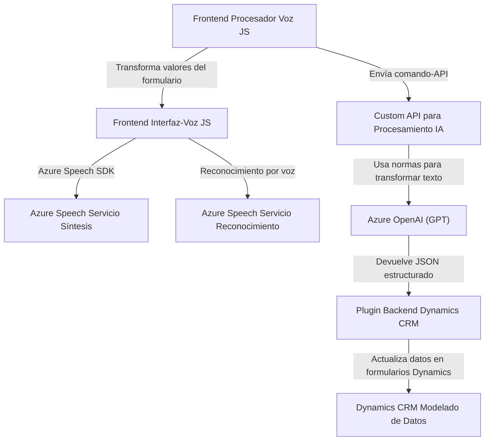

### Breve Resumen Técnico

La estructura del repositorio proporciona una solución que integra funcionalidades de reconocimiento y síntesis de voz con el **Azure Speech SDK** en ambientes de front-end y back-end. Los módulos para el front-end gestionan la interacción dinámica con formularios mediante comandos y voz, mientras que el backend amplía capacidades de procesamiento, usando Azure OpenAI para transformar textos basándose en reglas específicas.

---

### Descripción de Arquitectura

1. **Tipo de Solución**:  
   - **Frontend**: Módulos JavaScript para interacción vocal con formularios.
   - **Backend**: Plugin para Microsoft Dynamics CRM con integración de IA para procesamiento avanzado.
   - Solución híbrida que combina una capa de presentación (UX) y procesamiento en la nube (Azure Speech y OpenAI).

2. **Tipo de Arquitectura**:  
   - **Frontend**: Arquitectura orientada a componentes, modular (`readForm.js`, `speechForm.js`).
   - **Backend**: Arquitectura orientada a servicios (SOA), con desacoplamiento entre Dynamics CRM y Azure OpenAI.
   - La solución en conjunto puede clasificarse como **n-Capas**:
     - **Capa de presentación**: Formularios y SDK.
     - **Capa de negocio**: Procesamiento IA y servicios vocales.
     - **Capa de acceso a datos**: Visto parcialmente en el plugin.

3. **Patrones usados**:  
   - Carga dinámica de SDKs.
   - Procesadores básicos y avanzados (textos y campos visibles).
   - Integraciones desacopladas con servicios externos (Azure Speech y Azure OpenAI).
   - Abstracción de lógica en funciones utilitarias.

---

### Tecnologías Usadas

1. **Frontend**:  
   - **JavaScript ES6**.
   - **Azure Speech SDK** (síntesis y reconocimiento de voz).
   - Uso del DOM para manejar formularios.
   
2. **Backend**:  
   - **C#** (plugin de Dynamics CRM). 
   - **Microsoft.Xrm.Sdk** (API estándar para plugins).
   - **Azure OpenAI GPT** (procesamiento avanzado para transformación de texto).
   - **Newtonsoft.Json.Linq** para manipulación JSON.
   - **Sistema HTTP estándar** para solicitudes API.

3. **General**:  
   - **Servicios en la nube de Azure** (Speech + OpenAI).
   - **RESTful APIs** (integraciones desacopladas).

4. **Entorno destino**:  
   - **Dynamics 365 CRM**: Para formularios y plugins.
   - **Web Browser**: Interacción cliente para los módulos frontend.

---

### Diagrama Mermaid Compatible con GitHub Markdown

---

### Conclusión Final

El repositorio se centra en una solución **híbrida** que conecta interfaces del usuario (frontend en JavaScript) con servicios en la nube (Azure Speech y OpenAI) para mejorar la accesibilidad e interacción activa utilizando voz. Al mismo tiempo, cuenta con una capa backend en Dynamics CRM que amplía las capacidades del sistema a través de un servicio integrado de inteligencia artificial para transformar datos y realizar actualizaciones dinámicas en formularios.

La arquitectura presentada es principalmente **n-Capas**, destacando la modularidad y desacoplamiento en cada parte de la solución. La elección de **Azure Speech SDK** y **Azure OpenAI** refleja objetivos claros de escalabilidad y integración futura.