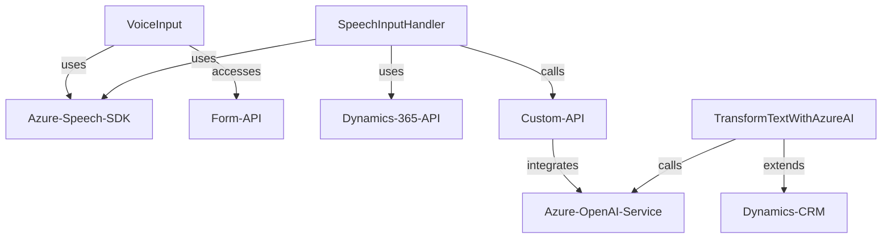

### Breve resumen técnico:
El repositorio contiene una solución que implementa funcionalidades para interacción con formularios en una aplicación de Dynamics 365 utilizando reconocimiento de voz y síntesis de voz integrados con Azure Speech SDK y Azure OpenAI. Esta solución procesa comandos de voz, extrae datos del formulario y los manipula, transformando texto o valores, todo mediante integraciones con APIs externas.

---

### Descripción de arquitectura:
La solución tiene características de arquitectura orientada a servicios con un enfoque moderado hacia desacoplamiento. Se observa:
1. **Funciones frontend:** Procesan la entrada del usuario y sintetizan la salida, invocando APIs externas.
2. **Plugin backend:** Realiza la transformación de datos input usando servicios de Azure OpenAI REST API.

Aunque estos módulos se pueden asociar a patrones de microservicio, la solución es principalmente un **"monolito distribuido"** para abordar necesidades específicas dentro de Dynamics 365, con una separación destacada entre frontend (JS/SDK en el navegador del lado cliente) y funciones backend (Servicios .NET y Azure).

---

### Tecnologías usadas:
1. **Frontend:**
   - **JavaScript:** Lenguaje principal para las funciones de voz y formulario.
   - **Azure Speech SDK:** Reconocimiento y síntesis de voz.
   - **Dynamics 365 API (`Xrm.WebApi`)**: Interacción con el formulario y almacenamiento de datos.

2. **Backend:**
   - **C#/.NET Framework**: Implementación del plugin para Dynamics CRM.
   - **Azure OpenAI Service:** Procesamiento avanzado de texto mediante IA.

---

### Patrones observados:
1. **Cargadores dinámicos:** Funciones específicas verifican la carga dinámica de SDKs como Azure Speech, reduciendo la carga inicial y optimizando dependencias.
2. **Plugins para CRM:** Implementación basada en el patrón `IPlugin` para extender funcionalidad en eventos de Dynamics CRM.
3. **Integración de APIs externas:** Llamadas REST a servicios como Azure OpenAI y procesamiento de respuestas usando DTOs.
4. **Separación funcional:** Estructuración modular con separación entre frontend y backend.
5. **Procesamiento de datos estructurados:** Los datos extraídos del formulario y los transformados por IA se manejan con estructuras definidas como objetos y JSON.

---

### Diagrama Mermaid válido para GitHub:

---

### Conclusión final:
La solución es una combinación de frontend y backend integrados con APIs externas (Azure Speech SDK y Azure OpenAI). Responde a necesidades específicas como procesar datos de formularios y comandos de voz en una aplicación de Dynamics 365 CRM. Aunque se observa una separación funcional adecuada, el enfoque de arquitectura es un **monolito distribuido**, dado que las capas de frontend y backend dependen directamente de la misma plataforma (Dynamics 365), lo que limita la independencia total del sistema.

Para un mejor diseño modular, se podría explorar la promoción del plugin hacia una arquitectura más desacoplada, posiblemente convirtiéndola en un microservicio autónomo que interactúe con Dynamics CRM vía API, permitiendo una mayor estabilidad, escalabilidad y mantenibilidad del sistema.