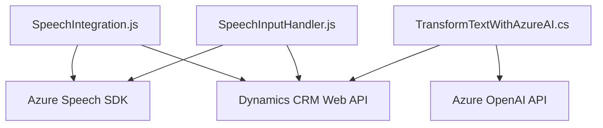

### Breve Resumen Técnico
El repositorio examinado contiene principalmente tres archivos que contribuyen a la construcción de funcionalidades interconectadas para una integración de reconocimiento de voz y procesamiento de texto utilizando Azure AI. Los archivos están separados por funciones específicas y se enfocan en la manipulación de formularios (frontend) y en la comunicación con APIs externas (Azure Speech SDK y OpenAI).

---

### Descripción de Arquitectura
La solución parece formar parte de un sistema híbrido que interactúa con un sistema CRM (Dynamics 365), extendiendo sus funcionalidades mediante integración con APIs de Azure para reconocimiento de voz (Speech SDK) y procesamiento avanzado del lenguaje natural (Azure OpenAI). La arquitectura puede clasificarse como **n-capas**, dividiéndose en:

1. **Capa de presentación**:
   - Los archivos en `FRONTEND/JS` implementan el reconocimiento de voz y la síntesis de audio para mejorar la experiencia del usuario en formularios dinámicos.
   - El manejo de la interacción del usuario con el formulario ocurre en esta capa.
2. **Capa de negocio**:
   - El archivo plugin `TransformTextWithAzureAI.cs` actúa como middleware, realizando labores de procesamiento a través de API externas y gestionando la lógica dentro del ecosistema Dynamics CRM.
3. **Capa de servicios**:
   - Se integra servicios externos como el *Azure Speech SDK* para ofrecer funcionalidades de voz y el servicio *Azure OpenAI* para procesamiento avanzado de texto, integrados vía solicitudes HTTP REST.

Por lo tanto, la arquitectura es una combinación de **n-capas con integración de servicios externos** (aunque se observa que gran parte de la lógica está contenida en módulos separados, lo que agrega modularidad).

---

### Tecnologías Usadas
1. **Frontend:**
   - **JavaScript**: Lenguaje principal para la manipulación del DOM, integración de SDK y procesamiento de datos del formulario.
   - **Azure Speech SDK**: Usado para reconocimiento de voz y síntesis en el navegador web.
   - **Callback pattern**: Para garantizar una carga correcta y asincrónica del SDK.

2. **Backend (Plugins):**
   - **Microsoft Dynamics CRM SDK**: Extensión de funcionalidades de CRM mediante plugins.
   - **C#:** Lenguaje orientado a objetos utilizado en el plugin.
   - **Azure OpenAI (GPT-4)**: Consumo de la API de procesamiento de lenguaje natural aplicada a las reglas del sistema CRM mediante solicitudes HTTP.
   - **System.Text.Json & Newtonsoft.Json.Linq**: Para la serialización y deserialización en objetos JSON.

3. **Integración de servicios**:
   - APIs REST (Azure Speech SDK, Azure OpenAI).
   - Xrm.WebApi.online: Para manipular con datos del CRM mediante un modelo SaaS (integración online).

4. **Patrones de diseño**:
   - **Event-Driven Architecture**: Múltiples interacciones basadas en eventos asincrónicos, como reconocimientos de voz o contextos dinámicos del formulario.
   - **Responsabilidad Única (SRP)**: Cada función y clase se dedica a una tarea específica, logrando modularidad accedida desde distintas partes del sistema.

---

### Diagrama Mermaid

---

### Conclusión Final
La solución, basada en descripción funcional y análisis de los archivos, parece ser una **aplicación de capa n** con integración de servicios externos. Los componentes están divididos en frontend (interfaz del usuario) y middleware plug-and-play (para CRM), lo que brinda un claro diseño modular y funcional. Las tecnologías elegidas son estándar y potentes, especialmente Azure Speech y OpenAI para añadir capacidades avanzadas de inteligencia artificial y reconocimiento de voz.

Se recomienda mejorar algunos puntos, como la externalización de las configuraciones sensibles (ejemplo: `apiKey`) y la posible eliminación de dependencias redundantes (como `Newtonsoft.Json.Linq` en el plugin). En general, la arquitectura es apropiada y muestra un diseño bien estructurado para el caso de uso presentado.