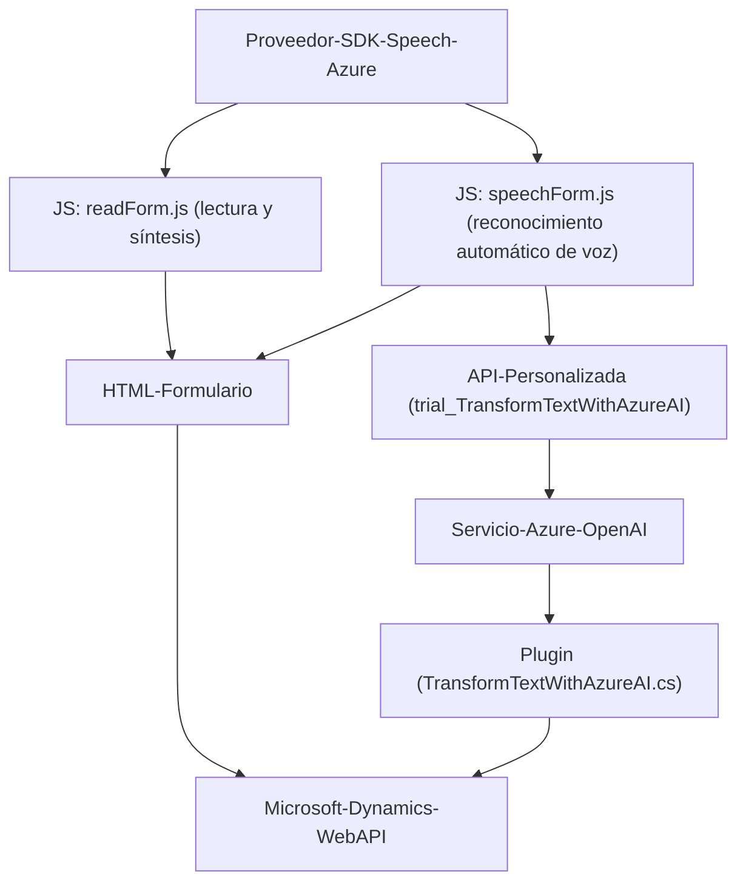

### Análisis de los archivos del repositorio

#### 1. Qué tipo de solución es
La solución es una integración compleja basada en aplicaciones empresariales para la interacción entre formularios (frontend JavaScript), reconocimiento de voz, síntesis de texto en voz (Azure Speech SDK), procesamiento avanzado de texto mediante inteligencia artificial (Azure OpenAI API), y plugins personalizados para Microsoft Dynamics CRM. Esto sugiere un sistema enfocado en la automatización de tareas en aplicaciones empresariales, como un asistente de voz que procesa formularios y ejecuta transcripciones avanzadas.

---

#### 2. Tecnologías, frameworks y patrones utilizados
**Tecnologías:**
- **Frontend:**  
  - JavaScript con funciones y módulos para la manipulación y automatización de formularios.  
  - Integración del Azure Speech SDK.  
  - Asynchronous operations con `Promise` y `async/await`.

- **Backend:**  
  - Plugins para Microsoft Dynamics CRM basados en `IPlugin`, ejecutados en el pipeline del CRM.  
  - Uso de Azure OpenAI API para procesamiento avanzado del texto transcrito.  
  - .NET Framework con bibliotecas estándar (e.g., `Newtonsoft`, `System.Net.Http`, `System.Linq.Expressions`, etc.).

- **Cloud Services:**
  - **Azure Cognitive Services Speech SDK:** Para reconocimiento y síntesis de voz.  
  - **Azure OpenAI API:** Procesamiento avanzado de texto con algoritmos de inteligencia artificial, posiblemente modelos GPT.

**Patrones de diseño:**  
- **Facade:** Utilizado tanto en el frontend como en el backend para simplificar interacciones (e.g., `startVoiceInput` funciona como un punto de entrada único).  
- **Callback-based architecture:** Uso de funciones callback para manejar eventos asincrónicos como la carga del Speech SDK.  
- **Data transformation:** Manipulación de datos para generar entradas legibles y procesar transcripciones.
- **Plugin architecture:** Extensiones basadas en la interfaz `IPlugin` para integrar con Microsoft Dynamics CRM.  
- **Service-oriented architecture:** Comunicación entre módulos y servicios externos mediante APIs.  
- **Event-driven design:** Eventos en frontend y triggers en plugins para iniciar procesos en respuesta a cambios en el estado del sistema.

---

#### 3. Tipo de arquitectura
La solución utiliza un **modelo híbrido de arquitectura** compuesto de las siguientes capas:
1. **Frontend (JavaScript):** Responsable de la interacción del usuario con datos del formulario CRM y generación/síntesis de texto en voz en tiempo real.
2. **API y servicios externos:** Comunicación bidireccional con servicios como Azure Cognitive Services y APIs personalizadas (Azure OpenAI API).
3. **Backend:** Extiende el CRM con funciones personalizadas y procesamientos complejos mediante plugins alojados en el servidor.

Por la división funcional en componentes como frontend, servicios en la nube, y backend extensible, este sistema puede ser catalogado como una arquitectura **orientada a servicios** (SOA). No es un monolito estricto ni una arquitectura hexagonal, pero tiene características de **n-capas**, ya que separa claramente las responsabilidades entre frontend, servicio API/capa lógica y backend.

---

#### 4. Dependencias o componentes externos presentes
- **Azure Speech SDK:**  Se utiliza para reconocimiento y síntesis de voz en el frontend.  
- **Azure OpenAI API:** Procesa texto con inteligencia artificial en plugins del CRM.  
- **Microsoft Dynamics CRM Web API:** Se utiliza para gestionar y acceder a datos en la capa backend (realización de operaciones CRUD en el Dataverse/CRM).  
- **Standard libraries:** Bibliotecas de .NET Framework como `System.Text.Json` para manejo de datos JSON y `System.Net.Http` para solicitudes HTTP.

---

#### 5. Diagrama Mermaid válido para GitHub

---

#### Conclusión técnica
La solución presentada está diseñada para manejar tareas avanzadas de reconocimiento de voz, síntesis de texto y procesamiento inteligente de datos en un entorno empresarial basado en Microsoft Dynamics CRM. Con un paradigma orientado a servicios, el sistema combina funcionalidades de frontend (interacción con formularios), servicios en la nube (Azure Speech SDK y OpenAI) y plugins backend. La arquitectura modular permite una fácil expansión, principalmente mediante servicios en la nube y plugins personalizados. El diagrama refleja las interacciones de los diferentes componentes, mostrando la dependencia entre SDKs y APIs externas, y la conexión con sistemas empresariales como el CRM.