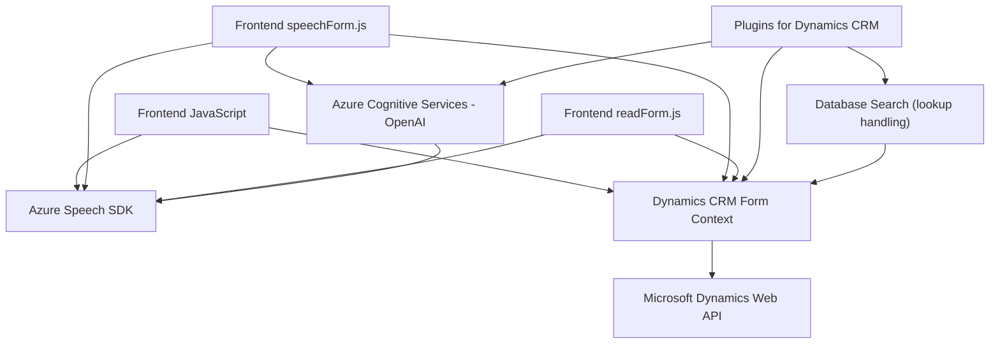

### Breve resumen técnico:
El repositorio presentado contiene una solución orientada a integrar entrada de voz, manejo dinámico de datos en formularios y procesamiento de texto mediante inteligencia artificial. Combina tecnologías y plugins que interactúan con servicios externos como Dynamics CRM y Azure Cognitive Services (Speech SDK y OpenAI). 

### Descripción de arquitectura:
La arquitectura de esta solución refleja un modelo de **microservicios acoplados** bajo el ecosistema Dynamics CRM. Se utiliza un enfoque de **n capas**, con un frontend modular para manejo de interacción en los formularios, lógica de negocio en los plugins, y comunicación directa con APIs de terceros. Esto potencia accesibilidad y permite extender procesos administrativos integrados con inteligencia artificial.

---

### **Tecnologías usadas**:
1. **Frontend**:
   - JavaScript para implementación modular del evento de entrada y síntesis de voz vía Azure Speech SDK.
   - Dynamics CRM Form Context API (`Xrm.WebApi`) para manipulación y actualización de formularios.

2. **Backend**:
   - .NET Framework (C#): Construcción de plugins para Dynamics CRM.
   - Azure OpenAI y Azure Speech SDK como facilitadores de lógica avanzada de IA.

3. **Patrones de diseño**:
   - **Event-driven programming**: Uso de callbacks en tareas asíncronas (SDK y APIs).
   - **Plugin Pattern**: Extensiones específicas dentro de Dynamics CRM, encapsulando lógica de negocio en eventos.
   - **Integración de Microservicios REST**: Comunicación directa con Azure AI y Dynamics via HTTP.

---

### **Dependencias o componentes externos presentes**:
1. **Azure Speech SDK**:
   - Cargado dinámicamente desde `aka.ms`. Permite reconocimiento de voz y síntesis de texto a voz.
2. **Azure OpenAI**:
   - Endpoint `gpt-4o` para transformar texto bajo ciertas reglas definidas.
3. **Microsoft Dynamics CRM**:
   - Interacción con datos dinámicos del formulario, dependencias `Xrm.WebApi` y `IPlugin`.
4. **Bibliotecas en C#**:
   - `Newtonsoft.Json` para manipulación de JSON.
   - `System.Net.Http` para comunicación API REST.
5. **APIs personalizadas**:
   - Extensiones para manipulación avanzada de texto y búsqueda en bases de datos.

---

### **Diagrama Mermaid**

---

### **Conclusión final**:
La solución presentada utiliza un enfoque modular con interacción entre frontend dinámico en JavaScript y procesamiento de datos vía backend en C#. La arquitectura está alineada hacia una estructura de **n capas**, donde cada capa aporta a la modularidad y escalabilidad: presentación (formularios), lógica de negocio (plugins), servicios externos (Azure AI y Dynamics Web API), y persistencia (CRM Database via Web API). Este diseño es robusto y bien pensado, permitiendo la personalización para diferentes escenarios empresariales mediante IA y manejo dinámico de formularios.