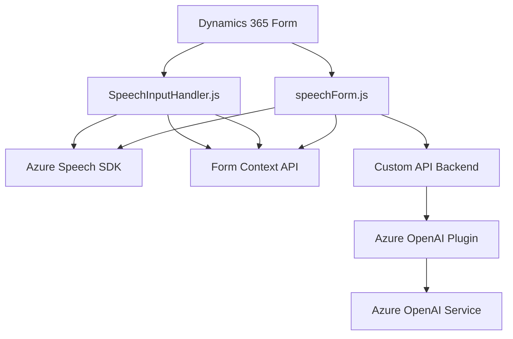

### Breve resumen técnico

La solución involucra múltiples componentes que interactúan para procesar datos y funcionalidades en un entorno **Dynamics 365**, usando tecnologías como **JavaScript** para el frontend y **.NET** para los plugins. Está centrada en la integración con los servicios de Azure como **Speech SDK** y **OpenAI**, que habilitan interacciones avanzadas de reconocimiento y síntesis de voz, así como procesamiento de textos mediante inteligencia artificial.

---

### Descripción de arquitectura

La arquitectura general es **n capas**, dividida en:
1. **Frontend (JavaScript)**: Interacción directa con Dynamics 365 usando el SDK de Azure Speech para la síntesis de voz y reconocimiento de comandos hablados.
2. **Plugin (Backend, .NET)**: Implementa lógica empresarial específica en Dynamics 365 mediante la integración con **Azure OpenAI**, delegando tareas intensivas de procesamiento textual a servicios externos RESTful.
3. **Servicios Externos (Azure)**: Azure proporciona capacidades de reconocimiento de voz y transformación de texto basadas en IA, asegurando que el procesamiento más complejo se realice fuera del entorno Dynamics.

La estructura refleja patrones de delegación, integración RESTful y modularidad, habilitando escalabilidad y mantenibilidad.

---

### Tecnologías usadas

#### Backend:
- **C# (Microsoft Dynamics Plugins)**: Extensión del CRM con lógica en el servidor.
- **Azure OpenAI API**: Procesamiento de texto avanzado usando modelos GPT para tareas específicas.
- **Newtonsoft.Json** y **System.Text.Json**: Serialización y manipulación JSON.

#### Frontend:
- **JavaScript**:
  - **Azure Speech SDK (Voz a texto/texto a voz)**.
  - SDK de web API de Dynamics 365 para manipulación de entidades y formularios.

#### Entorno:
- **Dynamics 365**: Sistema central para gestionar datos e integraciones de negocio.
- **Azure Services**:
  - Azure Speech para síntesis y reconocimiento de voz.
  - Azure OpenAI para procesamiento de texto.

#### Patrones utilizados:
1. **Delegación y modularidad** en JavaScript para funciones específicas.
2. **Inyección de dependencias** utilizando `IServiceProvider` en Dynamics Plugins.
3. **Encapsulación de lógica de negocio**, centralizando la interacción con componentes externos.

---

### Diagrama **Mermaid** válido para GitHub

---

### Conclusión final

La solución implementa una arquitectura basada en **n capas**, utilizando servicios de Azure como eje central para habilitar características avanzadas de interacción de voz y procesamiento de datos en formularios de **Dynamics 365**. Los patrones empleados garantizan modularidad y escalabilidad, permitiendo que los componentes como el frontend en JavaScript y los plugins en .NET sean extensibles y mantenibles.

Este sistema se adapta bien a entornos especializados donde las interacciones humano-computadora (mediante voz e inteligencia artificial) son fundamentales, y donde se requiere una integración fluida con servicios RESTful y APIs dinámicas. Sin embargo, la solución expone dependencias significativas con Azure, por lo que su operatividad está fuertemente vinculada a la disponibilidad de los servicios de Azure (Speech y OpenAI).