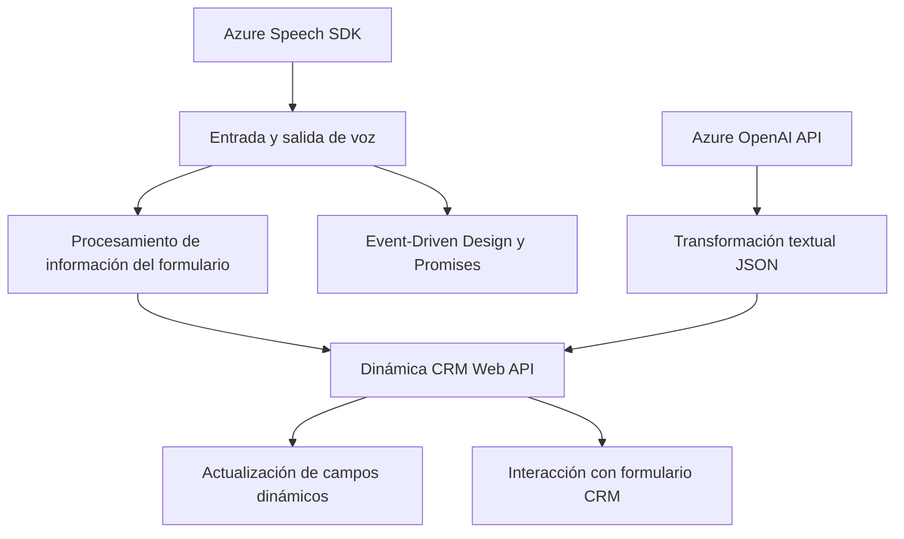

### Breve resumen técnico

El repositorio incluye tres archivos que implementan funcionalidad relacionada con el manejo de entradas de voz, lectura y síntesis textual de formularios, y transformación y estructuración de texto en el contexto de Dynamics CRM utilizando Microsoft Azure Speech SDK y Azure OpenAI API. La solución permite mejorar la interacción entre usuario y sistema, facilitando actualizaciones dinámicas de formularios basadas en input de voz y acciones asistidas por inteligencia artificial.

---

### Descripción de arquitectura

La solución presenta una arquitectura basada en **n capas** (multicapas) enfocada principalmente en **integración de servicios externos**. Los archivos tienen las siguientes características:

- Los componentes de frontend (`readForm.js` y `speechForm.js`) implementan lógica de negocio y comunicación con APIs externas mediante **integración por SDK y HTTP request (AJAX/Fetch)**. Este nivel de comunicación define la arquitectura como un ejemplo típico de **Layered Architecture con integración API externa**.
- Se emplea callbacks y promesas asíncronas para obtener y transformar datos.
- En el nivel backend (archivo `.cs`), la lógica está diseñada como un servicio increible encapsulado (plugin) que reside en el entorno de Dynamics 365 (cliente-servidor) y ejecuta tareas relacionadas con transformación y validación de datos.
  
**Capas identificadas:**
1. **Frontend (Presentation Layer)**: Archivos JavaScript (`readForm.js`, `speechForm.js`) que interactúan directamente con los usuarios para capturar voz y actualizar formularios.
2. **Middle Layer (Application Layer)**: Solicitudes a servicios API externos (Azure Speech SDK, OpenAI API) para procesar y transformar los datos.
3. **Backend (Data Layer)**: Manejo de datos en el entorno Dynamics CRM (base de datos corporativa) junto con la ejecución de lógica de negocio avanzada (archivo `.cs`).

---

### Tecnologías usadas

1. **Frontend (JavaScript):**
   - **Azure Speech SDK**: Para reconocimiento de voz y síntesis. Integración dinámica mediante carga en tiempo de ejecución.
   - **Microsoft Dynamics CRM Web API**: Uso de contextos de formulario para actualizaciones dinámicas.
   - **JavaScript Promises**: Manejo asíncrono de datos entre APIs y funcionalidad de implementación.
   - **Event-Driven Design Pattern**: Centros como `executionContext` capturan eventos para iniciar la interacción de usuario.

2. **Backend (.NET/C#):**
   - Exposición de plugins de Dynamics (`IPlugin` interface).
   - Comunicación con **Azure OpenAI API** para la transformación estructurada.
   - **JSON Libraries**: Uso de Newtonsoft.Json.LINQ y System.Text.Json para generar respuesta procesada.
   - **HTTPClient for External API**: Peticiones estructuradas a APIs remotas con credenciales.
   - Manipulación de texto mediante reglas (Regex, String Methods).

---

### Dependencias o componentes externos

1. **Servicios de Azure**:
   - **Azure Speech SDK** para captura de voz, síntesis y reconocimiento.
   - **Azure OpenAI API** para transformación avanzada de texto.

2. **Microsoft Dynamics CRM**:
   - Web API (`Xrm.WebApi`) para actualizaciones dinámicas de formularios y entidades.

3. **Entorno de producción de Dynamics CRM**:
   - Ejecución de plugins.
   - Integración directa con entidades CRM como `contact` y `account`.

4. **Javascript SDK**:
   - Carga de Microsoft Speech SDK desde una CDN pública: `https://aka.ms/csspeech/jsbrowserpackageraw`.

5. **Bibliotecas estándar de .NET** para tareas como operaciones de red, manipulación de texto, y manejo de objetos JSON.

---

### Diagrama **Mermaid** para GitHub Markdown

---

### Conclusión final

La solución presentada es un sistema de interacción avanzada con formularios en un entorno de Dynamics CRM, que aprovecha inteligencia artificial y tecnología cloud para mejorar la experiencia del usuario. La arquitectura es un ejemplo bien implementado de diseño en capas, separación de responsabilidades y orquestación de servicios externos utilizando patrones de integración API. La funcionalidad es interesante en contextos empresariales que buscan optimizar procesos con dinámicas basadas en entradas de voz y datos enriquecidos por IA.