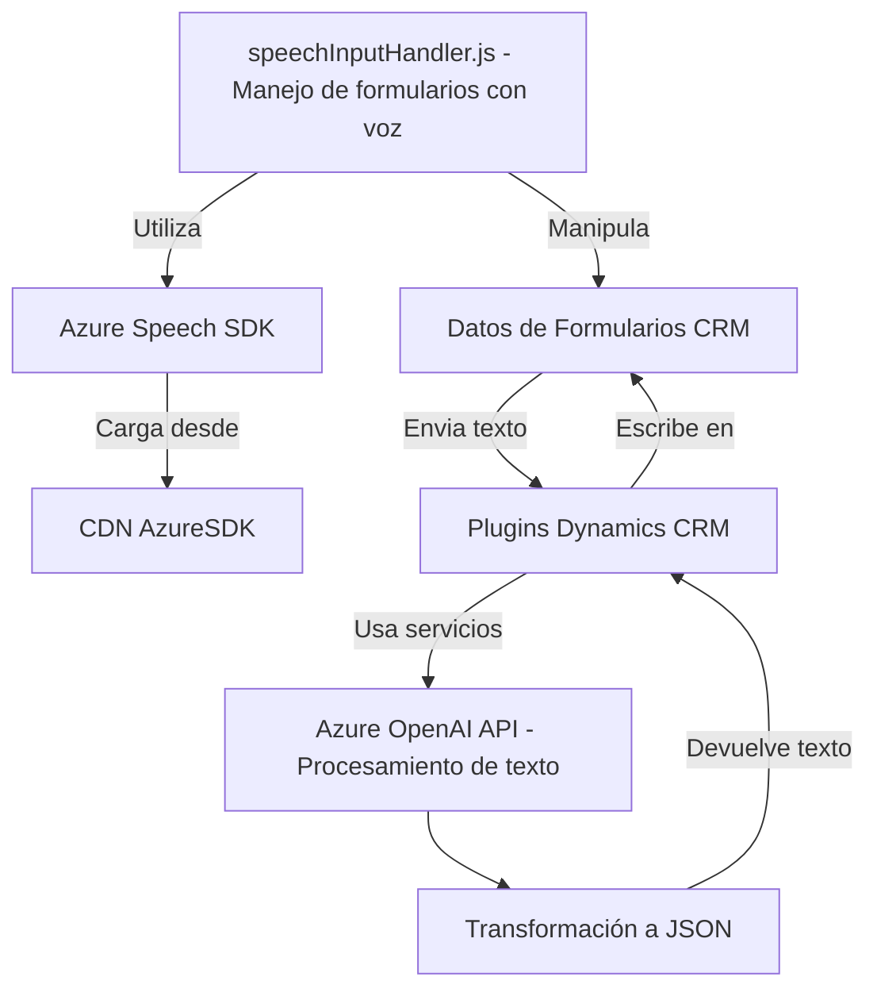

### Breve resumen técnico:
El repositorio presenta componentes enfocados en la interacción por voz y procesamiento de datos en un sistema CRM, integrados vía APIs de Microsoft Dynamics y Azure. Estos permiten introducir y manejar datos en formularios mediante reconocimiento de voz y transformación de texto con inteligencia artificial.

### Descripción de arquitectura:
La solución combina una arquitectura **modular cliente-servidor** que integra diferentes capas funcionales:
1. **Frontend**: Manejo de entrada por voz, uso de Azure Speech SDK y manipulación de formularios.
2. **Backend (Plugins)**: Implementación de un plugin de Dynamics CRM (C#) que usa Azure OpenAI para transformar textos.
3. **APIs externas**: Integración con servicios de Azure Speech y OpenAI para funcionalidades avanzadas.

Es una solución híbrida que se aproxima al paradigma **n-capas**:
- **Capa presentación**: Frontend con HTML/JS interactivo y entrada de datos.
- **Capa lógica (business)**: Plugins de Dynamics CRM que delegan procesamiento a APIs externas.
- **Capa de datos**: Gestión de formularios y datos mediante servicios de Dynamics CRM.

### Tecnologías usadas:
- **Frontend**:
  - HTML, CSS y JavaScript.
  - Azure Speech SDK (procesamiento y síntesis de voz).
  - Manipulación DOM y asincronismo en JavaScript.
  - Integración dinámica de dependencias de SDK desde CDN.

- **Backend**:
  - Dinámica CRM SDK (C#), plugins personalizados.
  - Azure OpenAI para procesamiento de texto.
  - System.Net.Http y JSON serializers para comunicación API REST.

- **Patrones implementados**:
  - **Lazy Loading**: Evaluación condicional para cargar Azure Speech SDK dinámicamente.
  - **Callback handlers**: Cada etapa de la lógica aprovecha eventos o promesas encadenadas.
  - **Plugin-based Architecture**: Integración extensible de funcionalidades externas con CRM.
  - **API Gateway Pattern**: Delegación de procesos hacia servicios como Azure OpenAI y su abstracción.

### Dependencias o componentes externos:
1. **Azure Speech SDK (Frontend)**: Usado para reconocimiento y síntesis de voz.
2. **Azure OpenAI API (Backend)**: Transformación de texto usando inteligencia artificial.
3. **Microsoft Dynamics CRM SDK**: Para interactuar con los formularios y datos organizacionales en el backend.
4. **CDN**: Para la carga dinámica del Azure Speech SDK.
5. **Newtonsoft.Json.Linq y System.Text.Json**: Manejo de JSON en plugins.

---

### Diagrama Mermaid válido para GitHub:

### Conclusión Final:
La solución presentada es una arquitectura modular basada en n-capas, que combina tecnologías frontend (Azure Speech SDK, JS) y backend (Microsoft Dynamics CRM plugins). Se observa una integración dinámica entre entrada por voz, procesamiento de datos en formularios, y la delegación de tareas complejas de AI al servicio Azure OpenAI. El diseño emplea patrones como Lazy Loading, Plugin-based Architecture y API Gateway, lo que lo hace adaptable y eficiente para sistemas dinámicos como los CRMs.