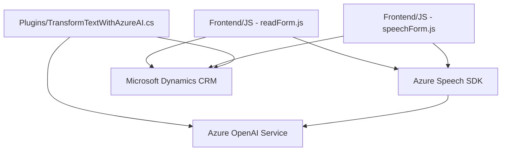

### Breve resumen técnico
El repositorio incluye archivos específicos para implementar soluciones relacionadas con interacción de voz, procesamiento de formularios y transformación de texto con IA. Los proyectos están orientados a integrarse con servicios de Microsoft Dynamics 365 y Azure Speech/OpenAI, brindando funcionalidades avanzadas para la interacción de usuarios mediante voz y procesamiento de datos estructurados.

---

### Descripción de arquitectura
La arquitectura se basa en un modelo de cliente-servidor con integración de servicios externos:
1. **Cliente**: Los archivos JavaScript se encargan de interactuar con formularios y realizar llamadas al servicio de Azure Speech SDK para entrada de voz y síntesis de texto.
2. **Servidor**: Los plugins para Microsoft Dynamics CRM funcionan como microservicios que consumen Azure OpenAI para transformar texto utilizando reglas específicas. El procesamiento y comunicación se organizan en capas funcionales:
   - **Frontend (JavaScript)**: Obtiene datos del formulario, interactúa con APIs externas y gestiona el flujo de entrada y salida de voz.
   - **Backend (C# Plugins)**: Procesa texto con reglas específicas y transforma la información en JSON estructurado.

La arquitectura es modular y facilita la integración en sistemas CRM y servicios de Azure, reforzando patrones como separación lógica y desacoplamiento entre cliente y servidor.

---

### Tecnologías usadas
1. **Frontend**:
   - **JavaScript** para interacción con formularios y lógica de negocio en Dynamics.
   - **Azure Speech SDK** para reconocimiento de voz y síntesis de texto.
   - **Dynamics Web API** para registrar valores y llamar Custom APIs.
2. **Backend**:
   - **C#** para implementar plugins compatibles con Dynamics CRM.
   - **Azure OpenAI Service** para transformar texto con IA.
   - **Librerías .NET**: `System.Net.Http`, `System.Text.Json`, etc.
   - **Newtonsoft.Json` para procesar datos JSON.

---

### Diagrama Mermaid válido para GitHub

---

### Conclusión final
La solución implementada en este repositorio corresponde a una arquitectura basada en **cliente-servidor** con integración de tecnologías de **Microsoft Dynamics CRM** y servicios de **Azure**. Los **archivos de frontend** se enfocan en gestionar interacción de voz y formularios mediante JavaScript, mientras que los **plugins backend en C#** amplían la funcionalidad, como el procesamiento de texto con reglas específicas usando Azure OpenAI.

La solución presenta:
- Modularidad lógica en la separación de responsabilidades entre frontend y backend.
- Uso eficiente de SDKs externos como Speech y OpenAI de Azure, destacando el desacoplamiento entre las capas.
- Capacidades avanzadas para interactuar con datos dinámicos y estructurados en un ecosistema de Microsoft Dynamics CRM.

Es un diseño escalable adaptado para aplicaciones empresariales que requieren inputs dinámicos y procesamiento inteligente mediante IA.