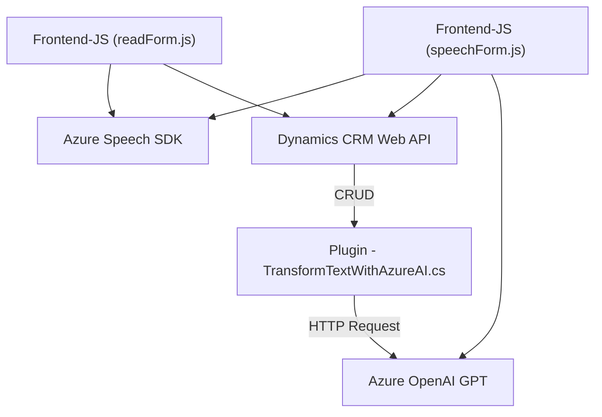

# Análisis del Repositorio GitHub

## **Breve resumen técnico**
El proyecto parece ser una implementación de una solución integrada entre un sistema de gestión empresarial **Microsoft Dynamics 365**, un frontend para formularios interactivos basado en **JavaScript**, y servicios avanzados de procesamiento de lenguaje mediante **Azure Speech SDK** y **Azure OpenAI GPT**. 

El objetivo general del sistema es mejorar la interacción de los usuarios con formularios mediante entrada de voz, reconocimiento de voz y producción de texto sintetizado. Asimismo, se incluye un plugin en Dynamics CRM que permite realizar transformaciones de datos basadas en normas específicas utilizando tecnología de inteligencia artificial (Azure OpenAI).

---

## **Descripción de la arquitectura**
La arquitectura del sistema parece ser **n-capas con integración de servicios externos**. Este diseño incluye:
1. **Capa de presentación**:
   - Implementada mediante `readForm.js` y `speechForm.js` en JavaScript. Se utiliza para interactuar con el usuario, capturar la entrada de datos (voz y texto) y procesar el formulario en el cliente.
   - Comunicación directa entre estas capas del frontend se realiza mediante invocación de APIs internas y externas (e.g., Azure Speech y Dynamics CRM Web APIs).
   
2. **Capa lógica del negocio**:
   - Implementada con el **plugin de Dynamics CRM**, que contiene lógica propia para procesar datos. Este plugin actúa como mediador entre Dynamics CRM y Azure OpenAI, enviando solicitudes HTTP al servicio externo de IA para generar respuestas basadas en el input recibido.
   - La lógica de negocio utiliza transformaciones personalizadas de texto y devuelve un JSON estructurado al cliente.

3. **Capa de integración con servicios externos**:
   - Conexiones realizadas directamente a los endpoints de **Azure Speech SDK** para reconocimiento/producción de voz desde los scripts del frontend.
   - Comunicación con **Azure OpenAI** desde el plugin para procesamiento avanzado de lenguaje natural (GPT).

4. **Capa de datos**:
   - La interacción con los modelos de datos de Dynamics CRM se realiza mediante el SDK de Microsoft Xrm, que permite consultar o actualizar registros del sistema.

En general, esta arquitectura se alinea a patrones **n-capas**, con elementos SOA y ciertas características de arquitectura **hexagonal** al integrar servicios externos y establecer puntos claros de interacción.

---

## **Tecnologías, frameworks y dependencias**
### **Tecnologías principales:**
1. **Frontend**
   - Lenguaje: **JavaScript/HTML** (para formularios interactivos y elementos dinámicos).
   - SDK: **Azure Speech SDK** (para reconocimiento y síntesis de voz para formularios).
   - **Web API de Dynamics CRM** para operaciones CRUD y API personalizadas en el sistema.

2. **Backend**
   - Plataforma: **Microsoft Dynamics CRM**.
   - Lenguaje: **C#** para implementar plugins personalizados que interactúan con CRM y servicios externos.
   - SDK: 
     - `Microsoft.Xrm.Sdk` para manipulación de datos del sistema CRM.
     - **Azure OpenAI/GPT Service** (procesamiento de texto).
   - Protocolos: 
     - **REST API** (para integración entre Dynamics y Azure OpenAI).

3. **Librerías usadas**:
   - **System.Net.Http**: Realiza solicitudes HTTP al endpoint OpenAI.
   - **System.Text.Json**: Serialización y deserialización de datos JSON.
   - **Newtonsoft.Json.Linq**: (Importado pero aparentemente no usado).
   - Dependencias de Dynamics CRM (`Microsoft.Xrm.Sdk`, `Microsoft.Xrm.Sdk.Query`).

---

## **Diagrama Mermaid**

---

## **Conclusión final**
Este repositorio parece ser parte de un sistema de **transformación de voz y texto** que utiliza una arquitectura **n-capas**, integrada con servicios externos de procesamiento de voz e IA. Las capas están bien definidas:
1. La capa **frontend** maneja la interfaz de usuario e interactúa con el contexto del formulario.
2. La capa **business** (Dynamics CRM) establece la lógica de negocio y opera sobre el modelo de datos.
3. Los **servicios externos** (Azure Speech SDK y Azure OpenAI API) rigen las funcionalidades avanzadas de procesamiento de voz e inteligencia artificial.
  
Se utiliza una combinación efectiva de tecnologías modernas como **JavaScript** para el cliente web, el **Azure Speech SDK** para reconocimiento de voz, y el **Azure OpenAI GPT** para interpretar y transformar datos en formato texto, todo esto orquestado mediante el sistema CRM Dynamics 365. Aunque la arquitectura muestra ser sólida, sería beneficioso evaluar pruebas de rendimiento y capacidad de escalado del sistema para garantizar que la integración con los servicios externos se mantenga robusta frente a un número elevado de solicitudes simultáneas.