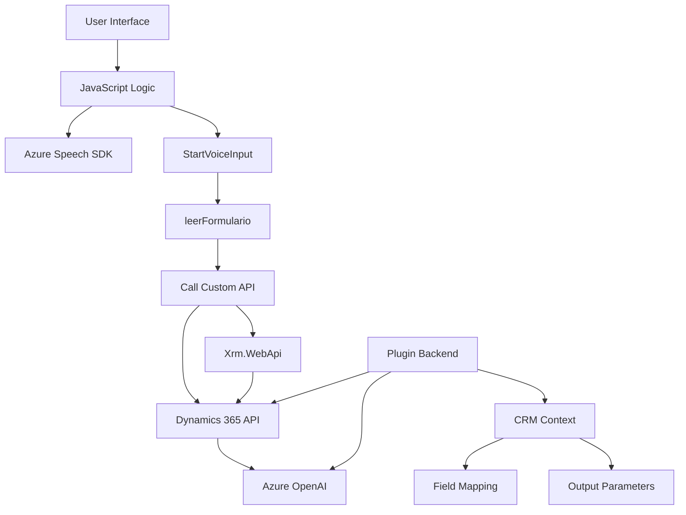

### Breve resumen técnico

El repositorio combina funcionalidades avanzadas de accesibilidad, reconocimiento de voz y procesamiento IA con integración directa a formularios dinámicos en contextos de CRM mediante Microsoft Dynamics. Los componentes abarcan un frontend en JavaScript y un plugin backend en C#.

---

### Descripción de arquitectura

La solución tiene una arquitectura **mixta basada en capas**:
1. **Frontend:** Utiliza JavaScript para el manejo de formularios dinámicos y funcionalidades integradas con Azure Speech SDK.
2. **Backend:** Plugin en C# que procesa los datos (texto) mediante Azure OpenAI para aplicaciones dentro de un entorno CRM.
3. Integración: Los componentes interactúan con **Azure Services** (Speech SDK y OpenAI) y APIs específicas del CRM (Dynamics Web API) aplicando patrones de diseño orientados a eventos, modularidad y servicios externos.

---

### Tecnologías usadas

1. **Frontend:**
   - JavaScript.
   - Azure Speech SDK (reconocimiento de voz y síntesis).
   - Dynamics 365 CRM API para formularios y datos asociativos.
2. **Backend:**
   - C#.
   - Microsoft Dynamics SDK.
   - Azure OpenAI (GPT-4).
   - Bibliotecas como `System.Net.Http` y `Newtonsoft.Json`.

3. **Patrones de diseño:**
   - Modularización: En función de roles bien definidos (manejo de voz, asignación dinámica de datos, etc.).
   - Eventos (callback y promesas): Asincronía en carga y ejecución.
   - Integración de microservicios: Comunicación con Azure OpenAI y Speech SDK.
   - Plugin para CRM: Implementación estándar en Microsoft Dynamics.

---

### Diagrama Mermaid

---

### Conclusión final

Esta solución es una integración avanzada que combina accesibilidad mediante voz, inteligencia artificial y gestión de datos en tiempo real a través de APIs en un sistema **Microsoft Dynamics CRM**. Su arquitectura basada en capas, servicios externos y modularización asegura escalabilidad y reutilización. Aunque técnicamente bien implementado, requiere mejorar en la gestión de credenciales sensibles para cumplir con mejores prácticas de seguridad.