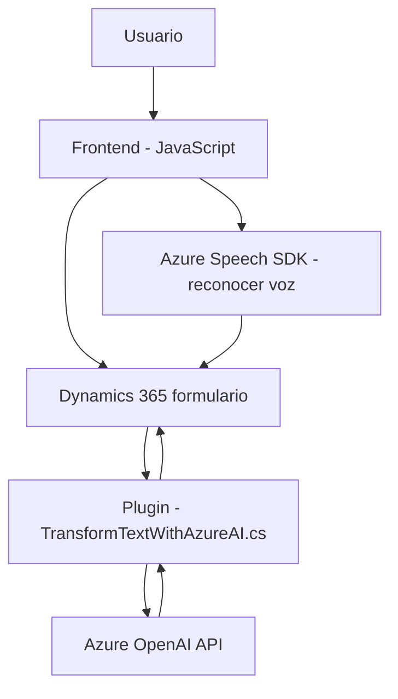

### Breve resumen técnico

El repositorio presenta una solución integrada con Dynamics 365 CRM utilizando múltiples tecnologías, incluyendo Azure Speech SDK y Azure OpenAI, enfocada en la interacción de formularios a través de reconocimiento y síntesis de voz, además de la transformación semántica de los valores ingresados mediante un plugin.

---

### Descripción de la arquitectura

La solución combina una arquitectura **n capas** y se organiza de la siguiente manera:
1. **Frontend (JavaScript):**  
   - Desarrollado como un módulo de Dynamics 365, se enfoca en la interacción con formularios integrando el SDK de Azure Speech para manejo de entrada de voz y síntesis de audio.  
   - Facade pattern usado en las funciones clave (`startVoiceInput`) para abstraer y simplificar el flujo.  
   - Funciones están desacopladas y poseen responsabilidades específicas.
2. **Plugin para Dynamics 365 (backend en .NET):**  
   - Implementa la funcionalidad como **plugin basado en eventos** de Dynamics CRM.
   - Actúa como un intermediario para realizar solicitudes HTTP al servicio Azure OpenAI y procesa los datos para cumplir requisitos semánticos.  
   - Utiliza patrones como **Command Pattern** y separación lógica en capas.

---

### Tecnologías usadas
1. **Frontend**  
   - **JavaScript:** Principal lenguaje para scripts.  
   - **Azure Speech SDK:** Para síntesis de voz y reconocimiento de audio.  
   
2. **Backend**  
   - **Dynamics CRM SDK:** Para la integración de plugins y manipulación directa con entidades del CRM.  
   - **Azure OpenAI:** Servicios de procesamiento de lenguaje natural (NLP) integrados a través de HTTP API.  
   - **System.Net.Http** y **Newtonsoft.Json:** Para solicitudes web y procesamiento de JSON en C#.
   - **C#:** Lenguaje backend para los plugins.  

---

### Diagrama Mermaid

---

### Conclusión final

La solución es una integración de Frontend y Backend diseñada bajo una arquitectura de n capas. El frontend habilita la captura de datos mediante voz y visualización de formularios en Dynamics 365 CRM, interactuando con Azure Speech SDK. En el lado del backend, el plugin utiliza la API de Azure OpenAI para transformar texto y cumplir con reglas específicas. La separación de responsabilidades y el uso de patrones como Facade y Command hacen que el sistema sea modular, fácil de ampliar y adaptado a la integración con servicios externos como Dynamics 365 y Azure.