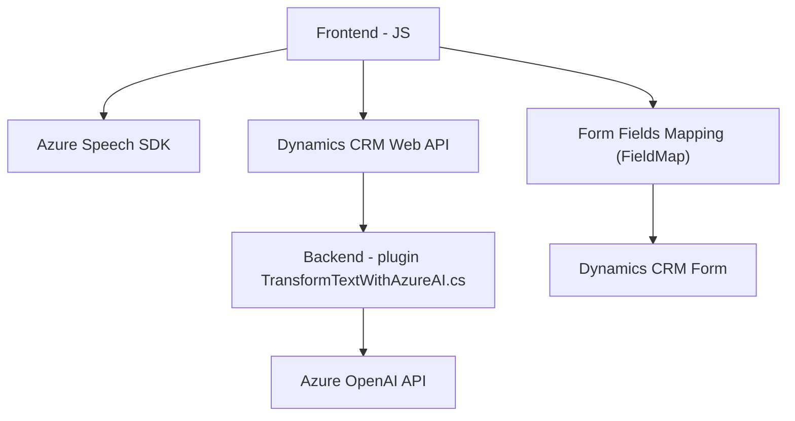

### Breve resumen técnico
La solución abarca dos características principales:
1. **Frontend interactivo basado en Azure Speech SDK**: Funcionalidades para interactuar con formularios mediante entrada de voz, procesar transcripciones y actualizar campos en Microsoft Dynamics CRM.
2. **Backend basado en plugins de Dynamics CRM**: Utilización de Azure OpenAI para transformar texto bajo reglas específicas, con integración directa en el ecosistema CRM como plugin.

La solución evidencia integración entre frontend y backend, apoyándose en APIs y SDKs de servicios de Azure.

---

### Descripción de arquitectura
La arquitectura empleada es **n-capas**, distribuida en:
1. **Capa de presentación**: Implementada en JavaScript, utiliza el Azure Speech SDK para interactuar con formularios mediante reconocimiento de voz.
2. **Capa lógica**: Procesamiento de datos ingresados por voz, transformación de texto con reglas predefinidas, y mapeo de valores a campos de formularios.
3. **Capa de integración**: Plugins y APIs en el backend que interactúan con el sistema central de Dynamics CRM y servicios externos como Azure OpenAI.

Se evidencia el uso de patrones como **Event-driven programming (Frontend)** y **Plugin-based architecture (Backend)**.

---

### Tecnologías usadas
1. **Frontend**
   - JavaScript / ES6.
   - Azure Speech SDK.
   - Dynamics CRM Web API.

2. **Backend**
   - C#/.NET Framework (para plugins de Dynamics CRM).
   - Azure OpenAI API.
   - NewtonSoft.Json para manejo de JSON.
   - System.Net.Http para comunicación con APIs externas.

3. **General**
   - Integración entre Dynamics CRM y servicios de Azure.

---

### Diagrama Mermaid

---

### Conclusión final
Esta solución está diseñada para aprovechar la interacción entre un sistema frontend en JavaScript, Azure Speech SDK, y el backend de Microsoft Dynamics CRM mediante plugins en .NET, proporcionando servicios específicos de reconocimiento de voz e inteligencia artificial para transformar texto y procesar datos estructurados en formularios dinámicos.

La arquitectura **n-capas** permite una separación clara de responsabilidades: la capa de presentación maneja la entrada de voz y procesamiento básico, mientras que el backend realiza transformaciones avanzadas mediante Azure OpenAI y define las integraciones necesarias con el ecosistema CRM.