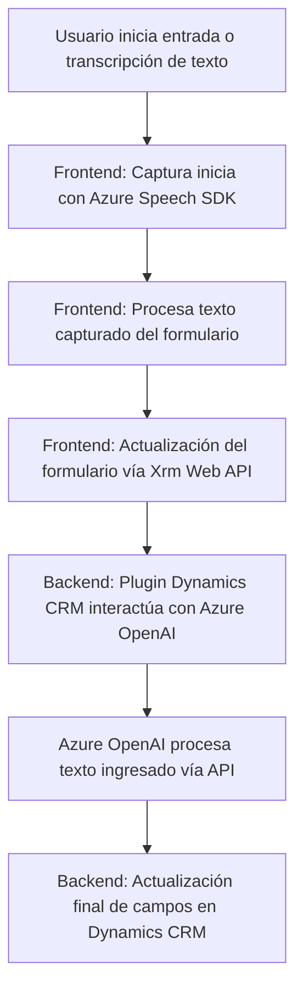

### Breve resumen técnico:
El repositorio incluye soluciones para integrar funcionalidades de procesamiento de voz y texto con servicios de Azure, Dynamics CRM, y APIs externas como Azure OpenAI. Los archivos tienen una orientación predominante hacia la creación de herramientas de frontend en **JavaScript** y plugins en **C#**, adecuándose a escenarios de CRM moderno con capacidades de IA y síntesis de voz.

---

### Descripción de arquitectura:
1. **Modelo Arquitectónico:**
   - **Frontend:** Modular y responsivo, diseñado para interactuar con formularios y servicios API externos. Usa funciones JavaScript asíncronas para la integración dinámica del **Azure Speech SDK**.
   - **Backend:** Plugin basado en **C#** para Dynamics CRM, que sigue una arquitectura basada en patrones orientados a plugins y a servicios API externos como OpenAI.

2. **Tipo de Arquitectura:**
   - Semi-modular, **n capas**:
     - **Capa de presentación:** UI basada en formulación y entrada de datos en Dynamics CRM.
     - **Lógica de negocio:** Funciones independientes procesan voz y texto en ambos (frontend y backend).
     - **Integración con servicios externos:** APIs como Azure Speech, Azure OpenAI, y Dynamics CRM Web API.

3. **Colaboración entre componentes:**
   - **Frontend:** Extrae datos dinámicamente del formulario y utiliza servicios de voz para síntesis y procesamiento en tiempo real.
   - **Backend:** Transforma datos a través de servicios de IA aplicando el plugin al contexto CRM.

---

### Tecnologías usadas:
1. **Frontend:**
   - **Azure Speech SDK:** Para reconocimiento y síntesis de voz.
   - **Vanilla JavaScript:** Lógica modular y manipulaciones DOM en un entorno flexible.
   - **Dynamics CRM Web API (Xrm):** Manipulación de datos.
   
2. **Backend (C#):**
   - Dynamics CRM SDK (`Microsoft.Xrm.Sdk`): Para lógica de negocio y operaciones con entidades CRM.
   - **Azure OpenAI API:** Procesamiento de texto con IA.
   - Dependencias estándar para solicitudes HTTP y parseadores JSON (`Newtonsoft`, `System.Net.Http`, entre otros).

3. **Patrones arquitectónicos:**
   - Modularidad: Separación clara de responsabilidades en funciones y clases individuales.
   - Delegación API: Uso de APIs dinámicas para extender las funcionalidades del CRM.
   - Asincronía: Carga dinámica de SDK y utilización de callbacks/promesas en el frontend y backend.

---

### Diagrama Mermaid:

---

### Conclusión final:
Este repositorio integra frontal y backend en un modelo **orientado al procesamiento de voz y texto**. La arquitectura refleja un diseño modular, dividido en capas de presentación frontal (proveedora de interacción dinámica con el usuario) y lógica de backend para servicios CRM y transformación de datos vía IA.

La solución está diseñada para complementar el CRM empresarial moderno con herramientas de IA y voz, destacándose por:
- Su capacidad de interactuar dinámicamente con servicios externos como Azure Speech y OpenAI.
- Uso eficiente de plataformas como Dynamics CRM para manipular datos en entornos corporativos.

Para maximizar la efectividad, sería útil expandir la seguridad en la gestión de las claves externas (como `AzureKey`) y consideraciones de redundancia en la comunicación API.