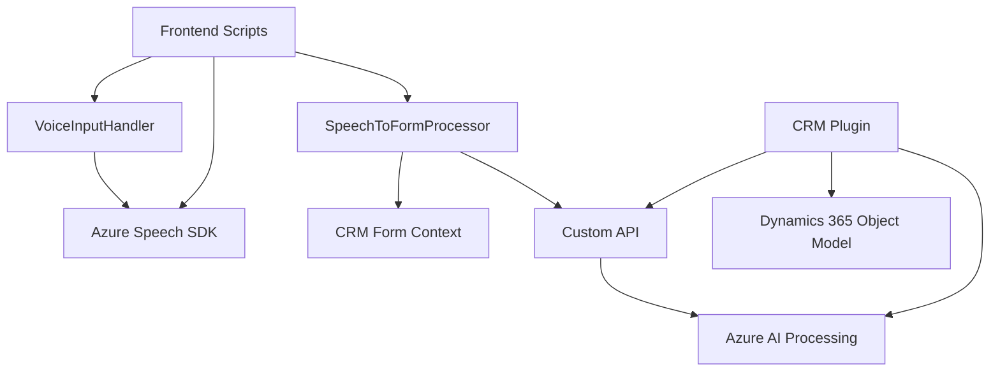

### Breve resumen técnico

El repositorio presenta una solución multifacética que interactúa con formularios dentro de un sistema CRM, utilizando tecnologías modernas como Azure Speech SDK para reconocimiento y síntesis de voz, y Azure OpenAI Service para procesamiento avanzado de texto. Los archivos se centran en funcionalidades relacionadas con entrada de voz, conversión a texto estructurado, lectura del texto visible en formularios y transformación de datos mediante inteligencia artificial.

---

### Descripción de arquitectura

La arquitectura combina **microservicios** y **plugins** para lograr modularidad y una clara separación de responsabilidades. Los componentes pueden clasificarse así:

1. **Frontend**: Incluirá módulos para lectura y entrada de voz, integración con Azure Speech SDK, y manipulación del formulario en el navegador mediante APIs propias del CRM.
2. **Plugins CRM**: Se ejecutan en el servidor como parte del ecosistema Dynamics 365 CRM, integrando servicios externos como Azure OpenAI para el procesamiento del texto.
3. **Servicios externos**: Uso extensivo de microservicios de Azure como Azure Speech y OpenAI.

Los patrones emergentes en esta solución incluyen:
- **Patrón Event-driven** para la ejecución basada en interacción del usuario.
- **Encapsulación de lógica** mediante la división de funciones específicas para procesamiento de datos y voz.
- **Integración de servicios externos** a través de API REST para comunicarse con Azure y Dynamics CRM.

La arquitectura es **modular**, adoptando una composición de **n capas** que incluye manejo de presentación, lógica de negocio y acceso externo a servicios.

---

### Tecnologías usadas

#### Frameworks y librerías:
- **Azure Speech SDK**: Procesamiento de voz para entrada y síntesis.
- **Microsoft Dynamics 365 SDK**: Interacción con formularios y objetos del CRM.
- **System.Net.Http / Newtonsoft.Json**: Para solicitudes REST y manejo de objetos JSON.
- **Azure OpenAI**: Generación y procesamiento de texto con GPT.

#### Lenguajes:
- **JavaScript**: Para la lógica de frontend (procesamiento en formularios).
- **C#**: Para los plugins del CRM y extensión de funcionalidades.

#### Patrones:
- **Event-driven**: Impulsado por eventos dentro del sistema CRM.
- **Modularidad**: Separación de roles entre procesamiento de voz, interacción con formularios y ejecución en el servidor.
- **Encapsulación**: Cada módulo y función define su alcance con claridad.

---

### Diagrama Mermaid

Este diagrama representa la interacción entre los componentes del repositorio y los servicios externos.

---

### Conclusión final

La solución combina el poder de la inteligencia artificial y el reconocimiento de voz con la modularidad necesaria para integrarse eficientemente en el ecosistema Dynamics 365 CRM. Utiliza tecnologías como Azure Speech SDK y Azure OpenAI Service para extender las capacidades de entrada y procesamiento de datos en los formularios CRM.

Su arquitectura híbrida basada en **plugins y servicios externos** asegura escalabilidad y mantenibilidad, mientras que el uso de patrones como **event-driven**, **encapsulación lógica**, y **modularidad** optimiza la integración y funcionamiento. Esta solución está diseñada para escenarios de CRM enriquecidos con inteligencia artificial, proporcionando un nivel avanzado de interacción y automatización.