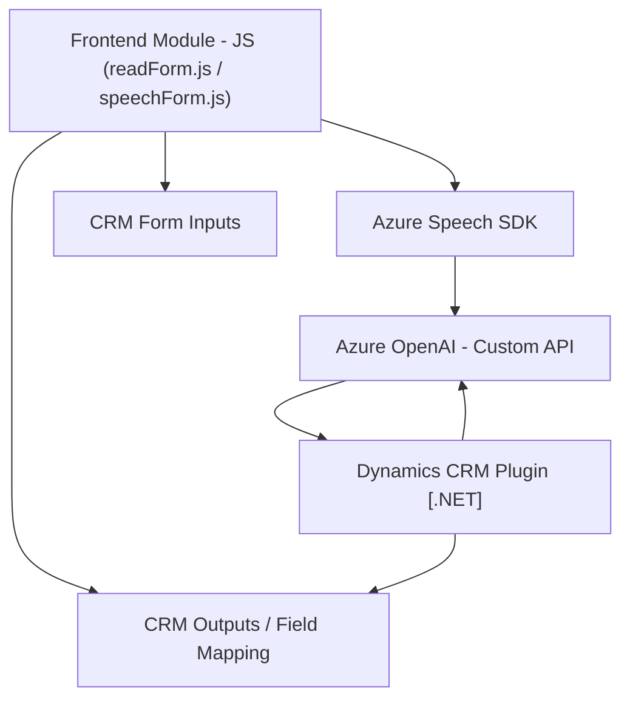

### Resumen Técnico:
El repositorio está orientado a una solución integral que utiliza tecnologías frontend, integración con servicios externos (Azure Speech SDK y Azure OpenAI), y complementos nativos de Dynamics CRM. La funcionalidad general gira en torno a la interacción con formularios y el procesamiento de texto, usando reconocimiento de voz y generación de voz configurada.

---

### Descripción de arquitectura:
La arquitectura puede clasificarse como híbrida entre una **n capas** en el contexto de Dynamics CRM (backend y plugin) y una **orientada a cliente API** para los módulos de frontend. Las principales características incluyen:
- **Frontend**: Implementación modular que usa lógica de cliente (JS), SDKs de Azure y llamadas a APIs personalizadas.
- **Backend/Plugin**: En el caso de Dynamics CRM, se utiliza un plugin que se comunica con Azure OpenAI, en un patrón de desarrollo encapsulado típico de CRM.
- **Integración con API**: Uso de APIs externas con Azure para reconocimiento de voz, síntesis y procesamiento basado en IA.

---

### Tecnologías usadas:
1. **JavaScript (Frontend)**:
   - Uso del navegador para integración con Azure Speech SDK.
   - Modularidad y delegación de funciones específicas para cada acción (extraer datos, sintetizar voz, procesar reconocimientos).

2. **Dynamics CRM Plugins (.NET/C#)**:
   - Clases implementando `Microsoft.Xrm.Sdk` para manipulación directa de entidades y contexto CRM.
   - HTTP client (`System.Net.Http`) para consumo de APIs externas (Azure OpenAI).

3. **Azure Speech SDK**:
   - Reconocimiento de voz para transcribir y sintetizar texto en voz.
   - Configuración dinámica para cargar SDK solo cuando sea necesario.

4. **Azure OpenAI**:
   - Transforma texto según reglas predefinidas, aprovechando modelos avanzados de IA.

---

### Diagrama Mermaid:

---

### Conclusión final:
El repositorio reflejado abarca múltiples aspectos de una solución moderna integrada:
- Combina una capa frontend altamente modular con integración de SDKs externos (Azure Speech SDK).
- Desarrolla plugins específicos para extender capacidades de Dynamics CRM, procesando datos de entrada y salida con servicios avanzados como Azure OpenAI.
- La arquitectura es híbrida, con componentes de **n capas**, lógica independiente cliente-servidor, y patrones como *plugin encapsulado* y *facade*.

Esta solución es ideal para entornos empresariales que requieren automatización del manejo de formularios CRM, interacción dinámica con clientes, y capacidades de síntesis de voz enriquecidas por IA.