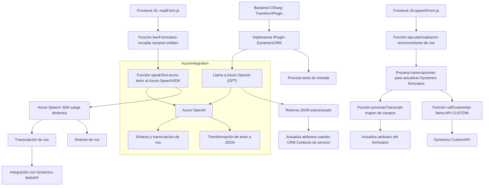

### Breve resumen técnico:
La solución representa un conjunto de servicios y funciones integradas con Dynamics CRM que habilitan la funcionalidad de entrada y salida por voz y texto. Utiliza Azure Speech SDK para generación de voz y transcripción de voz, además de Azure OpenAI para transformar y estructurar textos según reglas predefinidas. Este sistema facilita la interacción vocal y textual con formularios de Dynamics 365 y potencia las capacidades de la plataforma CRM.

---

### Descripción de arquitectura:
La arquitectura es principalmente **orientada a servicios** basada en dos componentes principales:
1. **Frontend (JS)**: Contiene lógica para lectura del formulario visible en Dynamics 365 y ejecución de síntesis de voz y transcripción de entrada de voz utilizando Azure Speech SDK.
   - Modularización mediante funciones bien definidas y reutilizables.
   - Los datos del DOM del formulario se integran a través del `executionContext` de Dynamics.
   - Funcionalidad de reconocimiento de voz utiliza patrones de carga condicional (lazy loading) y data mapping.

2. **Backend (Plugin)**: Define un **plugin para Dynamics CRM** que actúa como un intermediario entre el texto recibido y el servicio Azure OpenAI. Este componente interactúa directamente con el sistema CRM a través de la interfaz `IPlugin`.
   - Estrategia basada en capa para gestionar las solicitudes al servicio OpenAI.
   - Uso de un servicio externo (Azure GPT) para procesamiento de datos.
   - Proxy para enviar y recibir respuestas con estructuras JSON.

La arquitectura general tiende a representar un sistema de **integración de servicios externos** con Dynamics CRM, dividido en **Frontend (JS)** para el cliente y **Backend (Plugin)** para el servidor. **Patrones como Data Mapping, Lazy Loading y Plugin Architecture** son explícitos en la organización del sistema.

---

### Tecnologías usadas:
1. **Frontend:**
   - **JavaScript**: Usado para la interacción con el cliente.
   - **Azure Speech SDK**: Implementa la síntesis y reconocimiento de voz.
   - **Dynamics 365 Web API**: Permite acceso y actualización de datos de formularios.

2. **Backend:**
   - **C# y .NET Framework**: Desarrolla el plugin con integración a Dynamics CRM.
   - **Microsoft.Xrm.Sdk**: Funcionalidad de desarrollo de plugins en Dynamics CRM.
   - **Azure OpenAI Service**: Utiliza el modelo GPT para transformar texto en JSON estructurado.
   - **System libraries (HttpClient, Newtonsoft.Json)**: Para manejo de peticiones HTTP y procesamiento de JSON.

---

### Diagramación Mermaid  

---

### Conclusión final:
Este sistema es una solución basada en **n-capas** que integra frontend (JavaScript) y backend (C# plugin) para trabajar con Dynamics CRM. Su propósito es permitir interacción por voz o texto en formularios de Dynamics interactuando dinámicamente con Azure Speech SDK y Azure OpenAI. La arquitectura está optimizada para modularidad, extensibilidad y escalabilidad, apoyada en patrones como Data Mapping, Lazy Loading y Plugin Architecture. Esta integración potencia sistemas CRM al añadir capacidades avanzadas de Inteligencia Artificial y síntesis de voz, haciendo posible una experiencia de usuario más rica e interactiva.