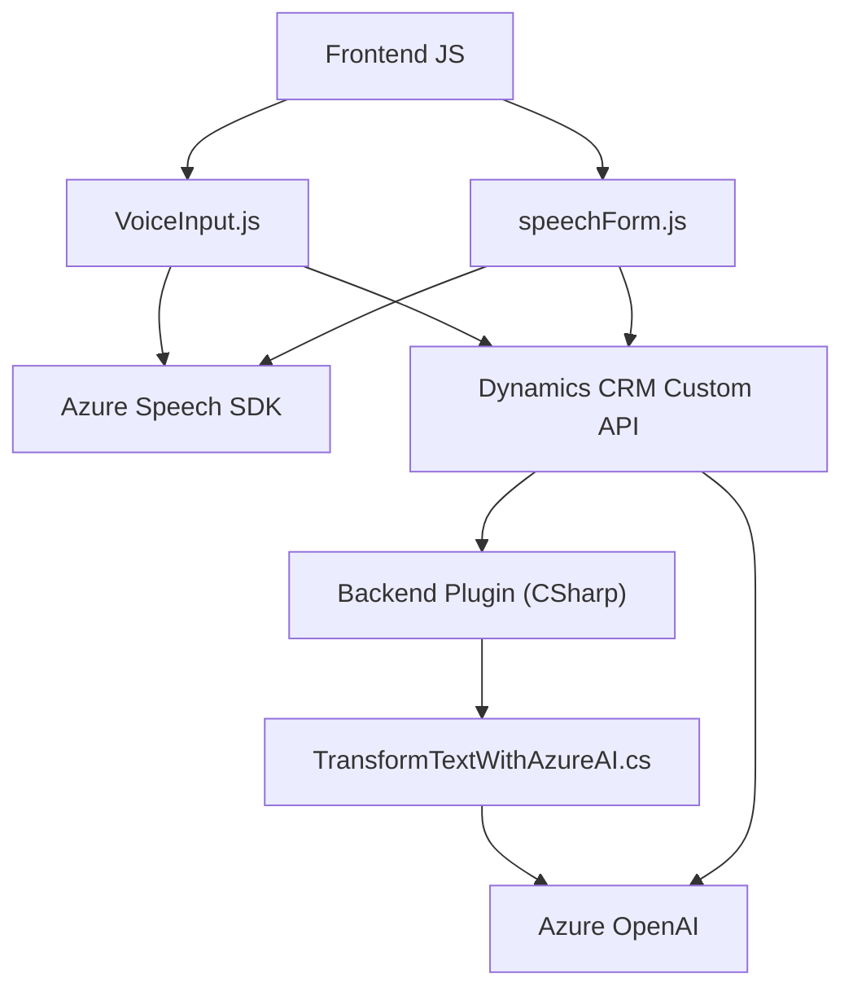

### Breve resumen técnico:
Este repositorio contiene la implementación de servicios y plugins que integran funciones de reconocimiento de voz, síntesis de voz y procesamiento de texto utilizando el **Azure Speech SDK** y **Azure OpenAI**, todo ello en el contexto de formularios de **Dynamics CRM**. La solución está implementada como un conjunto de archivos para el frontend (JavaScript) y un plugin backend (.NET).

---

### Descripción de la arquitectura:
La arquitectura de este sistema combina conceptos de **n-capas** y **hexagonal**:
1. El **frontend** implementa funciones modulares para el reconocimiento de voz, mapeo de datos del formulario y llamadas a APIs secundarias. Encapsula funcionalidades específicas en funciones bien definidas, siguiendo un enfoque modular.
2. El **backend** se estructura como **plugins** de Dynamics CRM que operan mediante patrones de extensión de funcionalidades. Estos plugins procesan texto con Azure OpenAI y devuelven un JSON estructurado.

Además, se observa integración API REST (para Azure OpenAI), lo que refuerza la función de conectar periféricos que procesan datos (puede considerarse un enfoque **hexagonal**).

---

### Tecnologías utilizadas:
1. **Frontend (JavaScript)**:
   - **Frameworks y SDKs**:
     - **Azure Speech SDK**: Para reconocimiento y síntesis de voz.
   - **APIs externas**:
     - Custom API de Dynamics 365.
   - **Patrones**:
     - Factory Pattern: Usado al crear configuraciones para el SDK (ej. `SpeechConfig`).
     - Mapper-based transformation: Mapeo de datos entre etiquetas visibles y atributos internos.
     - Callback Pattern: Carga dinámica del SDK con funciones callback.

2. **Backend (.NET)**:
   - **Frameworks y SDKs**:
     - **Microsoft.Xrm.Sdk**: Desarrollo para Dynamics CRM.
     - **Azure OpenAI (GPT-4)**: Procesamiento de texto.
     - **System.Net.Http**: Solicitudes HTTP.
     - **System.Text.Json/Newtonsoft.Json**: Manejo y estructura de JSON.
   - **Patrones**:
     - Plugin Pattern: La clase `TransformTextWithAzureAI` implementa el estándar de extensibilidad de Dynamics CRM.
     - Factory Pattern: Uso del contexto de la organización con `IOrganizationServiceFactory`.
     - Integración API REST: Lógica preparada para interactuar con servicios externos a través de HTTP.

---

### Dependencias o componentes externos:
1. **Azure Speech SDK**:
   - Utilizado en el frontend para reconocimiento de voz y síntesis.
2. **Azure OpenAI**:
   - Utilizado en el plugin para la transformación avanzada de texto.
3. **Dynamics CRM Custom API**:
   - Integración con servicios personalizados de Dynamics 365 para generación y procesamiento de datos.
4. **System Libraries**:
   - .NET libraries for HTTP communication, text processing, and CRM manipulation.

---

### Diagrama Mermaid para GitHub Markdown:

---

### Conclusión final:
La solución presentada utiliza un enfoque híbrido que mezcla **n capas** (frontend, backend) con características propias de una arquitectura **hexagonal**, gracias a su integración de servicios externos y modularidad. El uso de Azure Speech y OpenAI permite una implementación avanzada de funciones de síntesis, reconocimiento de voz y procesamiento de texto. Es una solución diseñada para integrarse directamente en **Dynamics CRM**, proporcionando automatización mediante comandos hablados y enriquecimiento de datos gracias a la inteligencia artificial.