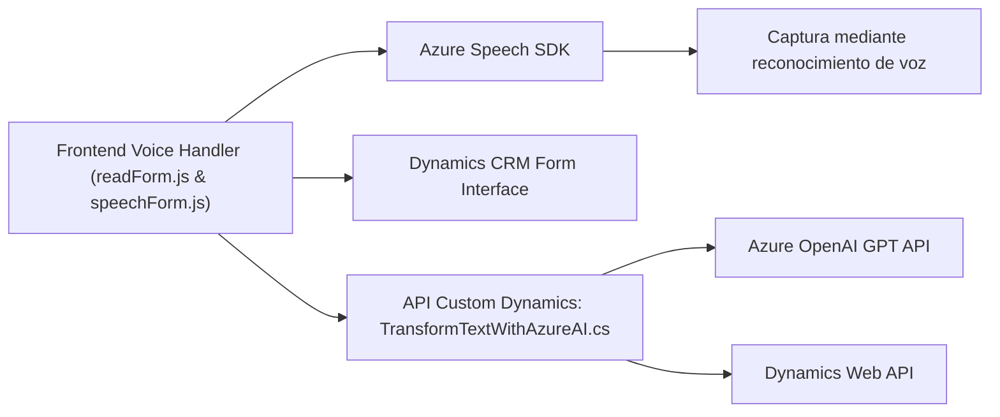

**Resumen Técnico**  
El repositorio integra diversas componentes que trabajan conjuntamente para desplegar una solución que facilita la interacción entre usuarios y Dynamics CRM mediante entrada de voz y procesamiento de texto. Las funcionalidades incluyen la captura de datos de formularios, síntesis de voz, reconocimiento de voz para entrada dinámica y procesamiento de texto con OpenAI API. Utiliza tecnologías de Microsoft como Dynamics 365, Azure Speech SDK y Azure OpenAI.

---

**Descripción de la Arquitectura**  
La solución utiliza una arquitectura basada en **n capas**. Se distingue lo siguiente:  
1. **Frontend**: Implementado mediante un conjunto de scripts JavaScript que interactúan con la interfaz de usuario de Dynamics CRM, proporcionando la funcionalidad de entrada y síntesis de voz.  
2. **Backend**: Implementado como un **plugin** en Dynamics CRM, que utiliza la interfaz `IPlugin` para manejar eventos del sistema y roles empresariales.  
3. **Externa**: Integración con el servicio Azure OpenAI y Azure Speech SDK para proveer las capacidades de aprendizaje automático y síntesis/entrada de voz.  

El uso de Web APIs de Dynamics y Azure OpenAI, junto con llamadas a servicios externos de Azure, posiciona esta solución en el paradigma moderno de **arquitectura orientada a servicios**. Aunque el repositorio aún refleja concentraciones funcionales, su orientación hace que se acerque a principios de integración que podrían ser expandidos a **microservicios** en el futuro.

---

**Tecnologías Usadas**  
1. **Lenguajes y frameworks**:  
   - JavaScript: Interfaz del frontend, procesamiento de formularios y funciones de síntesis/captura de voz.  
   - C#: Backend del plugin en Dynamics CRM, lógica empresarial.  

2. **Microsoft Dynamics CRM**:  
   - Web API para interacción con los formularios y atributos.  
   - Implementación de la interfaz `IPlugin` para lógica personalizada en eventos del CRM.  

3. **Azure Speech SDK**:  
   - Gestión de captura y síntesis de voz en el frontend. Se utiliza mediante la carga dinámica de su script externo.  

4. **Azure OpenAI service (GPT model)**:  
   - Procesa transformaciones avanzadas de texto con reglas específicas desde el plugin del backend.  

---

**Diagrama Mermaid válido para GitHub**  

---

**Conclusión Final**  
Esta solución representa una integración avanzada de tecnologías web, API y servicios cloud. La arquitectura de **n capas** organiza la funcionalidad en diferentes responsabilidades estructurales: el frontend para la interacción con el usuario (captura y síntesis de voz), el backend para la lógica empresarial y procesamiento avanzado, y la capa externa con servicios cloud para ampliar las capacidades. Los patrones están orientados a modularidad, separando cada tarea en bloques funcionales pequeños y escalables. Para evolucionar hacia una verdadera arquitectura de microservicios, se requeriría la desacoplamiento del plugin de Dynamics y la integración de más servicios independientes.