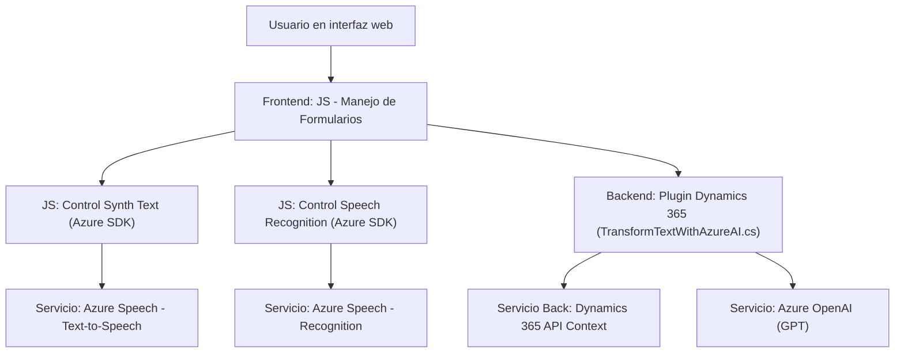

### Resumen técnico

El repositorio contiene tres componentes principales:
1. **frontend (JS)**: Implementa la interacción del usuario con formularios dinámicos en borradores de Dynamics 365, centrado en la síntesis y el reconocimiento de voz usando el SDK de Azure Speech.
2. **backend plugin (C#)**: Implementa un plugin para Dynamics 365 que utiliza Azure OpenAI para transformar texto en JSON estructurado siguiendo ciertas normas personalizadas.

Las soluciones están orientadas a integrarse en un sistema CRM basado en formularios dinámicos (Dynamics 365), permitiendo interacción por voz y transformación inteligente de texto usando servicios de Azure.

---

### Descripción de la arquitectura

1. **Frontend JS**:
   - Modular y orientado a funcionalidad específica (synthText y speechRecognition).
   - Utiliza **SDKs externos (Azure Speech)** y una estructura funcional para interactuar con contexto dinámico (formContext) del sistema CRM.

2. **Backend (plugin C#)**:
   - **Plugin para Dynamics 365**, diseñado siguiendo los estándares de la arquitectura de plugin (IPlugin interface). 
   - Implementa una integración **microservicio en Azure** para transformaciones avanzadas de texto mediante el modelo GPT de Azure OpenAI.

3. **Arquitectura general**:
   - **N-capas (capas separadas)**: Back y front están claramente separados.
   - **Integración basada en servicios externos**: SDK en frontend y OpenAI en backend.
   - **Centralidad en Dynamics 365 como motor de contexto**: Usan conceptos como `formContext`, `InputParameters` y salida transformada.
   - **Dependencia de Azure como proveedor de servicios IA, reconocimiento y síntesis de voz.**

---

### Tecnologías usadas

**Frontend:**
- JavaScript/ES6 (Vanilla JS).
- Azure Speech SDK (`https://aka.ms/csspeech/jsbrowserpackageraw`).

**Backend:**
- C# para plugins Dynamics 365.
- Librerías .NET (Microsoft.Xrm.Sdk, Newtonsoft.Json).
- Azure OpenAI (GPT API).

**Patrones identificados:**
- **Modularidad:** Cada función tiene responsabilidades bien definidas.
- **Integración externa:** Uso de servicios Azure Speech y OpenAI para capacidades extendidas.
- **Dependencia contextual:** Basado en el uso de Context API en Dynamics 365.
- **API Gateway** (implícito): Comunicación entre plugins (Dynamics) y servicios externos (OpenAI).
- **N-capas:** Separación backend (plugin) y frontend, con interacciones limitadas al contexto compartido de Dynamics 365.

---

### Diagrama Mermaid

---

### Conclusión final

Este repositorio implementa soluciones específicas para la interacción con sistemas CRM (Dynamics 365), aprovechando herramientas modernas de Azure. Su diseño modular, la dependencia en servicios de Azure (Speech, OpenAI) y la arquitectura orientada a capas n-capas le proporcionan capacidad de ampliación y buena práctica en desarrollo de integraciones. La funcionalidad de síntesis y reconocimiento de voz junto al procesamiento avanzado de texto orientado por IA lo hace altamente útil para proyectos empresariales que requieran personalización CRM y UX basada en voz.